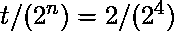

# ES6 |操作员

> 原文:[https://www.geeksforgeeks.org/es6-operators/](https://www.geeksforgeeks.org/es6-operators/)

**表达式**是一种计算值的特殊语句。每个表达式都由

*   **操作数:**代表数据。
*   **运算符:**对操作数执行某些操作。

考虑下面的表达式–**2/3**，在表达式中，2 和 3 是操作数，符号 **/** 是运算符。

**JavaScript 支持以下类型的运算符:**

*   算术运算符
*   关系运算符
*   逻辑运算符
*   按位运算符
*   赋值运算符
*   类型运算符
*   杂项操作员

**算术运算符:**众所周知，这些是 JavaScript ES6 中可用的基本数学运算符。

| 操作员 | 功能 |
| 加法(+) | 返回操作数的总和。 |
| 减法(-) | 返回这些值的差值。 |
| 乘法(*) | 返回这些值的乘积。 |
| 分部(/) | 执行除法并返回商。 |
| 模量(%) | 执行除法并返回余数。 |
| 增量(++) | 将变量的值增加 1。 |
| 减量(-) | 将变量值减少一。 |

**示例:**

```
<script>
    var num1 = 10.5
    var num2 = 2.5

    document.write("Sum : " + (num1 + num2) + "<br>");

    document.write("Difference : " + (num1 - num2) + "<br>")

    document.write("Product : " + num1 * num2 + "<br>")

    document.write("Quotient : " + num1 / num2 + "<br>")

    document.write("Remainder : " + num1 % num2 + "<br>")

    // pre-increment
    document.write("Value of num1 after pre-increment : "
                + (++num1) + "<br>")

    // post-increment
    document.write("Value of num1 after post-increment : "
                + (num1++) + "<br>")

    // pre-decrement
    document.write("Value of num2 after pre-decrement : "
                + (--num2) + "<br>")

    // post-decrement
    document.write("Value of num2 after post-decrement : "
                + (num2--) + "<br>")
</script>
```

**输出:**

```
Sum : 13
Difference : 8
Product : 26.25
Quotient : 4.2
Remainder : 0.5
Value of num1 after pre-increment : 11.5
Value of num1 after post-increment : 11.5
Value of num2 after pre-decrement : 1.5
Value of num2 after post-decrement : 1.5

```

**关系运算符:**比较两个值的运算符。关系运算符有时被称为比较运算符。

| 操作员 | 功能 |
| > | 如果左操作数大于右操作数，则返回 true，否则返回 false。 |
| < | 如果左操作数小于右操作数，则返回 true，否则返回 false。 |
| >= | 如果左操作数大于或等于右操作数，则返回 true，否则返回 false。 |
| <= | 如果左操作数小于或等于右操作数，则返回 true，否则返回 false。 |
| == | 如果两个操作数相同，则返回 true，否则返回 false。/td>
 |
| == | 如果两个操作数相同，则返回 true，否则返回 false。 |
| ！= | 如果两个操作数不相同，则返回 true，否则返回 false。 |

**示例:**

```
<script>
    document.write("11>12 : " + (11 > 12) + "<br>");

    document.write("11<12 : " + (11 < 12) + "<br>")

    document.write("12>=11 : " + (12 >= 11) + "<br>")

    document.write("12<=12 : " + (12 <= 12) + "<br>")

    document.write("11==11 : " + (11 == 11) + "<br>")

    document.write("11!=11 : " + (11 != 11) + "<br>")
</script>
```

**输出:**

```
11>12 : false
11=11 : true
12<=12 : true
11==11 : true
11!=11 : false

```

**逻辑运算符:**逻辑运算符用于组合两个或多个关系语句。

| 操作员 | 功能 |
| 和(&&) | 如果与&&组合的所有关系语句都为真，则返回 true，否则返回 false。 |
| 或者(&#124;&#124;) | 如果与&#124;&#124;组合的关系语句中至少有一个为 true，则返回 true，否则返回 false。< |
| ！ | 返回关系语句结果的倒数。 |

**示例:**

```
<script>

    // Returns true as every statement is true.
    document.write("13>12 && 12>11 && 9==9 : "
        + (13 > 12 && 12 > 11 && 9 == 9) + "<br>");

    // Returns false as 11>12 is false.
    document.write("11>12 && 12>11 && 9==9 : "
        + (11 > 12 && 12 > 11 && 9 == 9) + "<br>")

    // As one true statement is enough to return.
    document.write("11>12 || 12>11 || 9==9 : "
        + (11 > 12 || 12 > 11 || 9 == 9) + "<br>")

    // Returns false as 11>12 is not true.
        document.write("11>12 && (12>11 || 9==9) : "
        + (11 > 12 && (12 > 11 || 9 == 9)) + "<br>")
</script>             
```

**输出:**

```
13>12 && 12>11 && 9==9 : true
11>12 && 12>11 && 9==9 : false
11>12 || 12>11 || 9==9 : true
11>12 && (12>11 || 9==9) : false

```

**按位运算符:**按位运算符是一种用于对位模式或二进制数字执行按位运算的运算符，涉及对单个位的操作。

| 操作员 | 功能 |
| 按位“与”(&) | 将第一个操作数的每个位与第二个操作数的相应位进行比较。如果两个位都为 0，则相应的结果位设置为 0，否则为 1。 |
| 按位或(&#124;) | 将第一个操作数的每个位与第二个操作数的相应位进行比较。如果两个位都为 1，则相应的结果位设置为 1，否则为 0。 |
| 逐位 XOR(^) | 反转其对应操作数的位 |
| 左移(< | 将把“n”位数移到左侧，值为 0 的 n 位将在右侧填充。例:x=2，t=4，x <<t for="" easy="" evaluation="" it="" performs="" src="img/7ee023ff7e1fce52c9eac4e52b6941a6.png" class="ql-img-inline-formula quicklatex-auto-format" alt="x*(2^n)=2*(2^4)" title="Rendered by QuickLaTeX.com" height="31" width="203" style="vertical-align:-7px">。</t> |
| 右移(>>) | 将把“n”位数移到右侧，值为 0 的“n”位将填充在左侧。示例:x=2，t=4，x>>t，为了便于评估，它执行。 |
| 零填充右移 | 将二进制表示 b 中的 a(< 32)位向右移位，丢弃移位的位，并从左侧移入零 |

**示例:**

```
<script>
    document.write("2&3 : " + (2 & 3) + "<br>");
    document.write("2|3 : " + (2 | 3) + "<br>");
    document.write("2^3 : " + (2 ^ 3) + "<br>");
    document.write("~4 : " + (~4) + "<br>");
    document.write("2<<3 : " + (2 << 3) + "<br>");
    document.write("2>>3 : " + (2 >> 3) + "<br>");
</script>
```

**输出:**

```
2&3 : 2
2|3 : 3
2^3 : 1
~4 : -5
2<>3 : 0

```

**赋值运算符:**赋值运算符是用于为变量、属性、事件或索引器元素赋值的运算符。

| 操作员 | 功能 |
| 简单赋值(=) | 将右操作数的值赋给左操作数。 |
| 添加和分配(+=) | 它将右操作数与左操作数相加，并将结果赋给左操作数。 |
| 减法和赋值(-=) | 它从左操作数中减去右操作数，并将结果赋给左操作数。 |
| 乘法和赋值(*=) | 它将右操作数与左操作数相乘，并将结果赋给左操作数。 |
| 除法和赋值(/=) | 它将左操作数除以右操作数，并将结果赋给左操作数。 |

**示例:**

```
<script>
    var a = 12;
    var b = 10;
    a = b;
    document.write("a = b : " + a + "<br>");

    a += b;
    document.write("a += b : " + a + "<br>")

    a -= b;
    document.write("a -= b : " + a + "<br>")

    a *= b;
    document.write("a *= b : " + a + "<br>")

    a /= b;
    document.write("a /= b : " + a + "<br>")
</script>
```

**输出:**

```
a = b : 10
a += b : 20
a -= b : 10
a *= b : 100
a /= b : 10

```

**类型运算符:**是一元运算符。该运算符返回操作数的数据类型。
**语法:**

```
typeof(operand)
```

**示例:**

```
<script>
    var a = 12;
    var b = "Geeks";
    var b = "Geeks";
    var c = true;
    var d = String;

    document.write("a is " + typeof(a) + "<br>");

    document.write("b is " + typeof(b) + "<br>")
    document.write("c is : " + typeof(c) + "<br>")
    document.write("d is : " + typeof(d) + "<br>")
</script>
```

**输出:**

```
a is number
b is string
c is : boolean
d is : function

```

**其他运算符:**这些运算符在不同类型的场合使用时会做不同的运算符。

| 操作员 | 功能 |
| 否定运算符(-) | 更改值的符号。 |
| 串联运算符(+) | 当应用于字符串时，它会追加字符串。 |
| 条件运算符(？) | 它可以用作三元运算符。 |

**示例:**

```
<script>
    var a = "GeeksforGeeks=>";
    var b = "A Computer science portal.";
    var c = true;
    var d = 9;

    // Concatentaion
    document.write("a+b : " + a + b + "<br>");

    // Ternary Operator
    var c = 2 > 3 ? "yes is 2>3" : "No, It is not."
    document.write("2>3 :" + c + "<br>")

    // Negation
    d = -d;
    document.write("d = -d : " + d + "<br>")
</script>
```

**输出:**

```
a+b : GeeksforGeeks=>A Computer science portal.
2>3 :No, It is not.
d = -d : -9

```