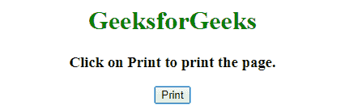
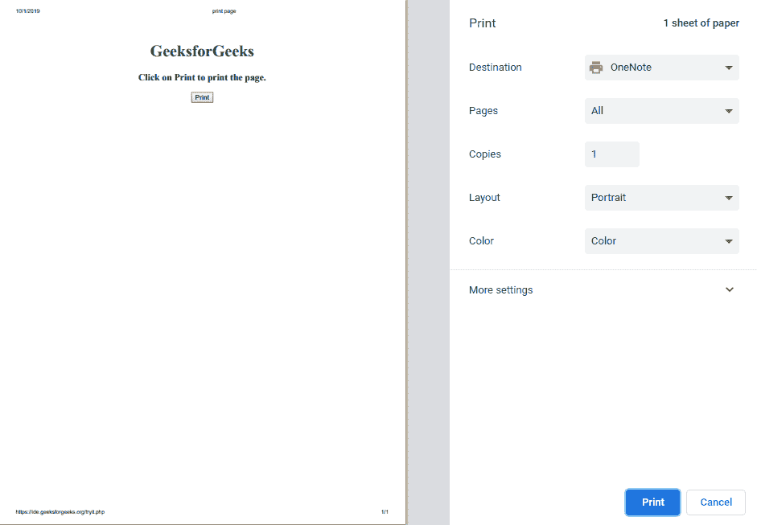
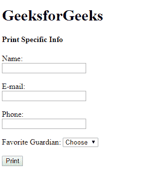
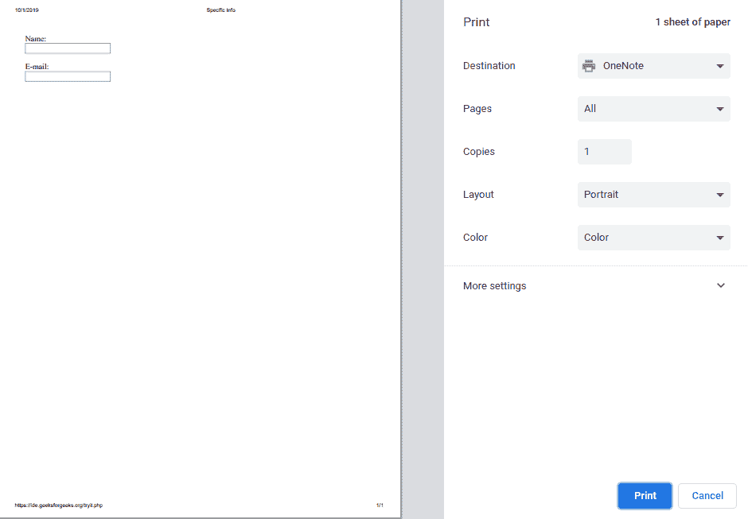

# ES6 |页面打印

> 原文:[https://www.geeksforgeeks.org/es6-page-printing/](https://www.geeksforgeeks.org/es6-page-printing/)

我们知道，ECMAScript (ES)是由 ECMAScript 国际标准化的脚本语言规范。它给 javascript 增加了新的特性。它的规范受到 Self、Perl、Python、Java 等语言的影响。有人称之为 JavaScript 6。
所以，打印页面是一样的。通过使用窗口对象的打印功能。执行时会打印当前网页(原始内容)。

**语法:**

```
window.print()
```

**例 1:**

```
<!DOCTYPE html>
<html>

<head>
    <title>Print page</title>
</head>

<body>
    <center>
        <h1 style="color:Green">GeeksforGeeks</h1>

        <h3>Click on Print to print the page.</h3>

        <button type="button" onclick="window.print()">
            Print
        </button>
        <!--prints the page-->
    </center>
</body>

</html>
```

**输出:**

*   **点击按钮前:**
    
*   **点击按钮后:**
    

但是，我们并不总是想打印网页上的所有内容。如果您想提供仅包含特定信息的打印件，那么您可以在

标签的帮助下完成。在下面的例子中，表单是完整/原始的内容，我们只能打印原始显示的网页。我们无法打印填好的表格信息。因为我们将原始内容分配给要打印的变量，但一次也不修改。

但是网页不仅限于文本。网页中还有其他东西，如由不同颜色组成的图像等。可以通过以下方式打印此类页面:

*   制作一个页面的副本，去掉无用的(不需要的)文本和图形，然后将它们链接到原页面的打印机友好页面。这意味着整个页面会像你看到的页面一样打印出来，不会有任何变化，如果你看到广告，也会打印在上面。
*   如果您不想保留一页的额外副本，那么您可以在“打印从这里开始”时使用适当的注释来标记您的可打印文本…..PRINT ENDS 在这里，然后你可以在后台使用 PERL 或任何其他脚本来清除可打印的文本，并为最终打印显示。这意味着将打印选定的部分。

**例 2:**

```
<!DOCTYPE html>
<html>

<head>
    <title>Page printing</title>
</head>

<body>
    <h1>GeeksforGeeks</h1>

    <h4>Print Specific Info</h4>

    <div id="specificInfo">
        <form>
            Name:<br>
            <input type="text" name="Name" />

            <br><br> 

            E-mail:<br>
            <input type="text" name="EMail" />

            <br><br>
        </form>
    </div>

    <form>
        Phone:<br>
        <input type="text" name="Ph" />

        <br><br>

        Favorite Guardian:
        <select name="Country">
            <option value="-1" selected>Choose</option>
            <option value="1">Quill</option>
            <option value="2">Gamora</option>
            <option value="3">Groot</option>
            <option value="4">Rocket</option>
            <option value="5">Drax</option>
        </select>

        <br><br>
    </form>

    <input type="button" onclick="printDiv('specificInfo')"
            value="Print" />

    <script>

        function printDiv(divName) {

            // Makes the content in the div tag
            // as the main and only content 
            // and assigns to this variable
            var printContents = 
                document.getElementById(divName).innerHTML; 

            // Complete content of the page
            var originalContent = document.body.innerHTML;

            // printContents is assigned to innerHtml now
            // the printable content is the div tag
            document.body.innerHTML = printContents; 

            window.print(); // Prints the page

            // originalContent is assigned to innerHtml
            // now the printable content is the complete
            // displayed page
            document.body.innerHTML = originalContent; 

            // If prints the complete page
            // window.print(); 
        }
    </script>
</body>

</html>
```

**输出:**

*   **点击按钮前:**
    
*   **点击按钮后:**
    

**注意:**此处，**名称和电子邮件**包含在 **div** 标签之间，因此这成为具体可打印部分。当我们将可打印部分分配给 innerHTML 时，它就变成了页面的完整内容并被打印出来。