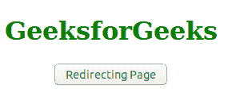
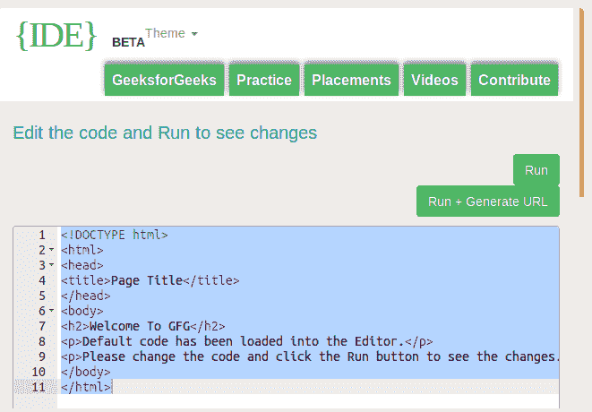

# ES6 |页面重定向

> 原文:[https://www.geeksforgeeks.org/es6-page-redirect/](https://www.geeksforgeeks.org/es6-page-redirect/)

**ES6 页面重定向**用于向用户和浏览器搜索引擎发送不同网站地址的请求，(搜索引擎和用户收到的网站地址与搜索引擎或用户请求的不同)。重定向到用户或搜索引擎没有请求的不同页面可以在同一服务器上，也可以在不同的服务器上。此外，它可以是一个不同的网站。
重定向到另一个没有被请求的页面是使用 JavaScript 最新版本的 ES6 完成的。有很多方法可以用来重定向到另一个页面，下面列出了所有方法的描述。记住一点，所有的方法都属于一个单窗口返回对象。

*   **location.replace()方法:**此方法将使用**将当前网站位置替换为重定向的网站位置。替换()**方法。
    **语法:**

    ```
    window.location.replace = "*Your redirected link"*
    ```

*   **位置.分配()方法:**该方法将使用**为重定向的网站位置分配一个新位置。**赋()法。
    **语法:**

    ```
    window.location.assign = "*Your redirected link"*
    ```

*   **location.reload()方法:**此方法将使用**重新加载当前文档。reload()** 方法。
    **语法:**

```
window.location.reload = "*Your redirected link"*
```

*   **window.navigate() Method:** This method can be used in Internet Explorer only all the other browsers remove this method. So it is good to be avoided because other browsers will not support this method. This method is similar to the **.location.assign()** method. This method assigns a new value that will be navigated by using the .navigate() method.
    **Syntax:**

    ```
    window.navigate  = "*Your redirected link"*
    ```

    以下示例将说明页面重定向的整个概念:
    **示例:**

    ```
    <!DOCTYPE html> 
    <html> 
    <head> 
        <title>
            ES6 | Page Redirect
        </title>

        <script> 
            function geeks() { 
                window.location = 
                    "https://ide.geeksforgeeks.org/tryit.php"; 
            } 
        </script> 
    </head> 

    <body style="text-align:center;">

        <h1 style="color:green;">
            GeeksforGeeks
        </h1>

        <input type = "button" 
            value = "Redirecting Page"
            onclick = "geeks()"> 
    </body> 
    </html>   
    ```

    **输出:**

    *   **点击按钮前:**
        
    *   **点击按钮后:**
        

    **注意:**在网页的头部添加 **rel = "canonical"** ，在使用页面重定向方式时通知搜索引擎。

    ```
    <link rel = "canonical" href = "Redirecting Page" />
    ```