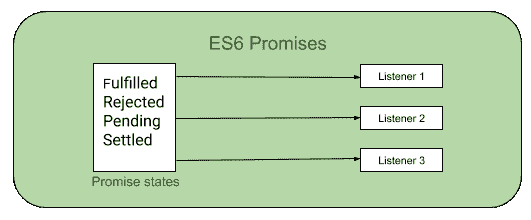

# ES6 |承诺

> 原文:[https://www.geeksforgeeks.org/es6-promises/](https://www.geeksforgeeks.org/es6-promises/)

承诺是用 JavaScript(ES6)实现异步编程的一种方式。承诺将成为未来价值的容器。就像如果你在任何一个网站上点了任何一种食物送到你的地方，那份订单记录就是承诺，食物就是承诺的价值。所以订单细节就是你点的食物的容器。让我们用另一个例子来解释一下。你在网上订购了一台很棒的相机。下订单后，您会收到订单收据。那张收据是一个承诺，你的订单将交付给你。收据是未来价值的占位符，即相机。

JavaScript 中用于异步编程的承诺。对于异步编程，JavaScript 使用了[回调](https://www.geeksforgeeks.org/javascript-callbacks/)但是使用回调有一个问题，那就是回调地狱或者末日金字塔。使用 ES6 Promise 将简单地避免所有与回调相关的问题。



**承诺的需求:**回调在处理基本情况时非常棒。但是在开发一个有大量代码的 web 应用程序时。回调会很麻烦。在复杂的情况下，每一次回调都会增加一层嵌套，这可能会使您的代码变得非常混乱和难以理解。回调的这种过度嵌套通常被称为**回调地狱**。

**示例:回调地狱**

```
f1(function(x){
    f2(x, function(y){
        f3(y, function(z){ 
            ...
        });
    });
}); 
```

为了处理这个问题，我们使用 Promises 代替回调。

**许下承诺:**当我们不确定分配的任务是否会完成时，承诺基本上就产生了。Promise 对象表示异步(异步)操作的最终完成(或失败)及其结果值。顾名思义，承诺要么被遵守，要么被违背。
承诺总是处于以下状态之一:

*   **履行:**与承诺相关的动作成功。
*   **拒绝:**与承诺相关的行动失败。
*   **待定:**承诺仍然待定，即尚未履行或拒绝。
*   **已结算:**承诺已履行或已拒绝

**语法:**

```
const promise = new Promise((resolve,reject) => {....}); 
```

**示例:**

```
const myPromise = new Promise((resolve, reject) => {
    if (Math.random() > 0) {
        resolve('Hello, I am positive number!');
    }
    reject(new Error('I failed some times'));
})
```

**对承诺的回调:**有两种类型的回调用于处理承诺**。然后是()**和**。catch()** 。它可以用于在履行(承诺被遵守)或拒绝(承诺被打破)的情况下处理承诺。

*   **.then():** Invoked when a promise is kept or broken. It can be chained to handle the fulfillment or rejection of a promise. It takes in two functions as parameters. The first one is invoked if the promise is fulfilled and the second one(optional) is invoked if the promise is rejected.

    **示例:**使用处理承诺拒绝。然后()

    ```
    var promise = new Promise(function(resolve, reject) { 
        resolve('Hello, I am a Promise!'); 
    }) 

    promise.then(function(promise_kept_message) {  
            console.log(promise_kept_message); 
                }, function(error) {     

            // This function is invoked this time
            // as the Promise is rejected.
            console.log(error);   }) 
    ```

*   **.catch()** can be used for handling the errors(if any). It takes only one function as a parameter which is used to handle the errors (if any).

    **示例:**使用处理承诺拒绝(或错误)。catch()

    ```
    const myPromise = new Promise((resolve, reject) => {
        if (Math.random()  > 0) {
            console.log('resolving the promise ...');
            resolve('Hello, Positive :)');
        }
        reject(new Error('No place for Negative here :('));
    });

    const Fulfilled = (fulfilledValue) => console.log(fulfilledValue);
    const Rejected = (error) => console.log(error);
    myPromise.then(Fulfilled, Rejected);

    myPromise.then((fulfilledValue) => {
        console.log(fulfilledValue);
    }}).catch(err => console.log(err));
    ```