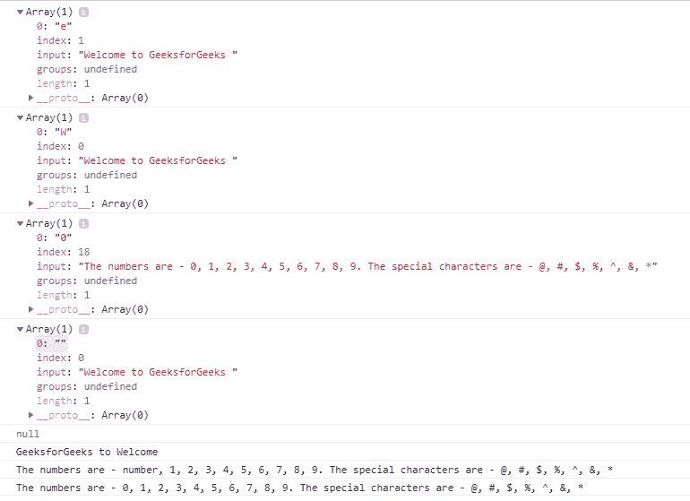

# 是 6 | RegEx

> 哎哎哎:# t0]https://www . geeksforgeeks . org/es 6-regex/

一个**正则表达式**是**正则表达式**的简称，它是定义一个模式的字符序列。正则表达式中的字符可以是字母、数字或特殊字符。通常，正则表达式用于在字符串中找到一个模式来替换、删除或修改它们。在 ES6 中，一个正则表达式可以由两种不同的符号来定义。

*   **文字符号:**该模式包含在斜线之间。它在编译时执行。所以，常量模式可以用文字符号表示。

    ```
     var regex = /pattern/
    ```

*   **构造函数:**模式在单引号内给出。它在运行时执行。因此，可以在构造函数中给出灵活的模式。

    ```
    var regex = new RegExp( pattern, optional arguments)
    ```

下面列出了提及模式的不同方式:

**括号的用法:**用于指图案中特定范围的字符。

| 带括号的图案 | 描述 |
| --- | --- |
| [模式] | 模式中的任何一个字符。 |
| [^pattern] | 任何一个不符合模式的字符。 |
| [0-9] | 0-9 之间的任何一个十进制数。 |
| [a-z] | 小写字母中的任何一个字符。 |
| [阿-兹] | 大写字母中的任何一个字符。 |

**量词的用法:**用于指定一个模式中字符出现的频率和位置。

| 量词 | 描述 |
| --- | --- |
| 模式+ | 匹配具有至少一个或多个模式的字符串。 |
| 模式* | 匹配零个或多个模式的字符串。 |
| 模式{n} | 将字符串与“n”个模式匹配。 |
| 模式{n1，n2} | 匹配模式范围从 n1 到 n2(包括 n1 和 N2)的字符串。 |
| 模式{n，} | 匹配具有最小“n”个模式的字符串。 |
| 模式$ | 匹配以模式作为结束序列的字符串。 |
| 模式 | 匹配以模式作为开始序列的字符串。 |

**文字字符的使用:**用于指定转义字符。

| 文字字符 | 描述 |
| --- | --- |
| \0 | 它表示一个空字符。 |
| \t | 它表示制表符空间。 |
| \n | 它表示一个换行符。 |
| \r | 它表示回车。 |

**元字符的使用:**仅用于指定字符的类型。

| 元字符 | 描述 |
| --- | --- |
| \s | 它表示空白或空白。 |
| \S | 它表示非空白或无空格字符。 |
| \d | 它表示十进制数字字符。 |
| \D | 它表示一个非数字字符。 |
| \w | 它表示一个单词字符(任何字符序列)。 |
| \W | 它表示非单词字符。 |

**示例:**

```
<script>
    var text1 = "Welcome to GeeksforGeeks ";

    var text2 = "The numbers are - 0, 1, 2, "
              + "3, 4, 5, 6, 7, 8, 9\. The "
              + "special characters are - @,"
              + " #, $, %, ^, &, *";

    // RegExp.match() and RegExp.replace()
    // have been used in the following
    // examples

    // Bracket notations
    // 1
    var regexp = new RegExp('[geeks]');
    console.log(text1.match(regexp));

    // 2
    var regexp = new RegExp('[^geeks]');
    console.log(text1.match(regexp));

    // 3
    var regexp = new RegExp('[0-9]');
    console.log(text2.match(regexp));

    // Quantifiers
    // 4
    var regexp = new RegExp('[geeks]*');
    console.log(text1.match(regexp));

    // 5
    var regexp = new RegExp('s{2}');
    console.log(text1.match(regexp));

    // Literal characters and meta characters
    // 6
    var regexp1 = /(\w+)\s(\w+)\s(\w+)/
    let newtext = text1.replace(regexp1, '$3 $2 $1');
    console.log(newtext);

    // 7
    var regexp1 = /(\d+)/;
    let newtext1 = text2.replace(regexp1, 'number');
    console.log(newtext1);

    // 8
    var regexp2 = /(\s+)/;
    console.log(text2.replace(regexp2, '\t'));
</script>
```

**输出:**


**注意:**RexExp 本身没有方法和属性。但是它继承了原型的一些功能和属性。