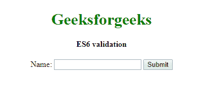
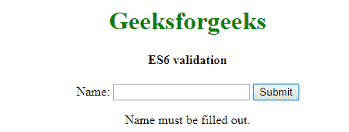
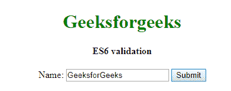
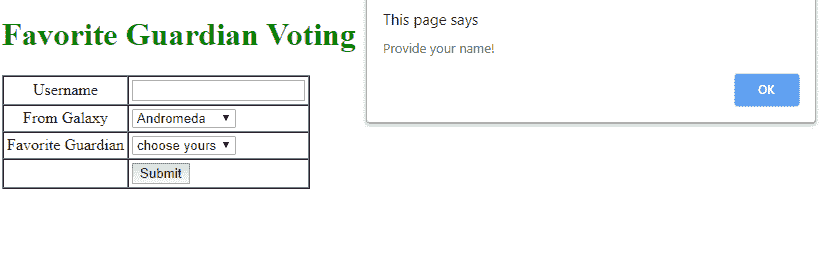
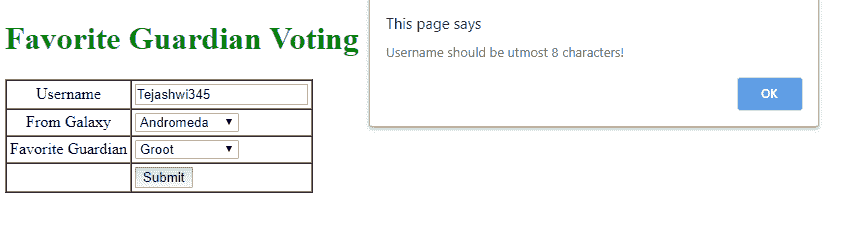
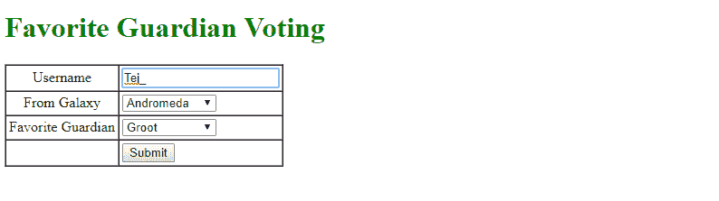

# 是 6 |验证

> 哎哎哎:# t0]https://www . geeksforgeeks . org/es 6-validation/

ES6 JavaScript 带来了用户输入的验证。验证是根据需求检查前端用户给出的信息是否正确的过程，一般来说，检查过程是在服务器端完成的，并将验证信息发送给前端用户，这不仅浪费了执行时间，也浪费了用户时间。JavaScript 提供了一种在发送到服务器端之前在前端验证表单数据的方法。表单验证通常执行两种类型的验证。

*   **基础验证:**是检查所有必填字段数据是否填写完毕的过程。
*   **数据格式验证:**是检查给定数据正确性的过程，例如给定的 Pincode 是否包含 6 位数字，或者 Gmail 是否包含@等。

**语法:**

```
<script>
function function(){
//validation code
}
</script>

<form action="redirect page" name="name of form" onsubmit="return function()">
<!--form-->
</form>
```

**参数:**设计表单时需要三个参数才能从用户那里获得任何信息。

*   **action=“重定向页面”:**给定信息准确时重定向到下一页。
*   **onsubmit =“return function()”:**调用验证函数，点击提交按钮时，**“return function()”**当 function()返回 true 时，将执行重定向到 action，如果为 false 则再次重定向执行，以循环方式提交。
*   **name= "表单名称":**借助 **name** 我们从表单中访问值。

**示例:**

## java 描述语言

```
<!DOCTYPE html>
<html>

<head>
    <title>Basic Validation</title>
    <script>
        function validateBasic() {
            var x = document.Basic.name.value;
            if (x == "") {
                document.getElementById("d1").innerHTML =
                  "Name must be filled out.";
                return false;
              //(optional)by default functions return is true
                return true;
            }
        }
    </script>
</head>

<body>
    <center>
        <h1 style="color:green;">Geeksforgeeks</h1>
        <h4>ES6 validation</h4>
        <!-- action store in local storage -->
        <form name="Basic" action="#"
              onsubmit="return validateBasic()">
            Name:
            <input type="text" name="name">
            <input type="submit" value="Submit">
        </form>
        <p id="d1"></p>

    </center>
</body>

</html>
```

**输出:**

*   不填写提交将打印要填写的信息:





*   带填充提交将打印件提交:




**数据格式验证**:是一个检查所有必填字段是否都填好的过程，根据要求没有。

**示例:**

## java 描述语言

```
<!DOCTYPE html>
<html>

<head>
    <title>Form Validation</title>
    <script>
        function validateData() {
            //Basic check whether the username is filled or not.
            if (document.Form.name.value == "") {
                alert("Provide your name!");
                document.Form.name.focus();
                return false;
            }
            //checks whether the username is less than or
            //equal to 8 characters or not
            if (document.Form.name.value.length > 8) {
                alert("Username should be utmost 8 characters!");
                document.Form.name.focus();
                return false;
            }
            //Checks whether the dropdown is selected or not.
            if (document.Form.Galaxy.value == "-1") {
                alert("Provide your Galaxy!");
                return false;
            }
            //Checks whether the dropdown is selected or not.
            if (document.Form.Guardian.value == "-1") {
                alert("Provide your Favorite Guardian!");
                return false;
            }
        }
    </script>
</head>

<body>
    <center>
        <h1 style="color:green">Favorite Guardian Voting</h1>
        <form action="#" name="Form"
              onsubmit="return validateData()">
            <table cellspacing="0" cellpadding="3" border="1">
                <tr>
                    <td align="center">Username</td>
                    <td>
                        <input type="text" name="name" />
                    </td>
                </tr>
                <tr>
                    <td align="center">From Galaxy</td>
                    <td>
                        <select name="Galaxy">
                            <option value="-1" selected>choose yours</option>
                            <option value="1">Milky Way</option>
                            <option value="2">Andromeda</option>
                            <option value="3">Whirlpool</option>
                        </select>
                    </td>
                </tr>
                <tr>
                    <td align="center">Favorite Guardian</td>
                    <td>
                        <select name="Guardian">
                            <option value="-1" selected>choose yours</option>
                            <option value="1">Quill</option>
                            <option value="2">Groot</option>
                            <option value="3">Rocket</option>
                            <option value="4">Drax</option>
                            <option value="5">Gamora</option>
                        </select>
                    </td>
                </tr>
                <tr>
                    <td align="right"></td>
                    <td>
                        <input type="submit" value="Submit" />
                    </td>
                </tr>
            </table>
        </form>
    </center>
</body>

</html>
```

**输出:**

*   用户名和喜爱的监护人未填写，因为根据验证脚本，用户名首先被触发，用户名警报首先被提醒:



*   由于用户名和监护人已填写，但用户名的数据格式验证不正确，因为用户名应小于或等于 8 个字符。



*   检查并填写用户名，使其少于 8 个字符。由于都是有效的，提交。




**提交中的 HTML . HTML:**

## java 描述语言

```
<!DOCTYPE html>
  <html>
    <body>
     <h2 style="color:red">Submitted.</h2>
    </body>
  </html>
```

**action =“C:\ Users \ Teju \ Desktop \ submit . html”**:它是本地系统上本地 HTML 页面的一个路径，当所有必填字段按要求填写完毕后，该操作重定向到给定的页面或服务器，并从那里开始执行。路径变成了关于服务器端的操作，或者我们接下来想要用表单细节转发的任何东西。