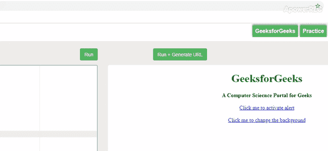
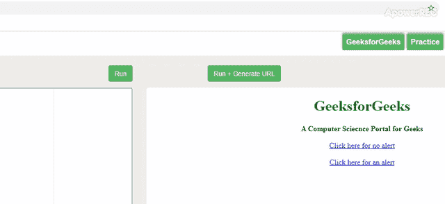

# 是 6 | Void 关键字

> 原文:[https://www.geeksforgeeks.org/es6-void-keyword/](https://www.geeksforgeeks.org/es6-void-keyword/)

JavaScript ES6 中的 **void** 关键字用于计算表达式，它不返回值。它是一元运算符，采用单个操作数。我们通常在超链接中使用它。有时，我们可能需要从链接中调用一些 JavaScript。当我们点击一个链接时，浏览器会加载一个新页面或者刷新同一个页面。但是我们不希望这种情况发生，如果一些 JavaScript 被附加到那个链接上，并且当我们必须调用另一个函数时 **void 操作符**是有用的，这可能会导致页面刷新。

**语法:**

```
void (expression)
void expression
```

以下示例说明了 ES6 JavaScript 中的 void 关键字:
**示例 1:**

```
<!DOCTYPE html>
<html>
    <head>
        <title>ES6 void keyword Example</title>
        <style>
            body{
               text-align: center; 
            }
            h1 { color: green;
            }
        </style>
    </head>
    <body>

        <h1>GeeksforGeeks</h1>
        <b>A Computer Sciecnce Portal for Geeks</b>
        <br><br>
        <a href="javascript:void(func());">
         Click me to activate alert
        </a>
        <br><br>
        <a href=
"javascript:void(document.body.style.backgroundColor='#F08080');">
         Click me to change the background
        </a>
            <script>
            var func = function() {
                alert("HI!!!");
            };
        </script>
    </body>

</html>
```

**输出:**


**例 2:**

```
<!DOCTYPE html>
<html>
    <head>
        <title>ES6 void keyword Example</title>
        <style>
            body{
               text-align: center; 
            }
            h1 { color: green;
            }
        </style>
    </head>
    <body>

        <h1>GeeksforGeeks</h1>
        <b>A Computer Sciecnce Portal for Geeks</b>
        <br><br>
        <a href = 
"javascript:void(javascript:alert('A Computer Sciecne Portal'))"> 
         Click here for no alert 
        </a> 
        <br><br>
        <a href = 
"javascript:alert('GeeksforGeeks');">
            Click here for an alert
        </a>
    </body>
</html>            
```

**输出:**
