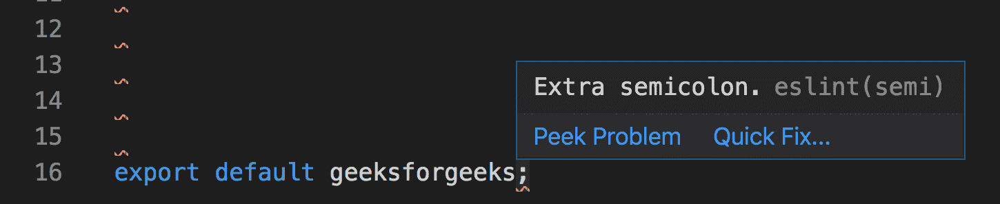
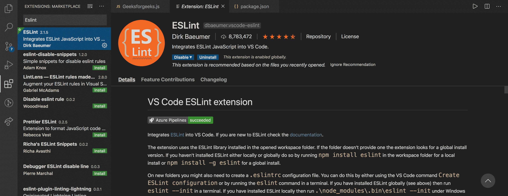

# ESL-可插拔 JavaScript lint

> 哎哎哎:# t0]https://www . geeksforgeeks . org/ESL int 可插入 JavaScript-linter/

在进入 ESlint 之前，你应该先了解一下林挺。这是检查代码是否有错误的过程。Linter 是一个自动化工具，它运行在一段静态代码上，以发现由于格式或不良编码实践而产生的任何差异。在源代码上运行林挺工具有助于提高代码的质量和可读性。

**ESLint:** 是一款 JavaScript 林挺工具，用于自动检测 ECMAScript/JavaScript 代码中发现的不正确模式。使用它的目的是提高代码质量，使代码更加一致，并避免错误。ESLint 是使用 Node.js 编写的，通过 npm 提供快速的运行时环境和方便的安装。
ESLint 中的“ES”代表“EcmaScript”，它是为了规范 Javascript 而创建的。

**先决条件:**在安装或开始在 ESLint 上工作之前，我们必须确保我们的系统中几乎没有可用的东西。

*   任何文本编辑器(例如 VS 代码、Atom 等)。)
*   安装在系统中的 node.js
    1.  [在 Windows 上安装 node . js](https://www.geeksforgeeks.org/installation-of-node-js-on-windows/)
    2.  [在 Linux 上安装 node . js](https://www.geeksforgeeks.org/installation-of-node-js-on-linux/)

**安装:**

*   我们可以使用 npm(节点包管理器)安装 **ESLint** 。

    ```
    npm install -g eslint
    ```

*   我们可以通过下面的命令设置一个配置文件。

    ```
    eslint --init
    ```

*   我们可以通过下面的命令在任何文件或目录上运行 ESLint。

    ```
    eslint yourfile.js
    ```

**使用 ESLint 的优势:**

*   **静态分析器:** ESLint 可以很容易地集成到大多数文本编辑器中，比如(VS Code，Sublime)。ESLint 允许开发人员发现他们的 JavaScript 代码的问题，甚至不用执行它。它可以快速分析静态代码，也可以作为集成管道的一部分进行集成。
*   **可定制:** ESLint 可以轻松定制，以满足开发人员的需求。创建 ESLint 的主要原因是允许开发者创建他们自己的林挺规则。一个人可以编写自己的规则，与 ESLint 的内置规则一起工作。
*   **自动修复:** ESLint 不仅能识别问题，还能自动修复问题。ESLint 的固定功能非常棒，可以根据 ESLint 的配置自动格式化/修复大部分代码。我们可以及时发现错误。

**配置规则:****ESLint**自带大量规则。我们可以通过使用配置命令或配置文件来修改项目中的那些规则。要更改任何规则的设置，我们必须将规则标识设置为以下值之一:

*   **“关闭”或 0:** 关闭规则。
*   **“警告”或 1:** 打开规则作为警告(不影响退出代码)。
*   **“错误”或 2:** 作为错误打开规则(触发时退出代码为 1)。

**在 VSCode 中设置 ESLint 的步骤:**

*   **步骤 1:** 创建一个 Javascript/React 项目
*   **步骤 2:** 在 VS 代码编辑器中安装 eslint 作为扩展。
*   **步骤 3:** 通过运行以下命令，在全局范围内安装 ESLint。

    ```
    npm install -g eslint
    ```

*   **步骤 4:** 在项目运行中初始化 eslint，命令如下

    ```
    eslint --init
    ```

*   **步骤 5:** 通过设置规则修改项目中的 eslint 配置文件。

**ESLint 规则:**
