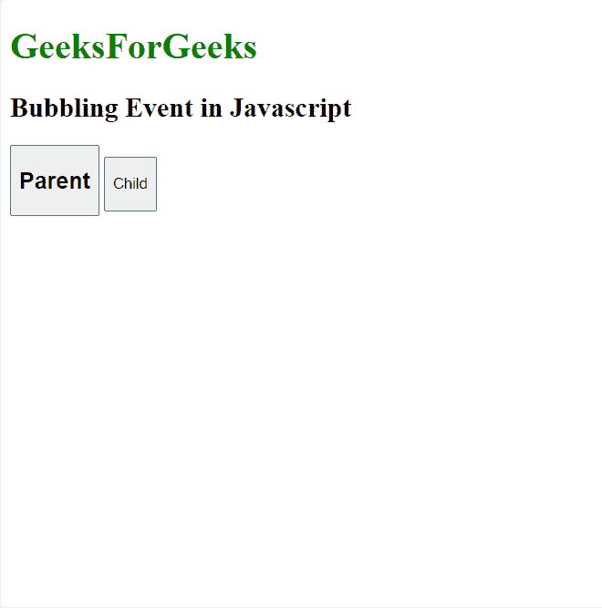
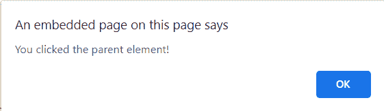
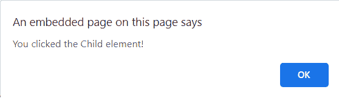
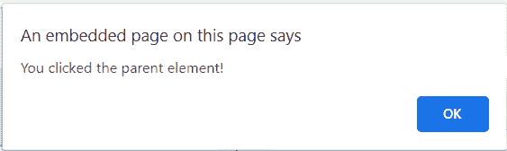

# JavaScript 中的事件冒泡

> 原文:[https://www.geeksforgeeks.org/event-bubbling-in-javascript/](https://www.geeksforgeeks.org/event-bubbling-in-javascript/)

**事件冒泡**是 HTML DOM API 中的一种事件传播方法，当一个事件在另一个元素内部的一个元素中，并且两个元素都注册了该事件的句柄。这是一个从触发事件的元素开始，然后向上冒泡到层次结构中的包含元素的过程。在事件冒泡中，事件首先由最里面的元素捕获和处理，然后传播到外部元素。

**语法:**

```
addEventListener(type, listener, useCapture)
```

*   **类型**:用于指事件的类型。
*   **监听器**:当指定类型的事件发生时，我们要调用的函数。
*   **用户捕捉**:布尔值。布尔值表示事件阶段。默认情况下，使用捕获为假。这意味着它正处于冒泡阶段。

**示例 1:** 这个示例展示了 JavaScript 中事件冒泡的工作方式。

## 超文本标记语言

```
<!DOCTYPE html>
<html>

<head>
    <title>
        Bubbling Event in Javascript
    </title>
</head>

<body>

    <h2>Bubbling Event in Javascript</h2>

    <div id="parent">
      <button>
          <h2>Parent</h2>
      </button>
      <button id="child">

<p>Child</p>

      </button>
    </div><br>

    <script>
        document.getElementById(
"child").addEventListener("click", function () {
            alert("You clicked the Child element!");
        }, false);

        document.getElementById(
"parent").addEventListener("click", function () {
            alert("You clicked the parent element!");
        }, false);
    </script>

</body>

</html>
```

**输出:**



输出

**点击父按钮后:**



点击父按钮后

**点击子按钮后:**



点击子按钮后



点击子按钮后

从上面的例子中我们了解到，在冒泡中，首先处理最里面的元素的事件，然后处理最外面的:首先处理

元素的点击事件，然后处理

元素的点击事件。