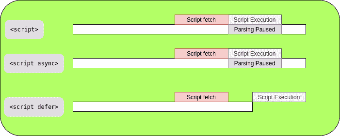

# 解释异步与延迟 JavaScript

> 原文:[https://www . geesforgeks . org/explain-asynchronous-vs-delivered-JavaScript/](https://www.geeksforgeeks.org/explain-asynchronous-vs-deferred-javascript/)

通常，当我们使用脚本标签加载任何 JavaScript 代码时，浏览器在遇到脚本标签时会暂停 HTML 解析，并首先开始下载 JavaScript 文件。在浏览器下载并执行完脚本之前，不会执行 HTML 元素脚本标记。浏览器等待脚本被下载、执行，然后处理页面的其余部分。

在现代浏览器中，脚本往往比 HTML 文件大，因此它们的下载量大，处理时间也更长。这增加了页面的加载时间，并限制用户浏览网站。为了解决这个问题，异步和延迟属性开始发挥作用。

**语法:**一个正常的脚本包含在页面中的方式如下。

```
<script src = "script.js"></script>
```

当 HTML 解析器找到这个元素时，会向服务器发送一个请求来获取脚本。

**异步:**当我们使用 async 属性时，脚本与页面的其余部分异步下载，而不需要暂停 HTML 解析，页面的内容被处理和显示。一旦脚本被下载，HTML 解析将被暂停，脚本的执行将会发生。一旦执行完成，HTML 解析将继续。页面和其他脚本不等待异步脚本，异步脚本也不等待它们。它非常适合独立脚本和外部脚本。

*   **语法:**

    ```
    <script async src = "script.js"></script>
    ```

**delay:**delay 属性告诉浏览器不要干扰 HTML 解析，只有在 HTML 文档被完全解析后才执行脚本文件。每当遇到具有此属性的脚本时，脚本的下载在后台异步开始，当脚本被下载时，它仅在完成 HTML 解析后执行。

*   **语法:**

    ```
    <script defer src = "script.js"></script>
    ```



**异步 vs 延迟:**

| 异步的 | 延期的 |
| 异步阻止页面的解析。 | 延迟从不阻塞页面。 |
| 异步脚本不会相互等待。因此，如果较小的脚本排在第二位，它将在前一个较长的脚本之前加载。 | 延迟脚本保持它们的相对顺序，这意味着第一个脚本将首先被加载，而它下面的所有其他脚本将不得不等待。 |
| 脚本的执行从暂停解析开始。 | 然而，脚本的执行只有在解析完全完成之后，但在文档的 DOMContentLoadedevent 之前才开始。 |