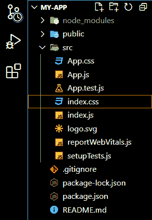

# 解释 JSX 的基本代码片段

> 原文:[https://www . geesforgeks . org/explain-basic-code-snippet-of-jsx/](https://www.geeksforgeeks.org/explain-basic-code-snippet-of-jsx/)

在本文中，我们将学习 react JSX 的基本代码片段。JSX 这个词的完整形式是 JavaScript-XML。这是 JavaScript 语言语法的扩展。JSX 允许我们将 HTML 代码片段直接实现到 React 中，只需对语法进行很少的修改。

**JSX 的意义:**在语法方面，react 中不强制写 JSX 代码。但是内置文件结构由编写简单 JSX 代码的组件组成。开发人员发现它很有用，因为 JSX 代码在 JavaScript 项目中使用用户界面时会显示更多有用的错误和警告消息。与使用“ **React.createElement()和 React.appendChild()** 方法创建的模板相比，JSX 代码看起来更简洁，更容易调试。

现在我们将在 react 应用程序中创建一个 JSX 组件，请看组件的详细解释。

**JSX 代码片段的解释:**现在我们要学习 JSX 代码片段的基本属性。

*   **插入多行 HTML 代码:**在 JSX 元素中插入 HTML 代码时，如果 HTML 代码是多行的，则将 HTML 代码放在括号内。在下面的示例中，您可以清楚地看到“jsxElement”中的 HTML 代码用括号括起来。
*   **一个顶级元素:**如果在 HTML 代码片段中有多个元素，那么它们必须用一个父元素包装。在我们的例子中，我们已经用< div >元素包装了我们的< h1 >和< p >元素。
*   **class name’属性替换‘class’:**HTML 的常规‘class’属性类似于 JavaScript 的‘class’关键字。因此为了避免任何冲突，HTML 的“类”属性被重命名为“类名”。“类名”属性取代了“类”属性，并执行与“类”属性相同的工作。
*   **元素必须关闭:**写 HTML 的时候不需要关闭所有的标签，至少有些标签没有关闭系统不会抛出任何错误。但是在 JSX 的例子中，你不能不关闭所有的标签就离开一个元素。它会抛出一个错误。

**示例:**

**创建反应应用程序:**

**步骤 1:** 使用以下命令创建一个反应应用程序:

```
npx create-react-app name_of_the_app
```

**步骤 2:** 创建 react 应用程序后，使用以下命令根据您的应用程序名称移动到目录:

```
cd name_of_the_app
```

**项目结构:**如下图。



**创建 JSX 元素:**现在我们要在 App.js 文件的 App 组件中创建一个 JSX 元素。下面讨论这些步骤。

*   清除 App.js 文件的 App 组件中的所有内容。
*   在应用程序组件内创建一个名为“jsxElement”的新变量。
*   将“jsxElement”变量的值设置为要显示的 HTML 代码片段。如果代码片段是多行的，请确保 HTML 代码片段在括号内。
*   从应用程序组件返回“jsxElement”变量。
*   “jsxElement”变量是一个基本 JSX 元素的例子。JSX 元素中的 HTML 是“JSX 的基本代码片段”的例子。

**App.js 文件**

## java 描述语言

```
// The App.js file
import './App.css';

function App() {

  let jsxElement=(
    <div className="App">
      <h1 className="heading">Welcome To GeeksforGeeks</h1>
      <p>Hello World</p>
    </div>
  );
  return jsxElement;
}

export default App;
```

**App.css 文件:**app . CSS 文件在顶部导入。反应项目结构是默认的“App.css”文件。创建 JSX 元素后，我们对其进行了修改，并在其中添加了我们自己的风格。

## 半铸钢ˌ钢性铸铁(Cast Semi-Steel)

```
/* App.css File */
.App {
    margin-left: 100px;
}

.heading {
    color: #308d46;
}
```

**运行应用程序的步骤:**打开终端，键入以下命令。

npm 启动

**输出:**

