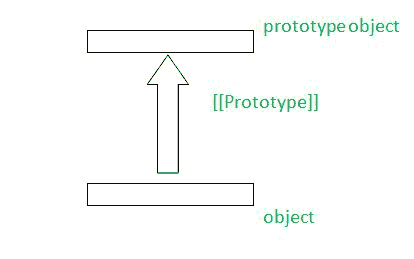
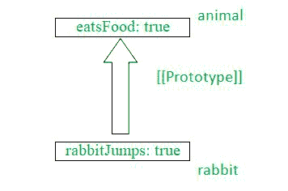

# 用 JavaScript 解释原型继承

> 原文:[https://www . geesforgeks . org/explain-prototype-inheritation-in-JavaScript/](https://www.geeksforgeeks.org/explain-prototype-inheritance-in-javascript/)

在本文中，我们将借助几个方法示例，尝试理解有效理解 JavaScript 中原型继承的确切含义或实际含义所需的事实。

让我们了解 JavaScript 中原型继承背后的基础知识。



**JavaScript 中的原型继承:**下面的要点将尝试分析 JavaScript 中原型继承背后的基础-

*   在经典的继承现象下，我们创建了一个新的类，它实际上扩展或重用了另一个类的属性或函数，或者被几种编程语言(如 C、C++、Java 等)使用的方法。)
*   JavaScript 没有使用经典继承，而是使用了被称为原型继承的现象。
*   在原型继承中，一个对象通过原型链接使用另一个对象的属性或方法。
*   所有的 JavaScript 对象都从一个原型继承属性和方法(像 Date 对象从 Date.prototype 继承属性等等)。

遵循图示，包含一些样本值将有助于我们更好、更有效地理解原型继承



*   在上面的图示中，我们举了一个例子来说明兔子和另一个动物原型之间的原型继承。
*   我们将兔子的原型对象设置为动物原型对象，其中我们将存储兔子的所有值，以便在缺少兔子属性的情况下，JavaScript 将自动从动物原型对象中获取它。

现在您已经理解了原型继承的简要详细描述，让我们通过以下几种方法来查看和理解原型继承

**方法 1:**

*   在这种方法中，我们将使用 **__proto__** ，这是名为 **[【原型】]** 的内部隐藏原型的特殊名称。
*   我们将把兔子的所有属性存储在动物原型对象中，此后我们可以随时访问它。
*   这个 __proto__ 有点老了，也是一个过时的方法，因为一些与 JavaScript 相关的历史原因而存在。

**示例:**

## java 描述语言

```
<script>
    let animal = {
        animalEats: true,
    };

    let rabbit = {
        rabbitJumps: true,
    };

    // Sets rabbit.[[Prototype]] = animal
    rabbit.__proto__ = animal;
    console.log(rabbit.animalEats);
    console.log(rabbit.rabbitJumps);
</script>
```

**输出:**

```
true
true
```

**方法 2:**

*   在这种方法中，我们将使用新的 JavaScript 方法来实现 JavaScript 原型继承。
*   这里我们将使用**object . set rototypeof()**方法获取两个参数，第一个是要设置原型的对象，第二个是对象的新原型。
*   此后，我们已经声明了两个对象，并使用这两个对象，我们将其中一个对象设置为另一个对象的原型对象。

## java 描述语言

```
<script>
    let rabbit = {
        rabbitJumps: true,
    };
    let animal = {
        animalEats: true,
    };
    Object.setPrototypeOf(rabbit, animal);
    console.log(rabbit.animalEats);
    console.log(rabbit.rabbitJumps);
</script>
```

**输出:**

```
true
true
```