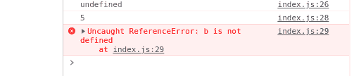

# 解释 JavaScript 中未定义和未定义的区别

> 原文:[https://www . geesforgeks . org/解释 javascript 中未定义和未定义的区别/](https://www.geeksforgeeks.org/explain-the-difference-between-undefined-and-not-defined-in-javascript/)

在 JavaScript 中，它们都与内存空间有关，它们之间有一个非常简单的区别。如果正在被访问的变量名在内存空间中不存在，那么它就不会被定义，如果存在于内存空间中，但是直到现在还没有被赋予任何值，那么它就不会被定义。

**undefined:** 是一个有特殊含义的 JavaScript 关键字。在我们给内存空间赋值之前，任何在内存中获得空间的东西都会包含未定义的内容。

让我们了解 JavaScript 代码是如何执行的，以便看到更清晰的画面。JavaScript 中的一切都发生在执行上下文中。执行上下文是一个独立的小部分，代码在这里执行，变量获得它们的内存空间。
JavaScript 代码正在[两阶段](https://www.geeksforgeeks.org/javascript-code-execution/)中执行，

1.  第一个是内存分配阶段，在此期间，所有变量和函数定义都存储在内存堆中。在这个阶段，JavaScript 给每个变量分配未定义的值。
2.  第二个是执行阶段的一个线程，在此期间，JavaScript 文件中编写的代码被执行。
    每个变量都保持值*未定义*，直到程序到达我们指定该变量的行。在那一行之后，变量的未定义值被原始值替换。

**示例 1:** 将创建全局执行上下文，在内存分配阶段， **var a** 将获得内存空间，JavaScript 将为其分配 *undefined* 。在执行的线程中，JavaScript 会遇到第一行 *console.log(a)* ，由于我们没有给 **a 赋值，** *undefined* 会打印在控制台上。在下一行中，我们给 a 分配了 5，因此变量 a 不再是*未定义的*。现在它包含值 5。所以下次每当我们访问变量 **a 时，**不会被评估为*未定义。*所以它会打印 a 的实际值。

## 超文本标记语言

```
<script>
  console.log(a);
  var a = 5;
  console.log(a);
</script>
```

**输出(控制台中):**

```
undefined
5
```

**附加点:**

1.  如果你正在给一个变量分配一个函数调用，而这个函数没有返回任何东西，那么这个变量将变成*未定义的*。
2.  您可以将*未定义的*显式分配给任何变量，但以不期望的方式使用语言关键字并不是一种好的做法。

**未定义:**在 JavaScript 中，当有人访问不在内存堆内的变量时，是 JavaScript 会抛出的引用错误之一。

**示例 2:** 首先，将创建全局执行上下文，在内存分配阶段，变量“a”将获得内存空间，默认情况下，JavaScript 将 undefined 赋给“a”**。**在执行线程中，“控制台日志(a)”将被打印为*未定义。*在下一行，我们已经给变量 a 分配了 5，在控制台中，将打印 5。在最后一行，当 JavaScript 遇到“console.log(b)”时，它在执行上下文的内存堆中搜索“b”但不可用，JS 引擎会抛出“T6”引用错误，并显示“b 未定义**”的消息。**JavaScript 遇到引用错误会停止执行。

## 超文本标记语言

```
<script>
  console.log(a);
  var a = 5;
  console.log(a);
  console.log(b);
</script>
```

**输出:**



**未定义和未定义的区别**

<figure class="table">

| undefined | undefined |
| --- | --- |
| It works like we declare a variable in the code, but there is no assignment before printing the value of the variable. | It works like we didn't declare the variable and tried to call it. |

</figure>