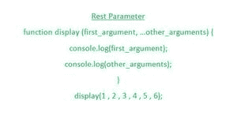

# 解释 ES6

中的 Rest 参数

> 原文:[https://www . geesforgeks . org/explain-the-rest-parameter-in-es6/](https://www.geeksforgeeks.org/explain-the-rest-parameter-in-es6/)

在本文中，我们将尝试理解 ES6 中与 rest 参数相关的细节，包括 rest 参数的语法，如何借助某些示例来使用它。

让我们首先了解与 Rest 参数相关的基本细节。



**静止参数:**

*   Rest 参数允许我们处理更多数量的输入，这些输入以一种更有效和更简单的方式在函数内部传递。
*   rest 参数允许我们将数量不定的值视为数组的值，这意味着使用 rest 参数语法传递的值被视为数组元素或数组值。
*   在我们的代码中使用 rest 参数使我们的代码更易读、更干净。

**语法:**下面是在我们的代码中使用 rest 参数的语法-

```
function function_name (...arguments) {
    // Code logic.........
}
```

通过使用上面举例说明的语法，我们可以很容易地在一个函数中传递几个参数，这进一步帮助任何用户使代码更加易读和清晰。

现在，在了解了关于 rest 参数的基本细节之后，让我们看一些例子，看看如何有效地使用这个 rest 操作符。

**示例 1:** 在本例中，我们将使用一种简单的方法编写函数，进一步添加 rest 参数，并在调用函数本身的同时将函数内部的一些参数作为参数传递。

## java 描述语言

```
<script>
    function display(first_argument, ...other_arguments) {
        console.log(first_argument);
        console.log(other_arguments);
    }

    display(1, 2, 3, 4, 5, 6);
</script>
```

**输出:**以上片段的输出如下-

```
1
[ 2, 3, 4, 5, 6 ]
```

**示例 2:** 在本例中，我们将计算用户在调用时在函数内部作为参数传递的所有数字的总和。

## java 描述语言

```
<script>
    function sum(...numbers) {
        let sum = 0;
        for (let element of numbers) {
            sum += element;
        }
        console.log(sum);
    }

    sum(1, 5, 5, 3, 6);
    sum(1, 2, 3, 4);
    sum(0, 1, 2);
</script>
```

**输出:**上述代码片段的输出如下所示-

```
20
10
3
```

**示例 3:** 在本例中，我们将对用户在函数调用时提供的所有参数进行排序。

## java 描述语言

```
<script>
    function sortNumbers(...numbers) {
        let sortedResult = numbers.sort();
        return sortedResult;
    }

    console.log(sortNumbers(1, 2, 3, 4, 0));
    console.log(sortNumbers(5, 2, 9, 7));
</script>
```

**输出:**上述代码片段的输出如下所示-

```
[ 0, 1, 2, 3, 4 ]
[ 2, 5, 7, 9 ]
```