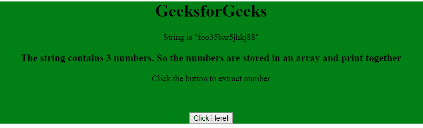
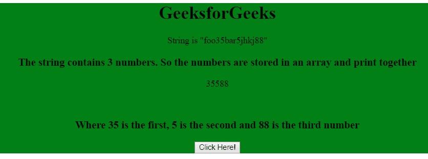

# 使用 JavaScript 从字符串中提取一个数字

> 原文:[https://www . geesforgeks . org/extract-a-number-from-a-string-use-JavaScript/](https://www.geeksforgeeks.org/extract-a-number-from-a-string-using-javascript/)

javascript 字符串中的数字可以通过 match 方法提取到数字数组中。该函数将正则表达式作为参数，并从字符串中提取数字。用于提取数字的正则表达式是(/(\d+)/)。

**示例 1:** 本示例使用 match()函数从字符串中提取数字。

```
<!DOCTYPE html>
<html>
<head>
    <title>
        Extract number from string
    </title>
</head>

<body >
    <div align="center" style="background-color: green;">

        <h1>GeeksforGeeks</h1>

        <p>String is "jhkj7682834"</p>

        <p id="GFG"> 
            Click the button to extract number
        </p>

        <input type="button" value="click " onclick="myGeeks()">
    </div>

    <script>
        function myGeeks() {
            var str = "jhkj7682834";
            var matches = str.match(/(\d+)/);

            if (matches) {
                document.getElementById('GFG').innerHTML
                        = matches[0];
            }
        }
    </script>
</body>
</html>                                
```

**输出:**

*   **点击按钮前:**
    
*   **点击按钮后:**
    

**示例 2:** 本示例使用 match()函数从字符串中提取数字。

```
<!DOCTYPE html>
<html>
<head>
    <title>
        Extract number from string
    </title>
</head>

<body>
    <div align="center" style="background-color: green;">

        <h1>GeeksforGeeks</h1>

        <p>String is "foo35bar5jhkj88"</p>

        <h3>
            The string contains 3 numbers. So the numbers
            are stored in an array and print together
        </h3>

        <p id="GFG">
            Click the button to extract number
        </p><br>

        <h3 id="Geeks"></h3>

        <input type="button" value="Click Here!" onclick="myGeeks()">
    </div>

    <script>
        function myGeeks() {
            var str = "foo35bar5jhkj88";
            matches = str.match(/\d+/g);
            var i=0

            document.getElementById('GFG').innerHTML
                = matches[0] + matches[1] + matches[2];

            document.getElementById("Geeks").innerHTML
                = "Where 35 is the first, 5 is the second"
                + " and 88 is the third number"
    }
    </script>
</body>
</html>                    
```

**输出:**

*   **点击按钮前:**
    
*   **点击按钮后:**
    

JavaScript 最出名的是网页开发，但它也用于各种非浏览器环境。您可以通过以下 [JavaScript 教程](https://www.geeksforgeeks.org/javascript-tutorial/)和 [JavaScript 示例](https://www.geeksforgeeks.org/javascript-examples/)从头开始学习 JavaScript。