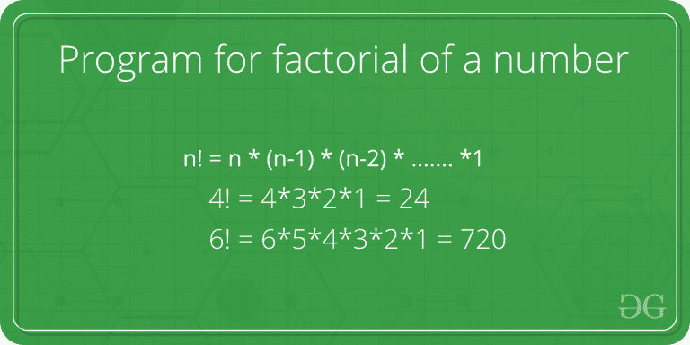
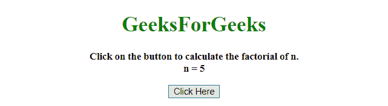
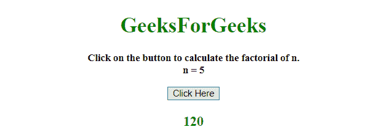
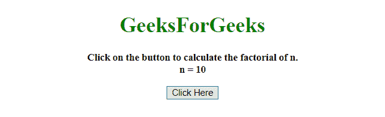
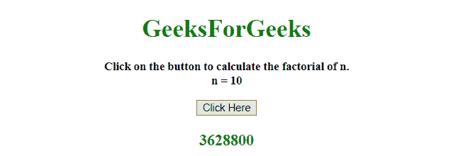

# 用 JavaScript 对一个数进行阶乘

> 原文:[https://www . geesforgeks . org/factorial-of-a-number-use-JavaScript/](https://www.geeksforgeeks.org/factorial-of-a-number-using-javascript/)

给定一个正整数 n，任务是在 javaScript 的帮助下找到这个数的阶乘。


**示例:**

```
Input : 4
Output : 24

Input : 5
Output : 120

```

**方法 1:迭代方法**在这种方法中，我们使用 for 循环来迭代数字序列并获得阶乘。

**示例:**

```
<!DOCTYPE HTML> 
<html> 

<head> 
    <title> 
        Factorial of a number using JavaScript
    </title>
</head> 

<body style = "text-align:center;"> 

    <h1 style = "color:green;" > 
        GeeksForGeeks 
    </h1>

    <p id = "GFG_UP" style =
        "font-size: 15px; font-weight: bold;">
    </p>

    <button onclick = "GFG_Fun()">
        Click Here
    </button>

    <p id = "GFG_DOWN" style =
        "color:green; font-size: 20px; font-weight: bold;">
    </p>

    <script>
        var up = document.getElementById('GFG_UP'); 
        var down = document.getElementById('GFG_DOWN'); 
        var n = 5;

        up.innerHTML = "Click on the button to calculate"
                + " the factorial of n.<br>n = " + n;

        function Factorial(n) {
            var ans=1;

            for (var i = 2; i <= n; i++)
                ans = ans * i;
            return ans;
        }

        function GFG_Fun() { 
            down.innerHTML = Factorial(n);
        } 
    </script> 
</body> 

</html>
```

**输出:**

*   **点击按钮前:**
    
*   **点击按钮后:**
    

**方法 2:递归方法:**在这种方法中，我们一次又一次地调用同一个函数来得到一个数的阶乘。

**示例:**

```
<!DOCTYPE HTML> 
<html> 

<head> 
    <title> 
        Factorial of a number
        using JavaScript
    </title>
</head> 

<body style = "text-align:center;"> 

    <h1 style = "color:green;" > 
        GeeksForGeeks 
    </h1>

    <p id = "GFG_UP" style = 
        "font-size: 15px; font-weight: bold;">
    </p>

    <button onclick = "GFG_Fun()">
        Click Here
    </button>

    <p id = "GFG_DOWN" style = 
        "color:green; font-size: 20px; font-weight: bold;">
    </p>

    <script>
        var up = document.getElementById('GFG_UP'); 
        var down = document.getElementById('GFG_DOWN'); 
        var n = 10;

        up.innerHTML = "Click on the button to calculate"
                + " the factorial of n.<br>n = " + n;

        function Factorial(n) {
            if (n === 0) { 
                return 1; 
            }
            else { 
                return n * Factorial( n - 1 ); 
            }
        }

        function GFG_Fun() { 
            down.innerHTML = Factorial(n);
        } 
    </script> 
</body> 

</html>
```

**输出:**

*   **点击按钮前:**
    
*   **点击按钮后:**
    