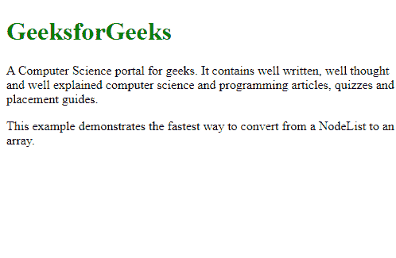
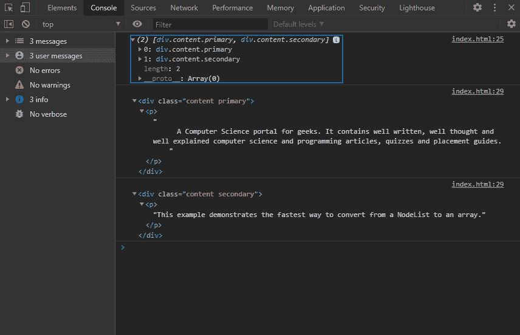

# 将 JavaScript 节点列表转换为数组的最快方法

> 原文:[https://www . geesforgeks . org/最快转换方式-JavaScript-nodelist-to-array/](https://www.geeksforgeeks.org/fastest-way-to-convert-javascript-nodelist-to-array/)

一个**节点列表**是一个类似于数组的节点集合。它基本上是 DOM 元素的集合。为了使用节点列表，我们可以将其转换为常规的 JavaScript 数组，这样就可以使用数组的特性和灵活性。节点列表是一个宿主对象，不受适用于本机 JavaScript 对象的常规规则的约束。

**方法:**将 NodeList 转换成 JavaScript 数组的方法有很多，但最快的是 ES6 的一个新方法。在 ES6 中，我们现在可以简单地使用 **Array.from()** 方法从节点列表创建一个数组。此方法用于从类似数组或可迭代的对象创建浅拷贝的新数组实例。在这种情况下，我们转换的节点列表是类似数组的对象。

**语法:**

```html
let my_arr = Array.from( given_nodelist )
```

**示例:**

## 超文本标记语言

```html
<!DOCTYPE html>
<html lang="en">

<body>
    <h1 style="color: green">
        GeeksforGeeks
    </h1>
    <div class="content primary">

        <p>
            A Computer Science portal for geeks.
            It contains well written, well thought
            and well explained computer science and
            programming articles, quizzes and
            placement guides.
        </p>

    </div>
    <div class="content secondary">

        <p>This example demonstrates the fastest
            way to convert from a NodeList to an array.
        </p>

    </div>
    <script>

        // This will act select all div DOM 
        elements in the page
        let nodelist =
            document.querySelectorAll('div');

        // This will convert the DOM NodeList
        // to a JavaScript Array Object
        let my_arr = Array.from(nodelist);

        // Display the array in the console
        console.log(my_arr);

        // Display all the values of the 
        // array in the console
        for (let val of my_arr) {
            console.log(val);
        }
    </script>
</body>

</html>
```

**输出:**



**控制台输出:**

