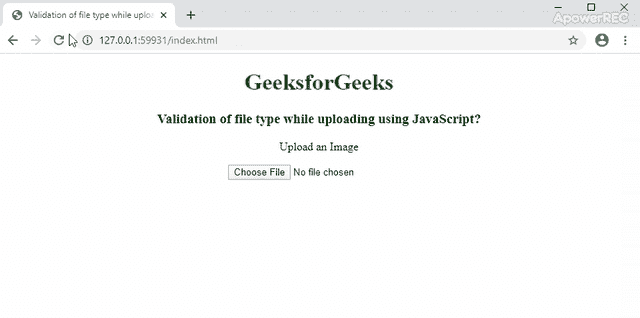
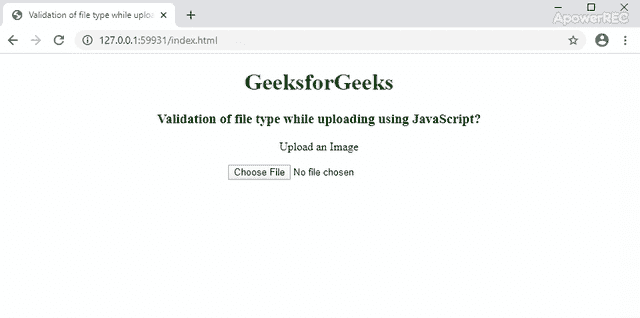

# 使用 JavaScript 上传文件时的文件类型验证

> 原文:[https://www . geesforgeks . org/file-type-validation-while-upload-it-use-JavaScript/](https://www.geeksforgeeks.org/file-type-validation-while-uploading-it-using-javascript/)

在本文中，我们将学习如何使用 **Javascript** 在上传文件之前通过检查文件扩展名来实现**文件类型验证**。这是客户端验证的演示，实现它是为了提供良好的用户体验。在某些情况下，与服务器端方法相比，客户端验证是一种更好的方法，因为它消耗的时间更少。

使用 JavaScript，您可以轻松地用允许的文件扩展名检查选定的文件扩展名，并可以限制用户只上传允许的文件类型。为此，我们将使用**文件验证()功能**。我们将创建包含完整文件类型验证代码的**文件验证()函数**。在这个函数中，我们将使用 **[正则表达式](https://www.geeksforgeeks.org/javascript-regular-expressions/)** 根据给定的模式检查文件的类型。

以下示例实现了上述方法:

**示例 1:** 在本例中，我们上传了具有扩展名的文件。jpeg/。jpg/。png/。仅限 gif。我们将扩展名列表存储在一个变量中，并将它们与上传的文件扩展名进行比较。为了将扩展名与上传的文件分开，我们将使用正则表达式，并且如果上传的文件扩展名遵循文件类型，还将预览上传的文件。

```html
<!DOCTYPE html>
<html>

<head>
    <title>
        File Type Validation while
        Uploading it using JavaScript
    </title>

    <style>
        h1 {
            color: green;
        }

        body {
            text-align: center;
        }
    </style>
</head>

<body>
    <h1> 
        GeeksforGeeks 
    </h1>

    <h3> 
        Validation of file type while 
        uploading using JavaScript? 
    </h3>

    <!-- File input field -->
    <p>Upload an Image</p>
    <input type="file" id="file"
        onchange="return fileValidation()" />

    <!-- Image preview -->
    <div id="imagePreview"></div>
    <script>
        function fileValidation() {
            var fileInput = 
                document.getElementById('file');

            var filePath = fileInput.value;

            // Allowing file type
            var allowedExtensions = 
                    /(\.jpg|\.jpeg|\.png|\.gif)$/i;

            if (!allowedExtensions.exec(filePath)) {
                alert('Invalid file type');
                fileInput.value = '';
                return false;
            } 
            else 
            {

                // Image preview
                if (fileInput.files && fileInput.files[0]) {
                    var reader = new FileReader();
                    reader.onload = function(e) {
                        document.getElementById(
                            'imagePreview').innerHTML = 
                            '';
                    };

                    reader.readAsDataURL(fileInput.files[0]);
                }
            }
        }
    </script>
</body>

</html>
```

**输出:**


**示例 2:** 上传扩展名为的文件。doc/。docx/。odt/。pdf/。特克斯/。txt/。rtf/。wps/。wks/。仅限 wpd。将扩展名列表存储在变量中，并将每个扩展名与上传的文件扩展名进行比较。为了从上传的文件中分离扩展名，我们将使用正则表达式。

```html
<!DOCTYPE html>
<html>

<head>
    <title>
        File Type Validation while
        Uploading it using JavaScript
    </title>

    <style>
        h1 {
            color: green;
        }

        body {
            text-align: center;
        }
    </style>
</head>

<body>
    <h1> 
        GeeksforGeeks 
    </h1>

    <h3> 
        Validation of file type while 
        uploading using JavaScript? 
    </h3>

    <!-- File input field -->
    <p>Upload an Image</p>
    <input type="file" id="file"
        onchange="return fileValidation()" />

    <!-- Image preview -->
    <div id="imagePreview"></div>
    <script>
        function fileValidation() {
            var fileInput = 
                document.getElementById('file');

            var filePath = fileInput.value;

            // Allowing file type
            var allowedExtensions = 
/(\.doc|\.docx|\.odt|\.pdf|\.tex|\.txt|\.rtf|\.wps|\.wks|\.wpd)$/i;

            if (!allowedExtensions.exec(filePath)) {
                alert('Invalid file type');
                fileInput.value = '';
                return false;
            } 
        }
    </script>
</body>

</html>
```

**输出:**


JavaScript 最出名的是网页开发，但它也用于各种非浏览器环境。您可以通过以下 [JavaScript 教程](https://www.geeksforgeeks.org/javascript-tutorial/)和 [JavaScript 示例](https://www.geeksforgeeks.org/javascript-examples/)从头开始学习 JavaScript。

HTML 是网页的基础，通过构建网站和网络应用程序用于网页开发。您可以通过以下 [HTML 教程](https://www.geeksforgeeks.org/html-tutorials/)和 [HTML 示例](https://www.geeksforgeeks.org/html-examples/)从头开始学习 HTML。

CSS 是网页的基础，通过设计网站和网络应用程序用于网页开发。你可以通过以下 [CSS 教程](https://www.geeksforgeeks.org/css-tutorials/)和 [CSS 示例](https://www.geeksforgeeks.org/css-examples/)从头开始学习 CSS。