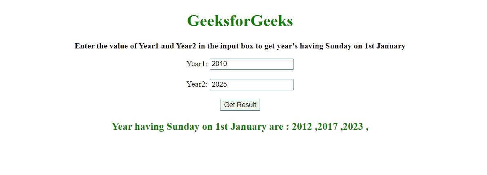

# 使用 JavaScript 在一系列年份之间查找是周日的 1 月 1 日

> 原文:[https://www . geeksforgeeks . org/find-1 月 1 日-be-Sunday-一系列年份之间的 javascript/](https://www.geeksforgeeks.org/find-1st-january-be-sunday-between-a-range-of-years-in-javascript/)

给定一个年份范围，任务是找到 1 月 1 日星期日所在的年份。

**方法:**我们可以用[javaScript date](https://www.geeksforgeeks.org/javascript-date/#:~:text=The%20Date%20object%20in%20JavaScript,shown%20in%20the%20below%20syntax.)得到 1 月 1 日有星期日的年份。在 JavaScript 中，日期对象基于时间值，即自 1970 年 1 月 1 日世界协调时以来的毫秒数。

我们可以通过以下方式声明日期对象:

*   [新日期()](https://www.geeksforgeeks.org/javascript-date/#:~:text=This%20time%20value%20is%20since,%2C%20minutes%2C%20seconds%2C%20milliseconds)%3B)
*   [新日期(值)](https://www.geeksforgeeks.org/javascript-date/#:~:text=This%20time%20value%20is%20since,%2C%20minutes%2C%20seconds%2C%20milliseconds)%3B)
*   [新日期(日期字符串)](https://www.geeksforgeeks.org/javascript-date/#:~:text=This%20time%20value%20is%20since,%2C%20minutes%2C%20seconds%2C%20milliseconds)%3B)
*   [新日期(年、月、日、时、分、秒、毫秒)](https://www.geeksforgeeks.org/javascript-date/#:~:text=This%20time%20value%20is%20since,%2C%20minutes%2C%20seconds%2C%20milliseconds)%3B)

在这个程序中，我们将使用最后一个。**新日期(年、月、日)**将返回给定参数的日、月、年。

**示例:**

## java 描述语言

```html
// Creating date object
// (Year , month , Day)
var A = new Date(2012, 0, 1);

// Printing the date
document.write(A);
```

**输出:**


用 JavaScript 找到一月一日是一系列年份之间的一个星期天？

在用给定的参数创建了 Date 对象之后，我们可以从 [getDay()](https://www.geeksforgeeks.org/javascript-date-getday-method/) 函数访问一周中的第 0 天(星期日)到第 6 天(星期六)。

**getDay()** 方法用于根据当地时间获取指定日期的星期几，其中 0 表示星期日。

**源代码:**

## 超文本标记语言

```html
<!DOCTYPE HTML>
<html>

<head>
    <style>
        body {
            text-align: center;
        }

        h1 {
            color: green;
        }

        #geeks {
            font-size: 16px;
            font-weight: bold;
        }

        #gfg {
            color: green;
            font-size: 20px;
            font-weight: bold;
        }
    </style>
</head>

<body>
    <h1>GeeksforGeeks</h1>
    <p id="geeks"></p>

    <label for="Year1">Year1:</label>
    <input type="number" id="year1" 
        name="Year1"><br><br>

    <label for="Year2">Year2:</label>
    <input type="number" id="year2" 
        name="Year2"><br><br>

    <button onClick="GFG_Fun()">
        Get Result
    </button>
    <p id="gfg"></p>

    <script>
        let s = `Enter the value of Year1 
        and Year2 in the input box to get 
        year's having Sunday on 1st January`;

        document.getElementById("geeks")
            .innerHTML = `<p>${s}</p>`;

        function GFG_Fun() {
            var y1 = Number(document
                .getElementById('year1').value);

            var y2 = Number(document
                .getElementById('year2').value);

            var res = " ";

            for (let year = y1; year <= y2; ++year) {
                const c_year = new Date(year, 0, 1);
                if (c_year.getDay() === 0) {
                    res += year + " ,";
                }
            }

            if (y1 > y2) {
                document.getElementById('gfg').innerHTML
                     = "Year2 must be greater than Year1";
            } else {
                if (res === " ") {
                    document.getElementById('gfg')
                    .innerHTML = `<p>No Year Exist</p>`;
                } else {
                    document.getElementById('gfg')
                    .innerHTML = `<p> Year having 
                    Sunday on 1st January are :${res}</p>`;
                }
            }
        } 
    </script>
</body>

</html>
```

**输出:**

