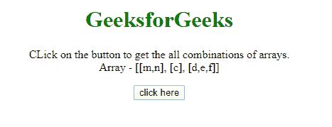
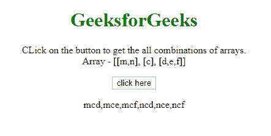
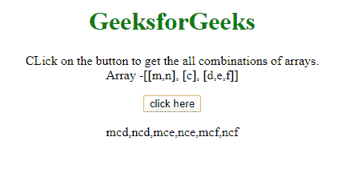

# 在 JavaScript 中找到数组值的所有组合

> 原文:[https://www . geesforgeks . org/find-所有数组值的组合-in-javascript/](https://www.geeksforgeeks.org/find-all-the-combinations-of-the-array-values-in-javascript/)

任务是获得数组的笛卡儿积(在连接它们之后找到所有的组合)。这里，借助于 JavaScript 讨论了两种方法。

**方法 1:**

*   获取数组中的所有数组。
*   递归被用来解决这个问题。基本条件是，当数组长度减少到零时，返回到现在为止的字符串构建。其他
*   将第一个数组元素减少**。reduce()方法**并返回递归结果返回的结果(递归在每次离开数组的第一项后调用)加上与每个数组元素串联的前一个值。
*   返回包含所有组合的最终 ans 数组。

**示例 1:** 该示例实现了上述方法。

```
<!DOCTYPE html>
<html>

<head>
    <title>
        All combinations of a JavaScript array values.
    </title>
</head>

<body style="text-align:center;">
    <h1 style="color:green;">   
            GeeksforGeeks   
        </h1>
    <p id="GFG_UP">
    </p>
    <button id="button" onclick="GFG_Fun();">
        click here
    </button>
    <p id="GFG_DOWN">
    </p>
    <script>
        var up = document.getElementById('GFG_UP');
        var down = document.getElementById('GFG_DOWN');
        var arr = [
            ['m', 'n'],
            ['c'],
            ['d', 'e', 'f']
        ];
        up.innerHTML = "CLick on the button to get the "+
          "all combinations of arrays.<br>Array - "+
          "[[" + arr[0] + "], [" + arr[1] + "], [" + arr[2] + "]]";

        function getCombn(arr, pre) {
            pre = pre || '';
            if (!arr.length) {
                return pre;
            }
            var ans = arr[0].reduce(function(ans, value) {
                return ans.concat(getCombn(arr.slice(1), pre + value));
            }, []);
            return ans;
        }

        function GFG_Fun() {
            down.innerHTML = getCombn(arr);
        }
    </script>
</body>

</html>
```

**输出:**

*   **点击按钮前:**
    
*   **点击按钮后:**
    

**方法 2:**

*   获取数组中的所有数组。
*   递归被用来解决这个问题。基本条件是，当数组的长度减少到 1 时，返回该数组的元素。其他
*   在离开数组的第一个元素后调用递归，并将结果存储在变量中(其他情况)。
*   遍历数组的每个元素(其他情况)，在每个元素内部遍历数组的第一个元素(arr)。
*   将数组的每个元素(arr[0])与数组(其他情况)连接起来，并将结果推入应答数组。

**示例 2:** 该示例实现了上述方法。

```
<!DOCTYPE html>
<html>

<head>
    <title>
        all combinations of a JavaScript array values.
    </title>
</head>

<body style="text-align:center;">
    <h1 style="color:green;">   
            GeeksforGeeks   
        </h1>
    <p id="GFG_UP">
    </p>
    <button id="button" onclick="GFG_Fun();">
        click here
    </button>
    <p id="GFG_DOWN">
    </p>
    <script>
        var up = document.getElementById('GFG_UP');
        var down = document.getElementById('GFG_DOWN');
        var arr = [
            ['m', 'n'],
            ['c'],
            ['d', 'e', 'f']
        ];
        up.innerHTML = "CLick on the button to get the all "+
          "combinations of arrays.<br>Array -"+
          "[[" + arr[0] + "], [" + arr[1] + "], [" + arr[2] + "]]";

        function getCombn(arr) {
            if (arr.length == 1) {
                return arr[0];
            } else {
                var ans = [];

                // recur with the rest of the array.
                var otherCases = getCombn(arr.slice(1)); 
                for (var i = 0; i < otherCases.length; i++) {
                    for (var j = 0; j < arr[0].length; j++) {
                        ans.push(arr[0][j] + otherCases[i]);
                    }
                }
                return ans;
            }
        }

        function GFG_Fun() {
            down.innerHTML = getCombn(arr);
        }
    </script>
</body>

</html>
```

**输出:**

*   **点击按钮前:**
    

*   **点击按钮后:**
    