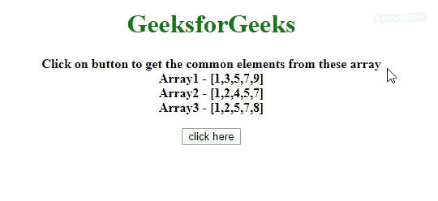

# 查找两个以上 JavaScript 数组的公共元素

> 原文:[https://www . geesforgeks . org/find-两个以上 javascript 数组的公共元素/](https://www.geeksforgeeks.org/find-the-common-elements-of-more-than-two-javascript-arrays/)

给定一个包含多个数组和一些元素的 HTML 文档，任务是在 JavaScript 的帮助下从数组中获取公共元素。下面讨论两种方法。

**方法 1:** 首先获取二维格式的数组，然后通过 [**`shift()`方法**](https://www.geeksforgeeks.org/javascript-array-prototype-shift/) 获取第一个数组，然后通过 [**filter()方法**](https://www.geeksforgeeks.org/javascript-array-filter/) 从第一个数组中过滤出共有的元素。所有数组中常见的元素可以通过[**【every()方法**](https://www.geeksforgeeks.org/javascript-array-prototype-every-function/) 进行检查，如果第一个数组的元素与所有元素匹配，则返回该元素。

*   **例:**

    ```html
    <!DOCTYPE HTML>
    <html>

    <head>
        <title>
            Finding matches between more than
            2 JavaScript arrays
        </title>
        <style>
            body {
                text-align:center;
            }
            h1 {
                color: green;
            }
            #geeks {
                font-size: 16px; 
                font-weight: bold;
            }

            #gfg {
                color: green; 
                font-size: 18px; 
                font-weight: bold;
            }
        </style>
    </head>

    <body style="">
        <h1 > 
                GeeksforGeeks 
            </h1>
        <p id="geeks">
        </p>
        <button onClick="GFG_Fun()">
            click here
        </button>
        <p id="gfg" >
        </p>
        <script>
            var up = document.getElementById('geeks');
            var down = document.getElementById('gfg');
            var arr1 = [1, 3, 5, 7, 9];
            var arr2 = [1, 2, 4, 5, 7];
            var arr3 = [1, 2, 5, 7, 8];
            var arr = [arr1, arr2, arr3];
            up.innerHTML =
                "Click on button to get the common elements from these"+
                " array<br>Array1 - [" + arr1 + "]<br>Array2 -"+
                " [" + arr2 + "]<br>Array3 - [" + arr3 + "]";

            function GFG_Fun() {
                arr4 = arr.slice();
                down.innerHTML = arr4.shift().filter(function(v) {
                    return arr4.every(function(a) {
                        return a.indexOf(v) !== -1;
                    });
                });
            }
        </script>
    </body>

    </html>
    ```

*   **输出:** 

**方法 2:** 首先获取二维格式的数组，然后使用 [**reduce()方法**](https://www.geeksforgeeks.org/javascript-array-reduce-method/) 逐个获取所有数组的访问权限。变量(p)逐个包含每个数组，并通过使用 [**filter()方法**](https://www.geeksforgeeks.org/javascript-array-filter/) 只返回变量(c)数组中的数组元素。最后，变量(c)包含公共元素的数组。

*   **例:**

    ```html
    <!DOCTYPE HTML>
    <html>

    <head>
        <title>
            Finding matches between more than
            2 JavaScript arrays
        </title>
        <style>
            body {
                text-align:center;
            }
            h1 {
                color: green;
            }
            #geeks {
                font-size: 16px; 
                font-weight: bold;
            }

            #gfg {
                color: green; 
                font-size: 18px; 
                font-weight: bold;
            }
        </style>
    </head>

    <body style="">
        <h1 > 
         GeeksforGeeks 
        </h1>
        <p id="geeks">
        </p>
        <button onClick="GFG_Fun()">
            click here
        </button>
        <p id="gfg" >
        </p>
        <script>
            var up = document.getElementById('geeks');
            var down = document.getElementById('gfg');
            var arr1 = [1, 3, 5, 7, 9];
            var arr2 = [1, 2, 4, 5, 7];
            var arr3 = [1, 2, 5, 7, 8];
            var arr = [arr1, arr2, arr3];
            up.innerHTML =
                "Click on button to get the common elements from these"+
                " array<br>Array1 - [" + arr1 + "]<br>Array2 -"+
                " [" + arr2 + "]<br>Array3 - [" + arr3 + "]";

            function GFG_Fun() {
                down.innerHTML = arr.reduce((p, c) =>
                p.filter(e => c.includes(e)));
            }
        </script>
    </body>

    </html>
    ```

*   **输出:** 