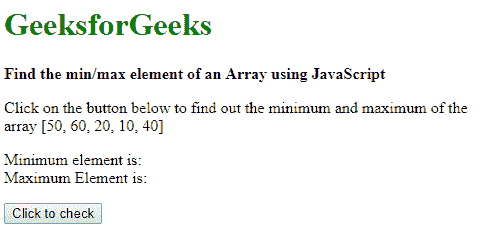
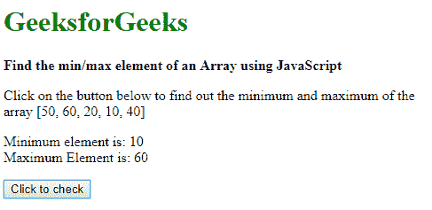

# 使用 JavaScript 找到数组的最小/最大元素

> 原文:[https://www . geesforgeks . org/find-the-min-max-element-of-array-use-JavaScript/](https://www.geeksforgeeks.org/find-the-min-max-element-of-an-array-using-javascript/)

数组中的最小和最大元素可以通过两种方法找到:

**方法 1:使用 Math.min()和 Math . max()**
Math 对象的 **min()** 和 **max()** 方法是静态函数，返回传递给它的最小和最大元素。这些函数可以用 spread(…)运算符传递给数组。spread 运算符允许 iterable 在需要多个参数的地方进行扩展。在这种情况下，它会自动扩展数组并将数字赋予函数。

**语法:**

```
minValue = Math.min(...array);
maxValue = Math.max(...array);
```

**例 1:**

```
<!DOCTYPE html>
<html>

<head>
    <title>
      Find the min/max element
      of an Array using JavaScript
  </title>
</head>

<body>
    <h1 style="color: green">
      GeeksforGeeks
  </h1>
    <b>Find the min/max element of 
      an Array using JavaScript</b>

    <p>Click on the button below t
      o find out the minimum and
      maximum of the array 
      [50, 60, 20, 10, 40]</p>

    <p>Minimum element is: <span class="min">
      </span>
        <br>Maximum Element is: <span class="max">
      </span></p>
    <button onclick="findMinMax()">
      Click to check
  </button>
    <script>
        function findMinMax() {
            array = [50, 60, 20, 10, 40];
            minValue = Math.min(...array);
            maxValue = Math.max(...array);
            document.querySelector(
              '.min').textContent = minValue;
            document.querySelector(
              '.max').textContent = maxValue;
        }
    </script>
</body>

</html>
```

**输出:**

*   **点击按钮前:**
    
*   **点击按钮后:**
    

**方法二:遍历数组，跟踪最小和最大元素**

最小和最大元素可以通过迭代数组中的所有元素来跟踪，并通过将它们与当前的最小和最大值进行比较来更新最小和最大元素。最初，最小值和最大值被初始化为无穷大和-无穷大。

**语法:**

```
minValue = Infinity;
maxValue = -Infinity;

for (item of array) {
    // find minimum value
    if (item < minValue)
    minValue = item;

    // find maximum value
    if (item > maxValue)
    maxValue = item;
}
```

**示例:**

```
<!DOCTYPE html>
<html>

<head>
    <title>
      Find the min/max element 
      of an Array using JavaScript
  </title>
</head>

<body>
    <h1 style="color: green">
      GeeksforGeeks
  </h1>
    <b>
      Find the min/max element
      of an Array using JavaScript
  </b>
    <p>
      Click on the button below to
      find out the minimum and 
      maximum of the array 
      [50, 60, 20, 10, 40]
  </p>

    <p>Minimum element is: <span class="min">
      </span>
        <br>Maximum Element is: <span class="max">
      </span></p>
    <button onclick="findMinMax()">
      Click to check
  </button>
    <script>
        function findMinMax() {
            array = [50, 60, 20, 10, 40];
            minValue = Infinity;
            maxValue = -Infinity;

            for (item of array) {
                // find minimum value
                if (item < minValue)
                    minValue = item;

                // find maximum value
                if (item > maxValue)
                    maxValue = item;
            }

            document.querySelector(
              '.min').textContent = minValue;
            document.querySelector(
              '.max').textContent = maxValue;
        }
    </script>
</body>

</html>
```

**输出:**

*   **点击按钮前:**
    
*   **点击按钮后:**
    