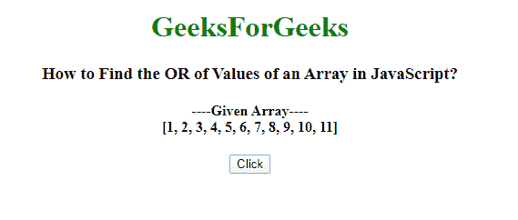
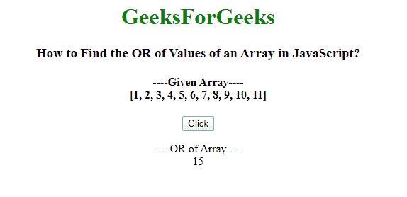
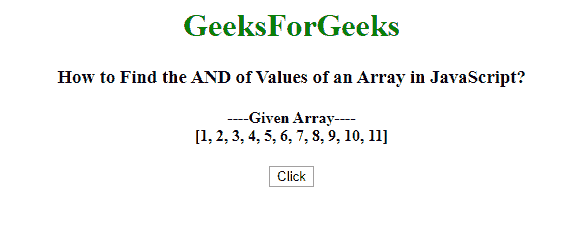
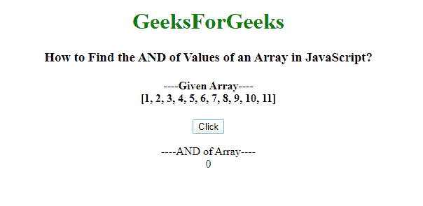
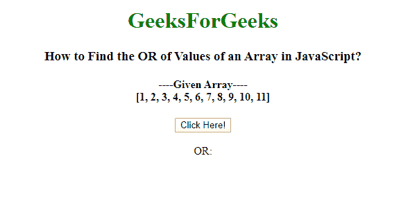
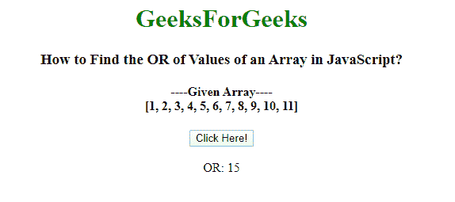
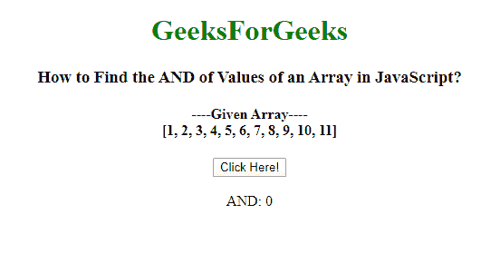

# 用 JavaScript 找到数组元素的 OR 和 AND

> 原文:[https://www . geesforgeks . org/find-or-and-of-array-of-elements-use-JavaScript/](https://www.geeksforgeeks.org/find-the-or-and-and-of-array-elements-using-javascript/)

给定一个数组和，任务是用 JavaScript 找到数组值的“或”和“与”。

**简单方法:**它使用一个简单的方法通过一个索引号访问数组元素，并使用循环使用 JavaScript 找到数组的 OR 和 and 值。

**示例 1:** 这个示例使用一个简单的方法，使用 JavaScript 找到 Array 元素的 OR。

```
<!DOCTYPE html> 
<html> 

<head> 
    <title> 
        How to Find the OR of Values 
        of an Array in JavaScript? 
    </title> 
</head> 

<body style="text-align:center;"> 

    <h1 style = "color:green;" > 
        GeeksForGeeks 
    </h1> 

    <h3> 
        How to Find the OR of Values 
        of an Array in JavaScript? 
    </h3> 

    <h4> 
        ----Given Array----<br> 
        [1, 2, 3, 4, 5, 6, 7, 8, 9, 10, 11] 
    </h4> 

    <button onclick="myGeeks()">Click</button> 

    <p id="gfg"></p> 

    <script> 
        function OR(input)
         { 
            if (toString.call(input) !== "[object Array]") 
            return false; 

            var total = Number(input[0]); 
            for(var i=1;i<input.length;i++) {                 
                if(isNaN(input[i])){ 
                    continue; 
                } 

                total |= Number(input[i]); 
            } 
            return total; 
        } 
        function myGeeks(item) { 
                document.getElementById("gfg").innerHTML
                    = "----OR of Array----" + "<br>" 
                    + OR([1, 2, 3, 4, 5, 6, 7, 8, 9, 10, 11]); 
            }
    </script> 
</body> 

</html>     
```

**输出:**
**点击按钮前:**

**点击按钮后:**


**示例 2:** 这个示例使用一个简单的方法，使用 JavaScript 找到 Array 元素的 AND。

```
<!DOCTYPE html> 
<html> 

<head> 
    <title> 
        How to Find the AND of Values 
        of an Array in JavaScript? 
    </title> 
</head> 

<body style="text-align:center;"> 

    <h1 style = "color:green;" > 
        GeeksForGeeks 
    </h1> 

    <h3> 
        How to Find the AND of Values 
        of an Array in JavaScript? 
    </h3> 

    <h4> 
        ----Given Array----<br> 
        [1, 2, 3, 4, 5, 6, 7, 8, 9, 10, 11] 
    </h4> 

    <button onclick="myGeeks()">Click</button> 

    <p id="gfg"></p> 

    <script> 
        function AND(input)
         { 
            if (toString.call(input) !== "[object Array]") 
            return false; 

            var total = Number(input[0]); 
            for(var i=1;i<input.length;i++) {                 
                if(isNaN(input[i])){ 
                    continue; 
                } 

                total &= Number(input[i]); 
            } 
            return total; 
        } 
        function myGeeks(item) { 
                document.getElementById("gfg").innerHTML
                    = "----AND of Array----" + "<br>" 
                    + AND([1, 2, 3, 4, 5, 6, 7, 8, 9, 10, 11]); 
            }
    </script> 
</body> 

</html>     
```

**输出:**
**点击按钮前:**

**点击按钮后:**


**使用 [reduce()方法](http://geeksforgeeks.org/javascript-array-reduce-method/):**JavaScript 中的 array reduce()方法用于将数组缩减为单个值，并为数组的每个值(从左到右)执行一个提供的函数，该函数的返回值存储在累加器中。

**语法:**

```
array.reduce( function( total, currentValue, currentIndex, arr ), initialValue )
```

**示例 1:** 本示例使用 array reduce()方法，使用 JavaScript 查找 array 的值的 OR。

```
<!DOCTYPE html> 
<html> 

<head> 
    <title> 
        How to Find the OR of Values 
        of an Array in JavaScript? 
    </title> 
</head> 

<body style="text-align:center;"> 

    <h1 style = "color:green;" > 
        GeeksForGeeks 
    </h1> 

    <h3> 
        How to Find the OR of Values 
        of an Array in JavaScript? 
    </h3> 

    <h4> 
        ----Given Array----<br> 
        [1, 2, 3, 4, 5, 6, 7, 8, 9, 10, 11] 
    </h4> 

    <button onclick="myGeeks()"> 
        Click Here! 
    </button> 

    <br><br> 

    OR: <span id="GFG"></span> 

    <script> 
        var arr=[1, 2, 3, 4, 5, 6, 7, 8, 9, 10, 11]; 

        function ORofArray(OR, num) { 
            return OR | num; 
        } 
        function myGeeks(item) { 
            document.getElementById("GFG").innerHTML 
                = arr.reduce(ORofArray); 
        } 
    </script> 
</body> 

</html>         
```

**输出:**
**之前点击按钮:**

**之后点击按钮:**


**示例 2:** 本示例使用 array reduce()方法，使用 JavaScript 查找 array 的值的 AND。

```
<!DOCTYPE html> 
<html> 

<head> 
    <title> 
        How to Find the AND of Values 
        of an Array in JavaScript? 
    </title> 
</head> 

<body style="text-align:center;"> 

    <h1 style = "color:green;" > 
        GeeksForGeeks 
    </h1> 

    <h3> 
        How to Find the AND of Values 
        of an Array in JavaScript? 
    </h3> 

    <h4> 
        ----Given Array----<br> 
        [1, 2, 3, 4, 5, 6, 7, 8, 9, 10, 11] 
    </h4> 

    <button onclick="myGeeks()"> 
        Click Here! 
    </button> 

    <br><br> 

    AND: <span id="GFG"></span> 

    <script> 
        var arr=[1, 2, 3, 4, 5, 6, 7, 8, 9, 10, 11]; 

        function ANDofArray(AND, num) { 
            return AND & num; 
        } 
        function myGeeks(item) { 
            document.getElementById("GFG").innerHTML 
                = arr.reduce(ANDofArray); 
        } 
    </script> 
</body> 

</html>         
```

**输出:**
**之前点击按钮:**

**之后点击按钮:**
