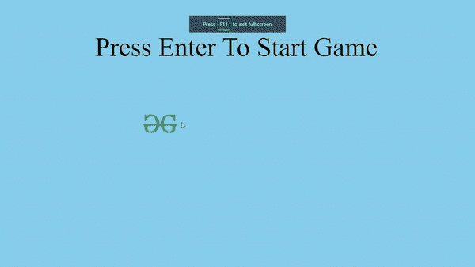

# JavaScript 中的 Flappy Bird游戏

> 原文:[https://www . geesforgeks . org/flappy-bird-game-in-JavaScript/](https://www.geeksforgeeks.org/flappy-bird-game-in-javascript/)

Flappy Bird 是一个无休止的游戏，其中涉及一只玩家可以控制的鸟。玩家必须保护小鸟不要像管子一样撞上栅栏。每当鸟儿穿过管道，分数就会增加一分。当鸟与管道碰撞或由于重力而坠落时，游戏结束。以下部分描述了构建这个游戏必须采取的步骤。

**HTML 部分:**在这个部分，游戏的元素被创建并加载。选择背景、鸟、栏和乐谱元素的图像。接下来，我们创建并链接 style.css 和 index.js 文件。

## 超文本标记语言

```html
<!DOCTYPE html>
<html>

<head>
    <link rel="stylesheet" href="style.css">
</head>

<body>
    <div class="background"></div>
    
    <div class="message">
        Press Enter To Start Game
    </div>
    <div class="score">
        <span class="score_title"></span>
        <span class="score_val"></span>
    </div>
    <script src="gfg.js"></script>
</body>

</html>
```

**CSS 版块:**该版块根据需要修改游戏对象的大小、位置、风格。

## 半铸钢ˌ钢性铸铁(Cast Semi-Steel)

```html
* {
    margin: 0;
    padding: 0;
    box-sizing: border-box;
}

body {
    height: 100vh;
    width: 100vw;
}

.background {
    height: 100vh;
    width: 100vw;
    background-color: skyblue;
}

.bird {
    height: 100px;
    width: 160px;
    position: fixed;
    top: 40vh;
    left: 30vw;
    z-index: 100;
}

.pipe_sprite {
    position: fixed;
    top: 40vh;
    left: 100vw;
    height: 70vh;
    width: 6vw;
    background-color: green;
}

.message {
    position: fixed;
    z-index: 10;
    height: 10vh;
    font-size: 10vh;
    font-weight: 100;
    color: black;
    top: 12vh;
    left: 20vw;
    text-align: center;
}

.score {
    position: fixed;
    z-index: 10;
    height: 10vh;
    font-size: 10vh;
    font-weight: 100;
    color: goldenrod;
    top: 0;
    left: 0;
}

.score_val {
    color: gold;
}
```

**JavaScript 部分:**这个部分包含了控制游戏状态和移动物体的代码部分。本节必须遵循以下步骤。

*   在 JavaScript 文件中获取对鸟和背景图像的引用。
*   为背景滚动速度、鸟的飞行速度和重力设置一些值。
*   创建无限滚动背景。可以从[这个](https://www.geeksforgeeks.org/html5-game-development-infinitely-scrolling-background/)链接中阅读到这样做的指南。
*   添加一个事件监听器来监听“输入”按键，将游戏状态更改为播放状态，并通过每帧从鸟的 y 坐标降低重力值来为鸟施加重力。
*   在视图宽度的末端生成障碍(管道)，以便它们最初不可见，但是随着背景移动，将管道的 x 坐标减少背景滚动值，以便看起来像鸟在移动。
*   应用与地面和管道的碰撞，如果鸟发生碰撞，则将游戏状态更改为结束状态，并显示一条消息来重启游戏。
*   管道之间每次成功导航后，增加分值。

## Java Script 语言

```html
// Background scrolling speed
let move_speed = 3;

// Gravity constant value
let gravity = 0.5;

// Getting reference to the bird element
let bird = document.querySelector('.bird');

// Getting bird element properties
let bird_props = bird.getBoundingClientRect();
let background =
    document.querySelector('.background')
            .getBoundingClientRect();

// Getting reference to the score element
let score_val =
    document.querySelector('.score_val');
let message =
    document.querySelector('.message');
let score_title =
    document.querySelector('.score_title');

// Setting initial game state to start
let game_state = 'Start';

// Add an eventlistener for key presses
document.addEventListener('keydown', (e) => {

  // Start the game if enter key is pressed
  if (e.key == 'Enter' &&
      game_state != 'Play') {
    document.querySelectorAll('.pipe_sprite')
              .forEach((e) => {
      e.remove();
    });
    bird.style.top = '40vh';
    game_state = 'Play';
    message.innerHTML = '';
    score_title.innerHTML = 'Score : ';
    score_val.innerHTML = '0';
    play();
  }
});
function play() {
  function move() {

    // Detect if game has ended
    if (game_state != 'Play') return;

    // Getting reference to all the pipe elements
    let pipe_sprite = document.querySelectorAll('.pipe_sprite');
    pipe_sprite.forEach((element) => {

      let pipe_sprite_props = element.getBoundingClientRect();
      bird_props = bird.getBoundingClientRect();

      // Delete the pipes if they have moved out
      // of the screen hence saving memory
      if (pipe_sprite_props.right <= 0) {
        element.remove();
      } else {
        // Collision detection with bird and pipes
        if (
          bird_props.left < pipe_sprite_props.left +
          pipe_sprite_props.width &&
          bird_props.left +
          bird_props.width > pipe_sprite_props.left &&
          bird_props.top < pipe_sprite_props.top +
          pipe_sprite_props.height &&
          bird_props.top +
          bird_props.height > pipe_sprite_props.top
        ) {

          // Change game state and end the game
          // if collision occurs
          game_state = 'End';
          message.innerHTML = 'Press Enter To Restart';
          message.style.left = '28vw';
          return;
        } else {
          // Increase the score if player
          // has the successfully dodged the 
          if (
            pipe_sprite_props.right < bird_props.left &&
            pipe_sprite_props.right + 
            move_speed >= bird_props.left &&
            element.increase_score == '1'
          ) {
            score_val.innerHTML = +score_val.innerHTML + 1;
          }
          element.style.left = 
            pipe_sprite_props.left - move_speed + 'px';
        }
      }
    });

    requestAnimationFrame(move);
  }
  requestAnimationFrame(move);

  let bird_dy = 0;
  function apply_gravity() {
    if (game_state != 'Play') return;
    bird_dy = bird_dy + gravity;
    document.addEventListener('keydown', (e) => {
      if (e.key == 'ArrowUp' || e.key == ' ') {
        bird_dy = -7.6;
      }
    });

    // Collision detection with bird and
    // window top and bottom

    if (bird_props.top <= 0 ||
        bird_props.bottom >= background.bottom) {
      game_state = 'End';
      message.innerHTML = 'Press Enter To Restart';
      message.style.left = '28vw';
      return;
    }
    bird.style.top = bird_props.top + bird_dy + 'px';
    bird_props = bird.getBoundingClientRect();
    requestAnimationFrame(apply_gravity);
  }
  requestAnimationFrame(apply_gravity);

  let pipe_seperation = 0;

  // Constant value for the gap between two pipes
  let pipe_gap = 35;
  function create_pipe() {
    if (game_state != 'Play') return;

    // Create another set of pipes
    // if distance between two pipe has exceeded
    // a predefined value
    if (pipe_seperation > 115) {
      pipe_seperation = 0

      // Calculate random position of pipes on y axis
      let pipe_posi = Math.floor(Math.random() * 43) + 8;
      let pipe_sprite_inv = document.createElement('div');
      pipe_sprite_inv.className = 'pipe_sprite';
      pipe_sprite_inv.style.top = pipe_posi - 70 + 'vh';
      pipe_sprite_inv.style.left = '100vw';

      // Append the created pipe element in DOM
      document.body.appendChild(pipe_sprite_inv);
      let pipe_sprite = document.createElement('div');
      pipe_sprite.className = 'pipe_sprite';
      pipe_sprite.style.top = pipe_posi + pipe_gap + 'vh';
      pipe_sprite.style.left = '100vw';
      pipe_sprite.increase_score = '1';

      // Append the created pipe element in DOM
      document.body.appendChild(pipe_sprite);
    }
    pipe_seperation++;
    requestAnimationFrame(create_pipe);
  }
  requestAnimationFrame(create_pipe);
}
```

**输出:**

