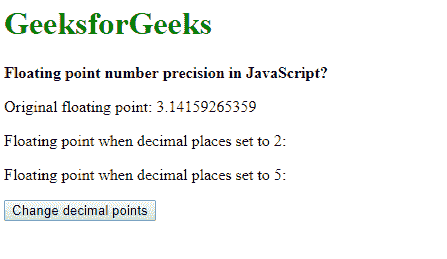
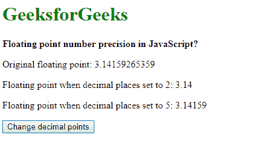
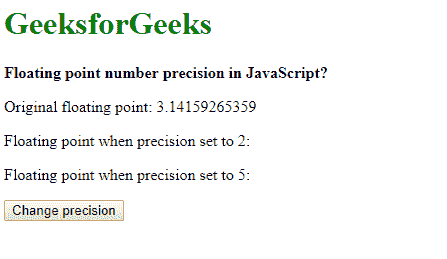
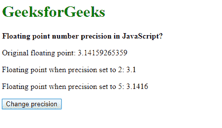

# JavaScript 中的浮点数精度

> 原文:[https://www . geesforgeks . org/JavaScript 中的浮点数精度/](https://www.geeksforgeeks.org/floating-point-number-precision-in-javascript/)

JavaScript 中浮点的表示遵循 IEEE-754 格式。这是一种双精度格式，每个浮点分配 64 位。这些浮动值的显示可以使用两种方法来处理:

**使用 [toFixed()](https://www.geeksforgeeks.org/javascript-tofixed-function/) 方法:**可以使用 toFixed()方法设置浮点值的小数位数。此方法将数字转换为字符串，在点后保留指定的位数。如果没有值作为参数传递，则取 0 作为默认值，即不显示小数点。

**语法:**

```
number.toFixed(digits)
```

**示例:**

```
<!DOCTYPE html>
<html>

<head>
    <title>
        Floating point number precision
        in JavaScript?
    </title>
</head>

<body>
    <h1 style="color: green">
        GeeksforGeeks
    </h1>

    <b>
        Floating point number precision
        in JavaScript?
    </b>

    <p>
        Original floating point: 3.14159265359
    </p>

    <p>
        Floating point when decimal places set
        to 2: <span class="output-2"></span>
    </p>

    <p>
        Floating point when decimal places set
        to 5: <span class="output-5"></span>
    </p>

    <button onclick="setDecimalPlaces()">
        Change decimal points
    </button>

    <script type="text/javascript">
        function setDecimalPlaces() {
            pi = 3.14159265359;
            twoPlaces = pi.toFixed(2);
            fivePlaces = pi.toFixed(5);

            document.querySelector('.output-2').textContent
                    = twoPlaces;
            document.querySelector('.output-5').textContent
                    = fivePlaces;
        }
    </script>
</body>

</html>                    
```

**输出:**

*   **点击按钮前:**
    
*   **点击按钮后:**
    

**使用[精确()方法](https://www.geeksforgeeks.org/javascript-toprecision-function/) :** 可以使用精确()方法设置浮点值的总位数。此方法将数字转换为字符串，保持指定的值的总位数，并将它们舍入到最接近的数字。如果没有任何值作为参数传递，则该函数充当 toString()函数，有效地返回作为字符串传递的值。

**语法:**

```
number.toPrecision(precision)
```

**示例:**

```
<!DOCTYPE html>
<html>

<head>
    <title>
        Floating point number precision
        in JavaScript?
    </title>
</head>

<body>
    <h1 style="color: green">
        GeeksforGeeks
    </h1>

    <b>
        Floating point number precision
        in JavaScript?
    </b>

    <p>
        Original floating point: 3.14159265359
    </p>

    <p>
        Floating point when precision set to
        2: <span class="output-2"></span>
    </p>

    <p>
        Floating point when precision set to
        5: <span class="output-5"></span>
    </p>

    <button onclick="setPrecision()">
        Click to check
    </button>

    <script type="text/javascript">
        function setPrecision() {
            pi = 3.14159265359;
            twoPlaces = pi.toPrecision(2);
            fivePlaces = pi.toPrecision(5);

            document.querySelector('.output-2').textContent
                    = twoPlaces;
            document.querySelector('.output-5').textContent
                    = fivePlaces;
        }
    </script>
</body>

</html>                    
```

**输出:**

*   **点击按钮前:**
    
*   **点击按钮后:**
    