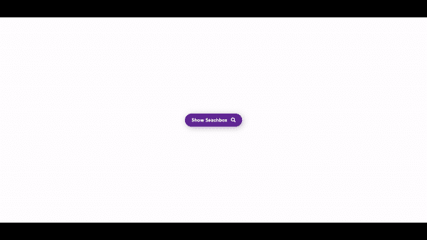

# 使用 CSS 和 JavaScript 的全屏搜索栏

> 原文:[https://www . geesforgeks . org/全屏-搜索-栏-使用-CSS-和-javascript/](https://www.geeksforgeeks.org/full-screen-search-bar-using-css-and-javascript/)

在本文中，我们将使用 CSS 和 JavaScript 创建一个全屏搜索栏。我们创建一个按钮，点击该按钮，我们将显示搜索栏。

#### 方法:

*   创建一个按钮，并使用 JavaScript 使搜索面板能够切换。
*   现在取一个 div，将其位置固定，顶部、底部、左侧、右侧属性设置为零，这样搜索栏就变成固定的(不可滚动的)全屏显示。
*   将其不透明度设置为小于 1 且大于 0 的值，背景颜色设置为黑色以使其风格很酷。
*   添加一个输入框和一个图标按钮来关闭搜索栏。

#### 实施:

## 超文本标记语言

```html
<!DOCTYPE html>
<html>
<head>
    <script src=
"https://kit.fontawesome.com/2961dbb4cf.js" crossorigin="anonymous">
    </script>
  <style>
      .myBtn{
      height: 42px;
      width: 183px;
      font-size: 15px;
      background: rebeccapurple;
      color: white;
      font-weight: bold;
      border-radius: 36px;
      border: none;
      cursor: pointer;
      outline: none;
      box-shadow: 3px 3px 18px 0px #b9b9b9;
      transition: 0.3s;
      position: absolute;
      top: 50%;
      left: 50%;
      transform: translate(-50%, -50%);
      }

      .myBtn:hover{
          color: black;
          background-color: white
      }

      .myBtn i{
          margin-left: 8px
      }

      .fullScreen{
          position: absolute;
          top: 0;
          left: 0;
          right: 0;
          bottom: 0;
          background-color: #000000d4;
          display: none
      }

      .inputBox{
          position: absolute;
          top: 50%;
          left: 50%;
          transform: translate(-50%, -50%);
          background: white;
          padding: 2px;
          border-radius: 3px;
          box-shadow : inset 0 0.25rem 0.125rem 0 rgb(0 0 0 / 5%);
          display: flex;
      }

      .inputBox input{
          height: 45px;
          width: 270px;
          border: none;
          outline: none;
          font-size: 19px;
          color: #4a4a4a;
          padding-left: 15px
      }

      .inputBox button{
          border: none;
          background-color: transparent;
          vertical-align: middle;
          cursor: pointer;
          transition: 0.5s
      }

      .inputBox button:hover{
          transform: rotate(360deg);

      }

      .inputBox button i{
          font-size: 30px
      }

      .closeBtn{
          height: 30px;
          width: 30px;
          background-color: white;
          border-radius: 16px;
          position: absolute;
          top: 62px;
          right: 42px;
          display: flex;
          justify-content: center;
          align-items: center;
          cursor: pointer;
      }
  </style>
</head>
<body>

    <button class="myBtn">Show Seachbox <span>
        <i class="fas fa-search"></i>
    </span></button>

    <div class="fullScreen">
        <div class="inputBox">
            <input type="text" 
                   placeholder="Search here...">
            <button type="submit">
              <i class="fas fa-arrow-right"></i>
            </button>
        </div>
        <div class="closeBtn">
          <i class="fa fa-close"></i>
        </div>
    </div>
    <script src="index.js"></script>
</body>
</html>
```

## java 描述语言

```html
const btn =
document.querySelector(".myBtn")
const searchBox =
document.querySelector(".fullScreen")
const closeBtn = 
document.querySelector(".closeBtn")

closeBtn.addEventListener("click", ()=>{
    searchBox.style.display = "none"
})

btn.addEventListener('click', ()=>{
    searchBox.style.display = "block"
})
```

#### **输出:**

