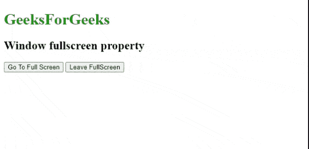

# 使用 JavaScript 的全屏 API

> 原文:[https://www . geesforgeks . org/full screen-API-using-JavaScript/](https://www.geeksforgeeks.org/fullscreen-api-using-javascript/)

该窗口通过使用网络应用编程接口支持全屏界面。我们可以激活或停用屏幕的全屏模式。全屏应用编程接口提供了以全屏模式呈现特定元素的方法。

**进场:**

*   [**点击**](https://www.geeksforgeeks.org/html-dom-onclick-event/) 事件将触发激活()方法，用于激活全屏。
*   这同样适用于退出全屏。

```html
<button onclick="activate(document.documentElement);">
      Go To Full Screen
</button>
<button onclick="deactivate();">
      Leave Full Screen
</button>
```

**示例:**以下代码使用了[****request full screen()****](https://www.geeksforgeeks.org/html-dom-requestfullscreen-method/)**方法。使用[**exit full screen()**](https://www.geeksforgeeks.org/html-dom-exitfullscreen-method/)**方法退出全屏也是如此。****

## ****超文本标记语言****

```html
**<!DOCTYPE html>
<html lang="en">

<head>
    <meta charset="UTF-8" />
    <meta http-equiv="X-UA-Compatible" content="IE=edge" />
    <meta name="viewport" content=
        "width=device-width, initial-scale=1.0" />
</head>

<body>
    <h1 style="color: green">GeeksForGeeks</h1>

    <h2>Window fullscreen property</h2>

    <button onclick="activate(document.documentElement);">
        Go To Full Screen
    </button>

    <button onclick="deactivate();">Leave FullScreen</button>

    <script>

        // Function for full screen activation
        function activate(ele) {
            if (ele.requestFullscreen) {
                ele.requestFullscreen();
            }
        }

        // Function for full screen activation
        function deactivate() {
            if (document.exitFullscreen) {
                document.exitFullscreen();
            }
        }
    </script>
</body>

</html>**
```

******输出:******

****

激活或停用全屏**** 

******应用:******

*   ****您可以将其应用于网站中的任何元素****

*   ****这将有助于执行全屏。****