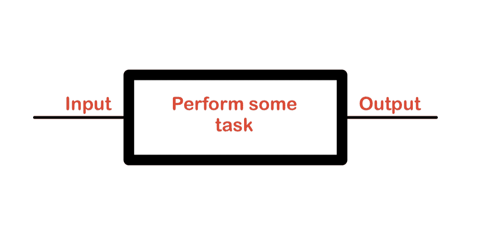
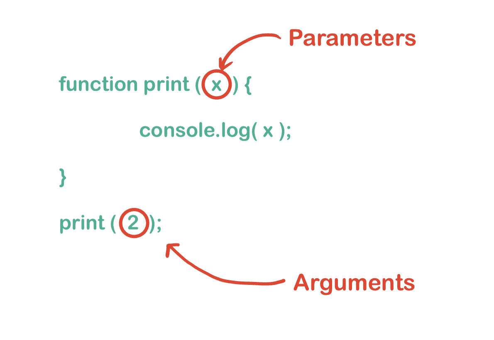
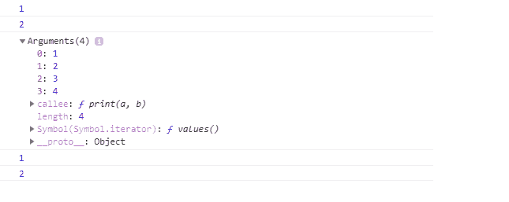
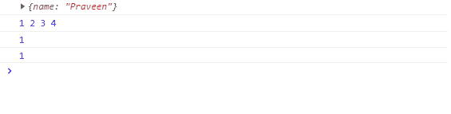
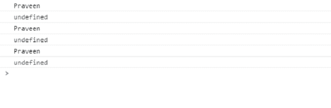
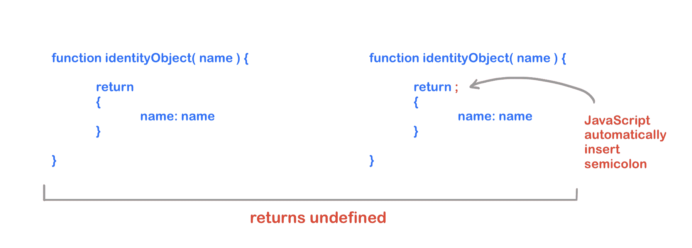
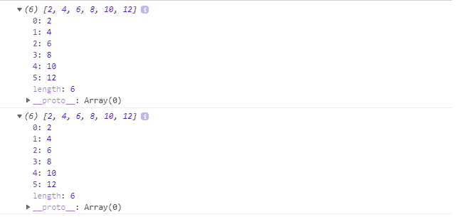

# JavaScript 中的函数式编程

> 原文:[https://www . geesforgeks . org/functional-programming-in-JavaScript-2/](https://www.geeksforgeeks.org/functional-programming-in-javascript-2/)

*函数*是函数式编程最重要的部分(尤其是在 JavaScript 中)。**函数** 是帮助开发人员执行函数式编程的单一来源。一般缩写为 FP，围绕*函数*展开，正是我们如何使用*函数*使我们的代码发挥作用。没有功能，就没有 FP。那么问题来了，函数到底是什么？

简单来说，函数是可以多次执行的代码集合。我们大多数人把函数和过程混为一谈。但它们是独立的实体。

<figure class="table">

| **PROCEDURE** | **FUNCTION**

 |
| A program may or may not take input. | A function always takes input (in FP). |
| A procedure may or may not return output. | The function always returns output. |

</figure>



函数的高级视图。

在函数式编程中，我们应该尽可能多地使用函数。

**输入:**在一般编程中，我们可以互换使用带参数的参数，但它们不是相同的参数。参数是我们通过函数调用传入的数据，参数是我们在函数定义中接收的数据。



参数和参数之间的区别

在 JavaScript 中，参数的数量不必总是与参数相同。如果我们传递更少的参数，那么剩下的参数将作为函数中的值未定义，如果我们传递的参数比声明的参数多，那么剩下的参数保持不变。

我们甚至不用定义一个参数就可以得到所有的参数，用*个参数作为*个类似数组的个对象*个，但不是一个好的做法。*

> *你知道吗，每个函数都有一个名为**参数**的内部属性。你有没有注意到它为什么叫**参数**而不是**参数**？*

***注意:**参数是一个类似数组的对象，我们可以在函数内部访问。它包含传递给函数的属性。因为我们讨论的是传递给函数的属性，而不是接收属性作为参数的属性。*

1.  *参数是类似数组的对象。我们可以用数组索引访问值，但不能使用像 *forEach、map、reduce* 等数组方法。因为它类似于数组但不是数组。*
2.  *参数对象包含传递给该函数的参数值(因此称为参数)。在下面的程序中，我们可以看到参数的输出。它打印我们作为参数传递的所有值。*

## *java 描述语言*

```
*function print(a, b) {
  console.log(a); 
  console.log(b); 

  console.log(arguments);     

  console.log(arguments[0]); 
  console.log(arguments[1]); 
}

print(1, 2, 3, 4);*
```

***输出:***

**

***注意:**从 ES5 开始，使用参数不被认为是好的做法。你应该避免使用它。但如果使用参数，则对象仅限于*长度*属性。*

*在函数编程中，我们严格注意函数声明中的参数数量，这就是所谓的 **arity** 。我们必须注意 arity，因为有时我们必须在函数内部传递一个函数，然后我们必须考虑兼容性。**T3】***

## *java 描述语言*

```
*// The arity of maipulateJSON is 2\. we can find
// arity with length property of a function
function manipulateJSON(json, options) {
    console.log(json, options)
}

console.log( manipulateJSON.length )*
```

***输出:***

```
*2*
```

*带有 arity 1 的函数被称为**一元**函数，同样带有 arity 2 的函数被称为**二进制**，而带有更多的 2，arity 被称为 **n 元**函数。*

**长度*功能可能有问题。假设，如果有一个默认参数或 rest 参数，那么该参数不包括在长度中。*

## *java 描述语言*

```
*function printDefault(fn, args = {}) {
  fn(args);
}

function printRest(fn, ...args) {
  fn(...args);
}

printDefault(console.log, { name: "Praveen" });
printRest(console.log, 1, 2, 3, 4);

console.log(printDefault.length); 
console.log(printRest.length);       *
```

***输出:***

**

***注意:**在 JavaScript 中，函数总是从外部(由 JS 引擎)或内部(由开发人员)返回输出。*

## *java 描述语言*

```
*function print1( name ) {
  console.log( name );
}

function print2( name ) {
  console.log( name );
  return;
}

function print3( name ) {
  console.log( name );
  return undefined;
}
console.log( print1("Praveen") );
console.log( print2("Praveen") );
console.log( print3("Praveen") );*
```

***输出:***

**

***注意:**建议函数编程中函数返回值。如果您想要返回多个值，那么您可以使用数组或对象。*

*你知道在 JavaScript 中， *return* 关键字不仅使用函数返回值，还可以用在流控制语句中。这意味着我们可以在函数执行的任何地方停止函数的执行。一个函数中可能有多个返回语句。但是它只是让开发人员搞不清楚这个函数是如何工作的。只是，在函数中使用多次返回不是一个好的做法。*

***函数可以返回值**众所周知函数可以返回值。它可以是基元、数组，也可以是对象。*

***注意:**你更喜欢分号(；)同时编写 JavaScript。如果**是**那就太好了，但是如果**不是**那我的朋友你应该。我知道这应该是开发人员的偏好，但是在 JavaScript 中，建议使用分号。JavaScript 使用[自动分号插入(ASI)](http://www.ecma-international.org/ecma-262/7.0/index.html#sec-automatic-semicolon-insertion) 。如果你没有插入分号，那么 ASI 就会起作用，可能会引起反响。可能有一些严重的错误。*

*

自动分号插入后的功能* 

*您一定希望 *identityObject* 返回一个对象，但是它将返回 *undefined* 。*

> *JavaScript 引擎足够聪明，知道在哪里插入分号。但是为什么要依赖发动机。*

#### *一个函数可以返回另一个函数*

*如果一个函数返回或接收一个或多个函数值，则该函数称为**高阶函数**。*

## *java 描述语言*

```
*const arr = [1, 2, 3, 4, 5, 6];

arr.forEach(function printArrayValues(val) {
  console.log(val);
});*
```

***输出:***

**

*在上面的程序中， *arr* 是一个数组，我们使用 [*forEach*](https://www.geeksforgeeks.org/javascript-array-foreach-method/) 的方法来打印所有的值。 *forEach()* 是一个高阶函数，需要一个函数作为参数。*

*我们在日常生活中使用高阶函数，FP 也不例外。FP 在每个地方都使用高阶。现在是时候引入**闭合了。***

***闭包**就是记住作用域变量，即使作用域已经改变。没有 ***闭包*** 我们就做不了 FP，闭包就是从另一个函数返回一个函数，记住作用域。我们将在另一篇文章中讨论闭包。*

***ES6 箭头功能:**我们都听说过箭头功能。因为它的语法较短，没有*功能*关键字。*

## *java 描述语言*

```
*const numbers = [1, 2, 3, 4, 5, 6];

const newNumbers = numbers.map(function (x) {
  return x * 2;
});
console.log(newNumbers);    

const arrowNewNumbers = numbers.map((x) => x * 2);
console.log(arrowNewNumbers);    *
```

***输出:***

**

*大多数用户更喜欢箭头功能，但我不建议使用它。以下是原因*

*   *使用 arrow 函数调试并不容易，因为 arrow 函数是一个匿名函数，如果在任何情况下我们都会得到一些 bug，并且我们调试我们的应用程序，那么在函数堆栈中我们将不会得到函数名。*
*   *我们总是要注意下面描述的箭头函数的语法。*

*箭头函数的规则:*

*   *我们可以放下*功能*关键词。*
*   *如果箭头函数中有一条语句，我们可以去掉*返回*关键字。*
*   *如果我们想返回一个对象，我们必须使用*返回*关键字。*

## *java 描述语言*

```
*const numbers = [1, 2, 3, 4, 5, 6];

// We can drop function and return keyword
const version1 = numbers.map((x) => x * 2);

// If there is single parameter thern we 
// can also drop parenthesis
const version2 = numbers.map(x => x * 2);

// If we have to return an object then we
// have to use curly braces with return 
// keyword because compiler gets easily
// confused with a block.
// const version3 = (arr) => { array: arr } // ERROR
const version3 = function (arr) {
  return {
    array: arr,
  };
};

console.log(version1);
console.log(version2);

console.log(version3(numbers));*
```