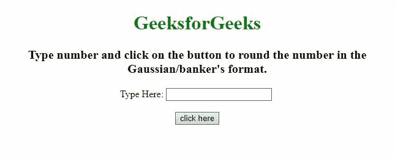

# JavaScript 中的高斯/庄家舍入

> 原文:[https://www . geesforgeks . org/Gaussian-bankers-rounding-in-JavaScript/](https://www.geeksforgeeks.org/gaussian-bankers-rounding-in-javascript/)

任务是在 JavaScript 的帮助下实现高斯/银行家舍入。这里讨论的方法很少。

**方法 1:** 获取 d 值(告诉我们需要舍入到的位数)。计算 *m(幂(10，d))* 。然后在我们要舍入的数字后移动小数(如果 d=2，将其移动到 n 右边的 2 位)。然后得到 *n(也就是 i)* 的楼层值，计算 *n* 的原始值与楼层值的差值。检查要返回的值是 *i* 还是 *i+1* 的条件，如果条件匹配，则返回 I(将值存储在 r 中)。*如果 d=0 返回 r 否则返回 r/m* 。

*   **示例:**该示例实现了上述方法。

    ```
    <!DOCTYPE html>
    <html>

    <head>
        <title>
            Gaussian/banker's rounding in JavaScript
        </title>
    </head>

    <body style="text-align:center;">
        <h1 style="color:green;">   
                GeeksforGeeks   
            </h1>
        <p id="GFG_UP" 
           style="font-size: 20px; 
                  font-weight: bold">
        </p>
        Type Here:
        <input id="inp" />
        <br>
        <br>
        <button id="button" onclick="GFG_Fun();">
            click here
        </button>
        <p id="GFG_DOWN"
           style="font-size: 26px;
                  font-weight: bold;
                  color: green;">
        </p>
        <script>
            var up = document.getElementById('GFG_UP');
            var down = document.getElementById('GFG_DOWN');
            up.innerHTML =
    "Type number and click on the button to round the number"
            +" in the Gaussian/banker's format.";

            function roundIt(n, d = 0) {
                var m = Math.pow(10, d);
                var n = +(d ? n * m : n).toFixed(8);
                var i = Math.floor(n),
                    diff = n - i; // getting the difference
                var e = 1e-8; // Rounding errors in var(diff)
                // Checking if the difference is less than or
                // greater than, based on that adding the 1 to it.
                var r = (diff > 0.5 - e && diff < 0.5 + e) ?
                    ((i % 2 == 0) ? i : i + 1) : Math.round(n);
                return d ? r / m : r; // if d != 0 then returning r/m else r
            }

            function GFG_Fun() {
                var inp = Number(document.getElementById('inp').value);
                down.innerHTML = roundIt(inp);
            }
        </script>
    </body>

    </html>
    ```

*   **输出:**
    

**方法 2:** 获取 d 值(告诉我们需要舍入到的位数)。根据 d 将小数移到 n 的右边，然后得到 *n(即 r)* 的取整值。如果*绝对评估值(n) % 1 == 0.5* ，如果 *r* 为偶数*返回 r else r-1* ，如果*绝对评估值(n) % 1！= 0.5* 然后*返回 r* 。

*   **示例:**该示例实现了上述方法。

    ```
    <!DOCTYPE html>
    <html>

    <head>
        <title>
            Gaussian/banker's rounding in JavaScript
        </title>
    </head>

    <body style="text-align:center;">
        <h1 style="color:green;">   
                GeeksforGeeks   
            </h1>
        <p id="GFG_UP"
           style="font-size: 20px;
                  font-weight: bold">
        </p>
        Type Here:
        <input id="inp" />
        <br>
        <br>
        <button id="button"
                onclick="GFG_Fun();">
            click here
        </button>
        <p id="GFG_DOWN" 
           style="font-size: 26px;
                  font-weight: bold;
                  color: green;">
        </p>
        <script>
            var up = document.getElementById('GFG_UP');
            var down = document.getElementById('GFG_DOWN');
            up.innerHTML =
                "Type number and click on the button to round " +
                "the number in the Gaussian/banker's format.";

            function roundIt(n, d = 0) {
                var n = n * Math.pow(10, d);
                var r = Math.round(n);
                var val = 
            Math.abs(n) % 1 === 0.5 ? (r % 2 === 0 ? r : r - 1) : r;
                return val / Math.pow(10, d);
            }

            function GFG_Fun() {
                var inp = Number(document.getElementById('inp').value);
                down.innerHTML = roundIt(inp);
            }
        </script>
    </body>

    </html>
    ```

*   **输出:**
    