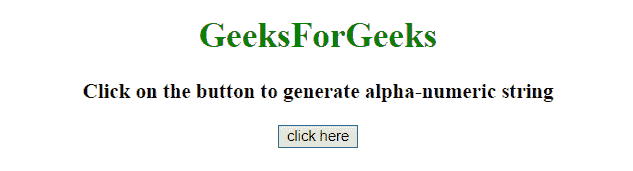
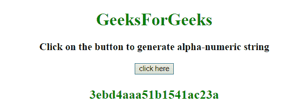
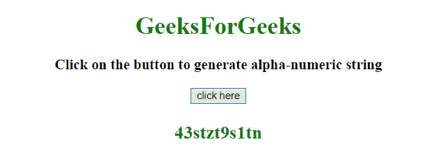

# 在 JavaScript 中生成随机字母数字字符串

> 原文:[https://www . geesforgeks . org/generate-random-alpha-numeric-string-in-JavaScript/](https://www.geeksforgeeks.org/generate-random-alpha-numeric-string-in-javascript/)

任务是使用 javascript 生成指定长度的随机字母数字字符串，我们将讨论一些技术。

**方法 1:**

*   创建一个包含两个参数的函数，一个是我们想要生成的字符串的长度，另一个是我们想要在字符串中出现的字符。
*   声明新变量 **ans = ' '** 。
*   使用 for 循环以相反的顺序遍历字符串。
*   使用 JavaScript **Math.random()方法**生成随机索引和字符串长度的倍数。
*   使用 JavaScript **Math.floor( )** 将其四舍五入并加入 ans。

**示例 1:** 本示例使用 **Math.random()方法**生成随机索引，然后追加我们传递的字符串中的字符。

```
<!DOCTYPE HTML>
<html>

<head>
    <title>
        Generate random 
        alpha-numeric string in JavaScript 
    </title>
</head>

<body style="text-align:center;"
      id="body">
    <h1 style="color:green;">  
            GeeksForGeeks  
        </h1>
    <p id="GFG_UP" 
       style="font-size: 19px;
              font-weight: bold;">
    </p>
    <button onClick="GFG_Fun()">
        click here
    </button>
    <p id="GFG_DOWN" 
       style="color: green; 
              font-size: 24px; 
              font-weight: bold;">
    </p>
    <script>
        var up = document.getElementById('GFG_UP');
        var down = document.getElementById('GFG_DOWN');
        up.innerHTML = 
          'Click on the button to generate alpha-numeric string';

        function randomStr(len, arr) {
            var ans = '';
            for (var i = len; i > 0; i--) {
                ans += 
                  arr[Math.floor(Math.random() * arr.length)];
            }
            return ans;
        }

        function GFG_Fun() {
            down.innerHTML = randomStr(20, '12345abcde');
        }
    </script>
</body>

</html>
```

**输出:**

*   **点击按钮前:**
    
*   **点击按钮后:**
    

**方法 2:**

*   首先使用 **Math.random()** 方法生成一个随机数。
*   使用 JavaScript **将 toString(36)** 转换为 base 36 (26 个字符+ 0 到 9)，它也是字母数字字符串。
*   使用 JavaScript**String . slice()**方法获取字符串中从位置 2 开始的部分。

**示例 2:** 本示例首先生成一个随机数(0-1)，然后使用 **toString(36)()方法**将其转换为基数 36，基数 36 也是字母数字字符串。

```
<!DOCTYPE HTML>
<html>

<head>
    <title>
      Generate random alpha-numeric string
      in JavaScript
    </title>
</head>

<body style="text-align:center;" 
      id="body">
    <h1 style="color:green;">  
            GeeksForGeeks  
        </h1>
    <p id="GFG_UP" 
       style="font-size: 19px;
              font-weight: bold;">
    </p>
    <button onClick="GFG_Fun()">
        click here
    </button>
    <p id="GFG_DOWN" 
       style="color: green;
              font-size: 24px; 
              font-weight: bold;">
    </p>
    <script>
        var up = document.getElementById('GFG_UP');
        var down = document.getElementById('GFG_DOWN');
        up.innerHTML = 
          'Click on the button to generate alpha-numeric string';

        function GFG_Fun() {
            down.innerHTML =
              Math.random().toString(36).slice(2);
        }
    </script>
</body>

</html>
```

**输出:**

*   **点击按钮前:**
    
*   **点击按钮后:**
    