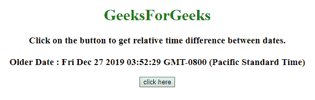
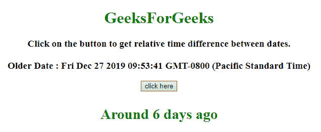
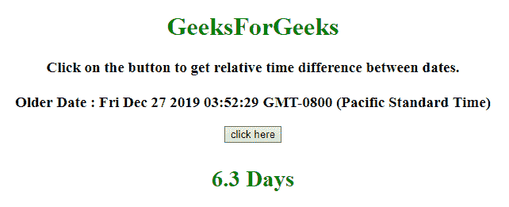

# 获取 JavaScript 中日期之间的相对时间戳差

> 原文:[https://www . geesforgeks . org/get-相对-时间戳-javascript 中的日期差/](https://www.geeksforgeeks.org/get-the-relative-timestamp-difference-between-dates-in-javascript/)

给定两个 JavaScript 日期，任务是获取它们之间的相对时间差(例如..2 小时前，2.5 天前等。)这里讨论了借助 javaScript 的两种方法。

**方法 1:**

*   获取变量中的前一个日期和当前日期。
*   计算以分钟、小时、日、月和年为单位的毫秒数。
*   计算前一日期和当前日期之间的毫秒差。
*   将这些毫秒与以分钟、小时、天、月和年为单位的毫秒按此顺序进行比较。
*   如果毫秒数小于其中任何一个，则计算相应的分钟、小时、天、月和年。

**示例 1:** 该示例实现了上述方法。

```
<!DOCTYPE HTML>
<html>

<head>
    <title>
        Get the relative timestamp difference between dates in JavaScript.
    </title>
    <script src=
"https://ajax.googleapis.com/ajax/libs/jquery/3.4.0/jquery.min.js">
    </script>
</head>

<body style="text-align:center;">
    <h1 style="color:green;">  
            GeeksForGeeks  
        </h1>
    <p id="GFG_UP">
    </p>
    <button onclick="GFG_Fun();">
        click here
    </button>
    <p id="GFG_DOWN">
    </p>
    <script>
        var up = document.getElementById('GFG_UP');
        var down = document.getElementById('GFG_DOWN');
        var prevDate = new Date();
        prevDate.setDate(prevDate.getDate() - 6);
        up.innerHTML =
            "Click on the button to get relative time difference between dates." +
            "<br><br>Older Date : " + prevDate;

        function timeDiff(curr, prev) {
            var ms_Min = 60 * 1000; // milliseconds in Minute
            var ms_Hour = ms_Min * 60; // milliseconds in Hour
            var ms_Day = ms_Hour * 24; // milliseconds in day
            var ms_Mon = ms_Day * 30; // milliseconds in Month
            var ms_Yr = ms_Day * 365; // milliseconds in Year
            var diff = curr - prev; //difference between dates.
            // If the diff is less then milliseconds in a minute
            if (diff < ms_Min) {
                return Math.round(diff / 1000) + ' seconds ago';

                // If the diff is less then milliseconds in a Hour
            } else if (diff < ms_Hour) {
                return Math.round(diff / ms_Min) + ' minutes ago';

                // If the diff is less then milliseconds in a day
            } else if (diff < ms_Day) {
                return Math.round(diff / ms_Hour) + ' hours ago';

                // If the diff is less then milliseconds in a Month
            } else if (diff < ms_Mon) {
                return 'Around ' + Math.round(diff / ms_Day) + ' days ago';

                // If the diff is less then milliseconds in a year
            } else if (diff < ms_Yr) {
                return 'Around ' + Math.round(diff / ms_Mon) + ' months ago';
            } else {
                return 'Around ' + Math.round(diff / ms_Yr) + ' years ago';
            }
        }

        function GFG_Fun() {
            $('#GFG_DOWN').html(timeDiff(new Date(), prevDate));
        }
    </script>
</body>

</html>
```

**输出:**

*   **点击按钮前:**
    
*   **点击按钮后:**
    

**方法 2:**

*   获取变量中的前一个日期和当前日期。
*   计算日期之间的秒数、分钟数、小时数和天数。
*   按此顺序将这些参数与 60 秒、60 分钟、24 小时、一天进行比较。
*   如果这些条件中的任何一个满足，则返回相应的参数。

**示例 2:** 该示例实现了上述方法。

```
<!DOCTYPE HTML>
<html>

<head>
    <title>
        Get the relative timestamp difference
      between dates in JavaScript.
    </title>
    <script src=
"https://ajax.googleapis.com/ajax/libs/jquery/3.4.0/jquery.min.js">
    </script>
</head>

<body style="text-align:center;">
    <h1 style="color:green;">  
            GeeksForGeeks  
        </h1>
    <p id="GFG_UP">
    </p>
    <button onclick="GFG_Fun();">
        click here
    </button>
    <p id="GFG_DOWN">
    </p>
    <script>
        var up = document.getElementById('GFG_UP');
        var down = document.getElementById('GFG_DOWN');
        var prevDate = new Date();
        prevDate.setDate(prevDate.getDate() - 6);
        prevDate.setHours(prevDate.getHours() - 6);
        up.innerHTML =
            "Click on the button to get relative time " +
            "difference between dates.<br><br>Older Date : " + prevDate;

        function conversion(ms) {

            // Calculating Seconds
            var sec = (ms / 1000).toFixed(1);

            // Calculating Minutes
            var min = (ms / (1000 * 60)).toFixed(1);

            // Calculating hours 
            var hrs = (ms / (1000 * 60 * 60)).toFixed(1);

            // Calculating days
            var days = (ms / (1000 * 60 * 60 * 24)).toFixed(1);
            if (sec < 60) {
                return sec + " Sec";
            } else if (min < 60) {
                return min + " Min";
            } else if (hrs < 24) {
                return hrs + " Hrs";
            } else {
                return days + " Days"
            }
        }

        function GFG_Fun() {
            var date = new Date();
$('#GFG_DOWN').html(conversion(date.getTime() - prevDate.getTime()));
        }
    </script>
</body>

</html>
```

**输出:**

*   **点击按钮前:**
    
*   **点击按钮后:**
    