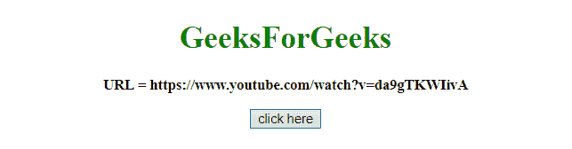
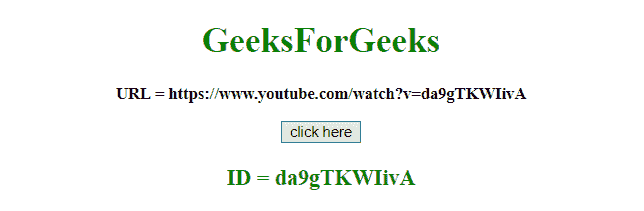

# 使用 JavaScript 从 URL 获取 YouTube 视频 ID

> 原文:[https://www . geesforgeks . org/get-the-YouTube-video-id-from-a-URL-using-JavaScript/](https://www.geeksforgeeks.org/get-the-youtube-video-id-from-a-url-using-javascript/)

给定一个 Youtube 视频网址，工作是使用 JavaScript 从网址中获取视频标识。这里讨论几个方法。

*   **split() method:**
    This method is used to split a string into an array of substrings, and returns the new array.
    **Syntax:**

    ```
    string.split(separator, limit)

    ```

    **参数:**

    *   **分隔符:**此参数为可选。它指定用于拆分字符串的字符或正则表达式。如果不使用，将返回整个字符串(只有一项的数组)
    *   **极限:**此参数为可选。它指定指定拆分次数的整数，超出拆分限制的项目将从数组中排除。

    **返回值:**
    返回一个新数组，包含拆分后的项目。

*   **JavaScript String substring()方法:**
    这个方法从一个字符串中获取两个定义的索引之间的字符，并返回新的子字符串。
    该方法获取字符串中“开始”和“结束”之间的字符，不包括“结束”本身。
    **语法:**

```
string.substring(start, end)

```

**参数:**

*   **开始:**此参数为必填项。它指定开始提取的位置。第一个字符的索引从 0 开始。
*   **结束:**此参数为可选。它指定停止提取的位置(包括)。如果不使用，它将提取整个字符串。

**返回值:**
返回包含提取字符的新字符串。

**示例 1:** 本示例通过正则表达式获取视频标识。

```
<!DOCTYPE HTML>
<html>

<head>
    <title>
        JavaScript
      | Get the YouTube video ID from a URL.
    </title>
</head>

<body style="text-align:center;" 
      id="body">
    <h1 style="color:green;">  
            GeeksForGeeks  
        </h1>
    <p id="GFG_UP" 
       style="font-size: 15px; 
              font-weight: bold;">
    </p>
    <button onclick="GFG_Fun()">
        click here
    </button>
    <p id="GFG_DOWN" 
       style="color:green;
              font-size: 20px; 
              font-weight: bold;">
    </p>
    <script>
        var up = document.getElementById('GFG_UP');
        var url = 'https://youtu.be/BnJWi0E3Mv0';
        up.innerHTML = "URL = " + url;
        var down = document.getElementById('GFG_DOWN');

        function GFG_Fun() {
            VID_REGEX =
/(?:youtube(?:-nocookie)?\.com\/(?:[^\/\n\s]+\/\S+\/|(?:v|e(?:mbed)?)\/|\S*?[?&]v=)|youtu\.be\/)([a-zA-Z0-9_-]{11})/;
            down.innerHTML = "ID = "
            + url.match(VID_REGEX)[1];
        }
    </script>
</body>

</html>
```

**输出:**

*   **点击按钮前:**
    
*   **点击按钮后:**
    

**示例 2:** 本示例首先拆分 URL，然后使用 **split()和 substring()方法**获取字符串的一部分。

```
<!DOCTYPE HTML>
<html>

<head>
    <title>
        JavaScript 
      | Get the YouTube video ID from a URL.
    </title>
</head>

<body style="text-align:center;"
      id="body">
    <h1 style="color:green;">  
            GeeksForGeeks  
        </h1>
    <p id="GFG_UP" 
       style="font-size: 15px;
              font-weight: bold;">
    </p>
    <button onclick="GFG_Fun()">
        click here
    </button>
    <p id="GFG_DOWN" 
       style="color:green;
              font-size: 20px;
              font-weight: bold;">
    </p>
    <script>
        var up = document.getElementById('GFG_UP');
        var url = 'https://www.youtube.com/watch?v=da9gTKWIivA';
        up.innerHTML = "URL = " + url;
        var down = document.getElementById('GFG_DOWN');

        function GFG_Fun() {
            down.innerHTML = "ID = " 
            + url.split("v=")[1].substring(0, 11);
        }
    </script>
</body>

</html>
```

**输出:**

*   **点击按钮前:**
    
*   **点击按钮后:**
    