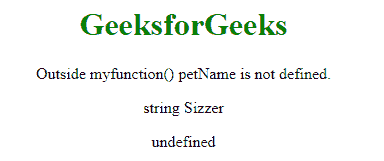
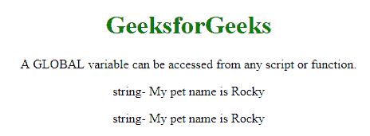

# JavaScript 中的全局和局部变量

> 原文:[https://www . geesforgeks . org/全局和局部变量 in-javascript/](https://www.geeksforgeeks.org/global-and-local-variables-in-javascript/)

**变量:**保存可以随时更改的数据或信息。JavaScript 使用保留关键字 var 来声明变量。在 JavaScript 中，有两种类型的变量，它还告诉您在程序中的什么地方可以使用您定义的变量和函数。

*   **Local Variable:**

    当您使用 JavaScript 时，局部变量是在函数中定义的变量。它们有局部作用域，这意味着它们只能在定义它们的函数中使用。

*   **Global Variable:**

    相反，全局变量是在函数之外定义的变量。这些变量具有全局作用域，因此任何函数都可以使用它们，而无需将它们作为参数传递给函数。

    **局部变量:**因为局部变量是在函数内部定义的，所以同名的变量可以用在不同的函数中。

    **示例:**

    ```
    <!DOCTYPE html>
    <html>

    <body>
        <center>
            <h1 style="color:green;">GeeksforGeeks</h1>

            <p>Outside myfunction() petName is not defined.</p>

            <p id="Geeks"></p>

            <p id="geeks"></p>

            <script>
                myfunction();

                function myfunction() {
                    var petName = "Sizzer"; // local variabl
                    document.getElementById("Geeks").innerHTML =
                        typeof petName + " " + petName;
                }

                document.getElementById("geeks").innerHTML =
                    typeof petName;
            </script>
      </center>

    </body>

    </html>
    ```

    **输出:**
    

    上面的例子说明了局部变量的使用。但是，函数外部的语句不能引用名为 petName 的变量而不导致错误。那是因为它有局部范围。

    **全局变量:**由于全局变量是在函数外部定义的，因此同名变量不能用于不同的函数。网页上的所有脚本和函数都可以访问它。

    **示例:**

    ```
    <!DOCTYPE html>
    <html>

    <body>
        <center>
            <h1 style="color:green;">GeeksforGeeks</h1>

            <p>A GLOBAL variable can be accessed from 
                                any script or function.</p>

            <p id="geeks"></p>
            <p id="Geeks"></p>
            <script>
                var petName = "Rocky";//global variable
                myFunction();

                function myFunction() {
                    document.getElementById("geeks").innerHTML =
                      typeof petName + "- " + "My pet name is " + petName;
                }

                document.getElementById("Geeks").innerHTML =
                   typeof petName + "- " + "My pet name is " + petName;
            </script>
      </center>

    </body>

    </html>
    ```

    **输出:**
    

    **Where to use which variables:**
*   虽然使用全局变量似乎比将数据传递给函数并从中返回数据更容易，但是全局变量经常会产生问题。这是因为任何函数都可以修改全局变量，而且很容易拼错变量名或修改错误的变量，尤其是在大型应用程序中。这又会产生调试问题。
*   相比之下，局部变量的使用减少了命名冲突的可能性。例如，两个不同的函数可以对局部变量使用相同的名称，而不会导致冲突。当然，这意味着更少的错误和调试问题。除了少数例外，应用程序中的所有代码都应该在函数中，所以所有变量都是局部的。
*   如果您拼错了已经声明的变量的名称，它将被视为一个新的全局变量。考虑到这一点，在声明新变量时一定要包含关键字，并且总是在代码中引用变量之前声明一个变量。

**注意:**尽可能使用局部变量。在变量被其他语句引用之前，总是使用 var 关键字来声明一个新变量。

**How to use variables:**

*   变量或函数的范围决定了哪些代码可以访问它。*   在函数内部创建的变量是局部变量，而局部变量和局部变量只能由函数内部的代码引用。*   在函数外部创建的变量是全局变量，所有函数中的代码都可以访问所有全局变量。*   如果您忘记在变量声明中编码 var 关键字，JavaScript 引擎会假设该变量是全局变量。这可能会导致调试问题。*   一般来说，将局部变量作为参数从一个函数传递到另一个函数比使用全局变量要好。这将使您的代码更容易理解，出错的机会也更少。