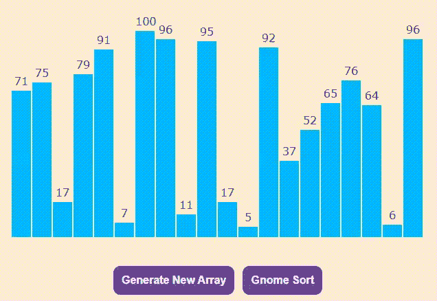

# 使用 JavaScript 的侏儒排序可视化工具

> 原文:[https://www . geesforgeks . org/gnome-sort-visualizer-use-JavaScript/](https://www.geeksforgeeks.org/gnome-sort-visualizer-using-javascript/)

侏儒排序也称为愚蠢排序，是基于花园侏儒排序他的花盆的概念。为了了解更多。请参考 [Gnome 排序](https://www.geeksforgeeks.org/gnome-sort-a-stupid-one/)。

像 **Gnome Sort** 这样的算法可以通过可视化而不是长代码来轻松理解。在本文中， **Gnome 排序可视化工具**是使用 **HTML、CSS** & **JavaScript** 实现的。

**先决条件:**

*   gnome 出来。
*   基本的 HTML、CSS 和 JavaScript。
*   JavaScript [承诺](https://www.geeksforgeeks.org/javascript-promises/)。
*   JavaScript [异步/等待](https://www.geeksforgeeks.org/async-await-function-in-javascript/)功能。

**进场:**

*   按钮**生成新数组**使用**数学.随机()**函数生成一个随机值数组，以及一个对应于该值的高度条。
*   不同的颜色用于指示哪些元素未排序(天蓝色)、已比较(深蓝色和红色)和已排序(浅绿色)。
*   按钮 **Gnome 排序**使用 Gnome 排序算法对元素进行排序。
*   最后，对元素进行排序。

## index.html

```html
<!DOCTYPE html>
<html lang="en">

  <!-- Head -->
  <head>
    <meta charset="UTF-8" />
    <meta name="viewport"
    content="width=device-width, 
       initial-scale=1.0" />
    <meta http-equiv="X-UA-Compatible" 
    content="ie=edge" />

    <!-- Title -->
    <title>Gnome Sort Visualizer</title>

    <!-- Linking style.css -->
    <link href="style.css" rel="stylesheet" />
  </head>

  <!-- Body -->
  <body>
    <section class="head">Gnome Sort Visualizer</section>
    <section class="data-container"></section>
    <section id="ele"></section>
    <div style="margin: auto; width: fit-content">

      <!-- "Generate New Array" button -->
      <button class="btn1" onclick="generate()" id="Button1">
        Generate New Array
      </button>

      <!-- "Gnome Sort" button -->
      <button class="btn2" onclick="CombSort(),disable()" id="Button2">
        Gnome Sort
      </button>
    </div>
  </body>

  <!-- Linking script.js -->
  <script src="script.js"></script>
</html>
```

## style.css

```html
.mySlides {
  display: none;
}
body {
  background-color: rgb(255, 235, 211);
  font-family: Verdana, sans-serif;
}
.head {
  margin-top: 20px;
  margin-right: 20vw;
  margin-left: 20vw;
  text-align: center;
  font-size: 30px;
  background-color: #6f459e;
  color: white;
  border-radius: 19px;
  font-weight: bolder;
}
.data-container {
  width: 600px;
  height: 364px;
  position: relative;
  margin: 0 auto;
}
.bar {
  width: 28px;
  position: absolute;
  left: 0;
  bottom: 0;
  background-color: rgb(0, 183, 255);
  transition: 0.2s all ease;
}
.bar__id {
  position: absolute;
  top: -24px;
  width: 100%;
  text-align: center;
}
.btn1 {
  padding: 12px;
  font-weight: bolder;
  background-color: #6f459e;
  border-radius: 10px;
  color: white;
  font-size: 16px;
  border: white;
  margin-top: 1vw;
  margin-right: 1vw;
}
.btn2 {
  padding: 12px;
  font-weight: bolder;
  background-color: #6f459e;
  border-radius: 10px;
  color: white;
  font-size: 16px;
  border: white;
}
#ele {
  text-align: center;
  height: 35px;
}
```

## script.js

```html
const container = document.querySelector(".data-container");

// Function to generate bars
function generatebars(num = 20) {

  // For loop to generate 20 bars
  for (let i = 0; i < num; i += 1) {

    // To generate random values from 1 to 100
    const value = Math.floor(Math.random() * 100) + 1;

    // To create element "div"
    const bar = document.createElement("div");

    // To add class "bar" to "div"
    bar.classList.add("bar");

    // Provide height to the bar
    bar.style.height = `${value * 3}px`;

    // Translate the bar towards positive X axis
    bar.style.transform = `translateX(${i * 30}px)`;

    // To create element "label"
    const barLabel = document.createElement("label");

    // To add class "bar_id" to "label"
    barLabel.classList.add("bar__id");

    // Assign value to "label"
    barLabel.innerHTML = value;

    // Append "Label" to "div"
    bar.appendChild(barLabel);

    // Append "div" to "data-container div"
    container.appendChild(bar);
  }
}

// Asynchronous function to perform "Gnome Sort"
async function CombSort(delay = 600) {
  let bars = document.querySelectorAll(".bar");

  var pos = 0;

  while (pos < 20) {
    if (pos == 0) {
      pos++;
    }

    // Assigning value of posth bar into value1
    var value1 = parseInt(bars[pos].childNodes[0].innerHTML);

    // Assigning value of pos-1th bar into value1
    var value2 = parseInt(bars[pos - 1].childNodes[0].innerHTML);

    // Comparing value1 and value2
    if (value1 >= value2) {
      pos++;
    } else {

      // Provide red color to the posth bar
      bars[pos].style.backgroundColor = "red";

      // Provide red color to the pos-1th bar
      bars[pos - 1].style.backgroundColor = "red";

      // Swap posth bar with (pos-1)th bar
      var temp1 = bars[pos].style.height;
      var temp2 = bars[pos].childNodes[0].innerText;

      // To pause the execution of code for 300 milliseconds
      await new Promise((resolve) =>
        setTimeout(() => {
          resolve();
        }, 300)
      );

      // Swap posth bar with (pos-1)th bar
      bars[pos].style.height = bars[pos - 1].style.height;
      bars[pos].childNodes[0].innerText = 
            bars[pos - 1].childNodes[0].innerText;
      bars[pos - 1].style.height = temp1;
      bars[pos - 1].childNodes[0].innerText = temp2;
      pos--;
    }

    // To pause the execution of code for 300 milliseconds
    await new Promise((resolve) =>
      setTimeout(() => {
        resolve();
      }, 300)
    );

    // Providing skyblue color
    for (var x = 0; x < 20; x++) {
      bars[x].style.backgroundColor = "rgb(0, 183, 255)";
    }
  }

  // Providing lightgreen color
  for (var x = 0; x < 20; x++) {
    bars[x].style.backgroundColor = "rgb(49, 226, 13)";
  }

  // To enable the button "Generate New Array" after final(sorted)
  document.getElementById("Button1").disabled = false;
  document.getElementById("Button1").style.backgroundColor = "#6f459e";

  // To enable the button "Gnome Sort" after final(sorted)
  document.getElementById("Button2").disabled = false;
  document.getElementById("Button2").style.backgroundColor = "#6f459e";
}

// Call "generatebars()" function
generatebars();

// Function to generate new random array
function generate() {
  window.location.reload();
}

// Function to disable the button
function disable() {

  // To disable the button "Generate New Array"
  document.getElementById("Button1").disabled = true;
  document.getElementById("Button1").style.backgroundColor = "#d8b6ff";

  // To disable the button "Gnome Sort"
  document.getElementById("Button2").disabled = true;
  document.getElementById("Button2").style.backgroundColor = "#d8b6ff";
}
```

**输出:**

