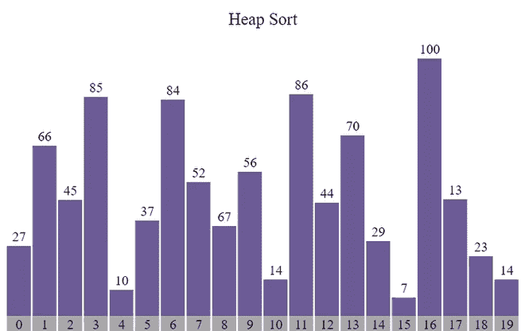
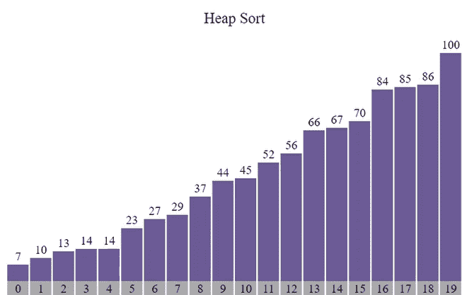
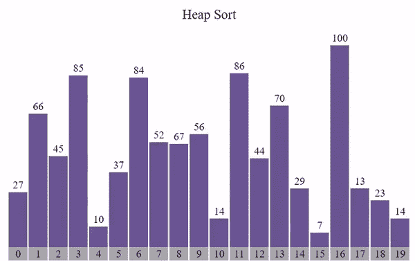

# 使用 JavaScript 的堆排序可视化

> 原文:[https://www . geesforgeks . org/heap-sort-visualization-use-JavaScript/](https://www.geeksforgeeks.org/heap-sort-visualization-using-javascript/)

**图形用户界面**比程序更容易理解。在本文中，我们将使用 JavaScript 可视化堆排序。我们将看到数组如何首先被转换成 Maxheap，然后我们如何得到最终的排序数组。我们还将可视化堆排序的时间复杂性。

**参考:**

*   [堆排序](https://www.geeksforgeeks.org/heap-sort/)
*   [JavaScript 中的异步函数](https://www.geeksforgeeks.org/how-to-create-an-asynchronous-function-in-javascript/)

**进场:**

*   首先，我们将使用 [Math.random()](https://www.geeksforgeeks.org/javascript-math-random-method/) 函数生成一个随机数组。
*   不同的颜色用于指示正在比较、排序和未排序的元素。
*   由于算法的运算速度非常快， [setTimeout()](https://www.geeksforgeeks.org/java-script-settimeout-setinterval-method/) 功能被用来减缓进程。
*   按**“Ctrl+R”**键可生成新数组。
*   使用 **Heapify()** 功能，使用 **HeapSort()** 功能执行排序。

**示例:**



排序前



排序后

下面是可视化[堆排序](https://www.geeksforgeeks.org/heap-sort/)算法的程序。

**index.html**

## 超文本标记语言

```html
<!DOCTYPE html>
<html lang="en">

<head>
    <link rel="stylesheet" href="style.css" />
</head>

<body>
    <br />
    <p class="header">Heap Sort</p>

    <div id="array"></div>
    <div id="count"></div>
    <script src="script.js"></script>
</body>

</html>
```

**style.css:** 以下是上述文件中使用的“style.css”的内容。

## 半铸钢ˌ钢性铸铁(Cast Semi-Steel)

```html
* {
    margin: 0px;
    padding: 0px;
    box-sizing: border-box;
}

.header {
    font-size: 20px;
    text-align: center;
}

#array {
    background-color: white;
    height: 270px;
    width: 598px;
    margin: auto;
    position: relative;
    margin-top: 64px;
}

.block {
    width: 28px;
    background-color: #6b5b95;
    position: absolute;
    bottom: 0px;
    transition: 0.2s all ease;
}

.block_id {
    position: absolute;
    color: black;
    margin-top: -20px;
    width: 100%;
    text-align: center;
}

.block_id2 {
    position: absolute;
    color: black;
    margin-top: 22px;
    width: 100%;
    text-align: center;
}

.block2 {
    width: 28px;
    background-color: darkgray;
    position: absolute;
    transition: 0.2s all ease;
}

.block_id3 {
    position: absolute;
    color: black;
    margin-top: 1px;
    width: 100%;
    text-align: center;
}

#count {
    height: 20px;
    width: 598px;
    margin: auto;
}
```

**script.js:** 以下是上述 HTML 代码中使用的“script.js”文件的内容。

## java 描述语言

```html
var container = document.getElementById("array");

// Function to generate the array of blocks
function generatearray() {
  for (var i = 0; i < 20; i++) {

    // Return a value from 1 to 100 (both inclusive)
    var value = Math.ceil(Math.random() * 100);

    // Creating element div
    var array_ele = document.createElement("div");

    // Adding class 'block' to div
    array_ele.classList.add("block");

    // Adding style to div
    array_ele.style.height = `${value * 3}px`;
    array_ele.style.transform = `translate(${i * 30}px)`;

    // Creating label element for displaying
    // size of particular block
    var array_ele_label = document.createElement("label");
    array_ele_label.classList.add("block_id");
    array_ele_label.innerText = value;

    // Appending created elements to index.html
    array_ele.appendChild(array_ele_label);
    container.appendChild(array_ele);
  }
}

// Function to generate the indexes
var count_container = document.getElementById("count");
function generate_idx() {
  for (var i = 0; i < 20; i++) {

    // Creating element div
    var array_ele2 = document.createElement("div");

    // Adding class 'block2' to div
    array_ele2.classList.add("block2");

    // Adding style to div
    array_ele2.style.height = `${20}px`;
    array_ele2.style.transform = `translate(${i * 30}px)`;

    // Giving indexes
    var array_ele_label2 = document.createElement("label");
    array_ele_label2.classList.add("block_id3");
    array_ele_label2.innerText = i;

    // Appending created elements to index.html
    array_ele2.appendChild(array_ele_label2);
    count_container.appendChild(array_ele2);
  }
}

// Asynchronous Heapify function
async function Heapify(n, i) {
  var blocks = document.querySelectorAll(".block");
  var largest = i; // Initialize largest as root
  var l = 2 * i + 1; // left = 2*i + 1
  var r = 2 * i + 2; // right = 2*i + 2

  // If left child is larger than root
  if (
    l < n &&
    Number(blocks[l].childNodes[0].innerHTML) >
      Number(blocks[largest].childNodes[0].innerHTML)
  )
    largest = l;

  // If right child is larger than largest so far
  if (
    r < n &&
    Number(blocks[r].childNodes[0].innerHTML) >
      Number(blocks[largest].childNodes[0].innerHTML)
  )
    largest = r;

  // If largest is not root
  if (largest != i) {
    var temp1 = blocks[i].style.height;
    var temp2 = blocks[i].childNodes[0].innerText;
    blocks[i].style.height = blocks[largest].style.height;
    blocks[largest].style.height = temp1;
    blocks[i].childNodes[0].innerText =
    blocks[largest].childNodes[0].innerText;
    blocks[largest].childNodes[0].innerText = temp2;

    await new Promise((resolve) =>
      setTimeout(() => {
        resolve();
      }, 250)
    );

    // Recursively Hapify the affected sub-tree
    await Heapify(n, largest);
  }
}

// Asynchronous HeapSort function
async function HeapSort(n) {
  var blocks = document.querySelectorAll(".block");

  // Build heap (rearrange array)
  for (var i = n / 2 - 1; i >= 0; i--) {
    await Heapify(n, i);
  }

  // One by one extract an element from heap
  for (var i = n - 1; i > 0; i--) {

    // Move current root to end
    var temp1 = blocks[i].style.height;
    var temp2 = blocks[i].childNodes[0].innerText;
    blocks[i].style.height = blocks[0].style.height;
    blocks[0].style.height = temp1;
    blocks[i].childNodes[0].innerText = 
    blocks[0].childNodes[0].innerText;
    blocks[0].childNodes[0].innerText = temp2;

    await new Promise((resolve) =>
      setTimeout(() => {
        resolve();
      }, 250)
    );

    // Call max Heapify on the reduced heap
    await Heapify(i, 0);
  }
}

// Calling generatearray function
generatearray();

// Calling generate_idx function
generate_idx();

// Calling HeapSort function
HeapSort(20);
```

**输出:**

