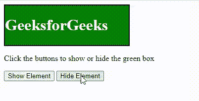

# 使用 JavaScript 中的可见性属性隐藏或显示 HTML 元素

> 原文:[https://www . geesforgeks . org/hide-or-show-html-elements-use-visibility-property-in-JavaScript/](https://www.geeksforgeeks.org/hide-or-show-html-elements-using-visibility-property-in-javascript/)

可见性属性用于隐藏或显示 HTML 元素的内容。可见性属性指定元素当前在页面上可见。“隐藏”值可用于隐藏元素。这将隐藏元素，但不会移除元素占用的空间，这与 display 属性不同。

**语法:**

```
element.style.visibility = 'hidden';
element.style.visibility = 'visible';
```

**示例:**

## 超文本标记语言

```
<!DOCTYPE html>
<html>

<head>

    <style>
        .container {
            height: 80px;
            width: 250px;
            border: 2px solid black;
            background-color: green;
            color: white;
        }
    </style>
</head>

<body>
    <div class="container">
        <h1>GeeksforGeeks</h1>
    </div>

<p>
        Click the buttons to show or hide the green box
    </p>

    <button onclick="showElement()">
            Show Element
    </button>

    <button onclick="hideElement()">
            Hide Element
    </button>

    <script type="text/javascript">
        function showElement() {
            element = document.querySelector('.container');
            element.style.visibility = 'visible';
        }

        function hideElement() {
            element = document.querySelector('.container');
            element.style.visibility = 'hidden';
        }
    </script>
</body>

</html>
```

**输出:**

