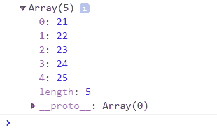
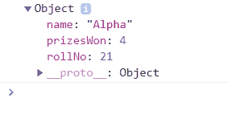
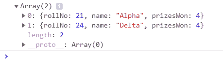

# JavaScript 中的高阶箭头函数

> 原文:[https://www . geesforgeks . org/高阶-箭头-函数-in-javascript/](https://www.geeksforgeeks.org/higher-order-arrow-functions-in-javascript/)

**先决条件:** [箭头功能](https://www.geeksforgeeks.org/arrow-functions-in-javascript/)

高阶函数是接收函数作为*参数*的函数，否则返回函数作为*输出*。高阶箭头功能意味着使用箭头功能(在 ***ES6*** 中)和高阶功能。

**高阶箭头功能需求:**

*   一般来说，程序员指导如何执行功能，而不是什么是需要的，这增加了代码的长度，使其容易出错。
*   而在高阶箭头函数实现中，代码要短得多*、*简洁*、*简洁*、*易于调试*，并且关注于需要什么而不是如何*实现它。**
*   *我们可以直接用当前值来处理*，而不是使用其索引(即 arr[0])单独访问它。**
*   *不需要创建预定义的数组并推回更改。*
*   *可以避免对象的突变，不需要维护回路的**。***

***为什么要避免 forEach()？**
forEach()函数不返回任何值，因此需要将结果放入预定义的数组中，而 map()函数则不是这种情况。*

```
*<script>
// Data set of students
var Students = [
    { rollNo: 21, name: 'Alpha' },
    { rollNo: 22, name: 'Beta' },
    { rollNo: 23, name: 'Gamma' },
    { rollNo: 24, name: 'Delta' },
    { rollNo: 25, name: 'Omega'}
];

// Use forEach() function
var StudentRollNo = [];

Students.forEach(function (Student) {
    StudentRollNo.push(Student.rollNo);
});

// Display rollNo data
console.log(StudentRollNo);
</script>*
```

***输出:**
*

*高阶函数是:*

1.  ***map() Function:** It works on a given array like *changing/transforming* the whole array and then simply return it. It does not break the flow for few conditions. The map() function takes two arguments. The first is *callback* which gives the *current value* of the iteration, *index* of iteration, *original array* from which the map was called. The *other argument* is *not mandatory* which is the value to use as this in the callback. One drawback of using the map() function is that its performance is good only with *small data sets*.

    ```
    <script>
    // Data set of students
    var Students = [
        { rollNo: 21, name: 'Alpha' },
        { rollNo: 22, name: 'Beta' },
        { rollNo: 23, name: 'Gamma' },
        { rollNo: 24, name: 'Delta' },
        { rollNo: 25, name: 'Omega'}
    ];

    // Use map() function
    var StudentRollNo = Students.map(function (Student) {
        return Student.rollNo
    });

    // Display rollNo data
    console.log(StudentRollNo);
    </script>
    ```

    **输出:**
    

    以上代码的实现使用**箭头功能**。

    ```
    <script>
    // Data set of students
    var Students = [
        { rollNo: 21, name: 'Alpha' },
        { rollNo: 22, name: 'Beta' },
        { rollNo: 23, name: 'Gamma' },
        { rollNo: 24, name: 'Delta' },
        { rollNo: 25, name: 'Omega'}
    ];

    // Use map() function with arrow functions
    const StudentRollNo = 
        Students.map(Student => Student.rollNo); 

    // Display Roll no data
    console.log(StudentRollNo);
    </script>
    ```

    **输出:**
    

    **注:**更多信息请参考:[JavaScript 中的地图](https://www.geeksforgeeks.org/map-in-javascript/)* 
2.  ***reduce() Function:** It is similar to map() function in terms of callback for every element of array. But the difference is that it *reduce passes* the result of this callback from original array to another. The result is termed as ***accumulator*** which can be of anything *integer*, *character*, *string*, *object*, *map* etc and should be passed while invoking. The *callback* now gets the *accumulator, current value, index of iteration, whole array*.
    In simple words, the accumulator accumulates all the return values. Its value is the collection of previously returned accumulations.

    ```
    <script>
    // Data set of students
    var Students = [
        { rollNo: 21, name: 'Alpha', prizesWon: 1 },
        { rollNo: 22, name: 'Beta', prizesWon: 3 },
        { rollNo: 23, name: 'Gamma', prizesWon: 0 },
        { rollNo: 24, name: 'Delta', prizesWon: 0 },
        { rollNo: 25, name: 'Omega', prizesWon: 1}
    ];

    // Using reduce() function
    var totalPrizes = Students.reduce(function (accumulator, Student) {
        return accumulator + Student.prizesWon;
    }, 0);

    // Display total number of prizes won by all
    console.log(totalPrizes);
    </script>
    ```

    **输出:**

    ```
    5
    ```

    以上代码的实现使用**箭头功能**。

    ```
    <script>
    // Data set of students
    var Students = [
        { rollNo: 21, name: 'Alpha', prizesWon: 1 },
        { rollNo: 22, name: 'Beta', prizesWon: 3 },
        { rollNo: 23, name: 'Gamma', prizesWon: 0 },
        { rollNo: 24, name: 'Delta', prizesWon: 0 },
        { rollNo: 25, name: 'Omega', prizesWon: 1}
    ];

    // Using reduce() function with arrow functions
    const totalPrizes = Students.reduce(
        (accumulator, Student) => accumulator + Student.prizesWon, 0);

    // Display total number of prizes won by all
    console.log(totalPrizes);
    </script>
    ```

    **输出:**

    ```
    5
    ```* 
3.  ***find() Function:** It also works on an array and returns the *first array element* which satisfies the *condition* given in the function. It is similar to map() function. Its performance is *not much efficient* in case of *large data sets* although it works fine with small data sets.

    ```
    <script>
    // Data set of students
    var Students = [
        { rollNo: 21, name: 'Alpha', prizesWon: 4 },
        { rollNo: 22, name: 'Beta', prizesWon: 3 },
        { rollNo: 23, name: 'Gamma', prizesWon: 0 },
        { rollNo: 24, name: 'Delta', prizesWon: 4 },
        { rollNo: 25, name: 'Omega', prizesWon: 1}
    ];

    // Using find() function 
    var achievers = Students.find(function (Student) {
        return Student.prizesWon == 4;
    });

    // Display only first Student who won four prizes
    console.log(achievers);
    </script>
    ```

    **输出:**
    

    以上代码的实现使用**箭头功能**。

    ```
    <script>
    // Data set of students
    var Students = [
        { rollNo: 21, name: 'Alpha', prizesWon: 4 },
        { rollNo: 22, name: 'Beta', prizesWon: 3 },
        { rollNo: 23, name: 'Gamma', prizesWon: 0 },
        { rollNo: 24, name: 'Delta', prizesWon: 4 },
        { rollNo: 25, name: 'Omega', prizesWon: 1}
    ];

    // Using find() function with arrow functions
    var achievers = Students.find(
        (Student) => Student.prizesWon == 4);

    // Display only first Student who won four prizes
    console.log(achievers);
    </script>
    ```

    **输出:**
    * 
4.  ***filter() Function:** The filter() function works on an array and returns an array for filtered items implying the *length* of the array is *reduced*. It also receives the similar arguments as map but the difference lies in the callback as it needs to return either *true* or *false*. If the value returned is true then the element remains in the array otherwise the element is filtered out.

    ```
    <script>
    // Data set of students
    var Students = [
        { rollNo: 21, name: 'Alpha', prizesWon: 4 },
        { rollNo: 22, name: 'Beta', prizesWon: 3 },
        { rollNo: 23, name: 'Gamma', prizesWon: 0 },
        { rollNo: 24, name: 'Delta', prizesWon: 4 },
        { rollNo: 25, name: 'Omega', prizesWon: 1}
    ];

    // Using filter() function 
    var achievers = Students.filter(function (Student) {
        return Student.prizesWon == 4;
    });

    // Display Students who won four prizes
    console.log(achievers);
    </script>
    ```

    **输出:**
    

    以上代码的实现使用**箭头功能**。

    ```
    <script>
    // Data set of students
    var Students = [
        { rollNo: 21, name: 'Alpha', prizesWon: 4 },
        { rollNo: 22, name: 'Beta', prizesWon: 3 },
        { rollNo: 23, name: 'Gamma', prizesWon: 0 },
        { rollNo: 24, name: 'Delta', prizesWon: 4 },
        { rollNo: 25, name: 'Omega', prizesWon: 1}
    ];

    // Using filter() function with arrow functions
    var achievers = Students.filter(
        (Student) => Student.prizesWon == 4);

    // Display Students who won four prizes
    console.log(achievers);
    </script>
    ```

    **输出:**
    *