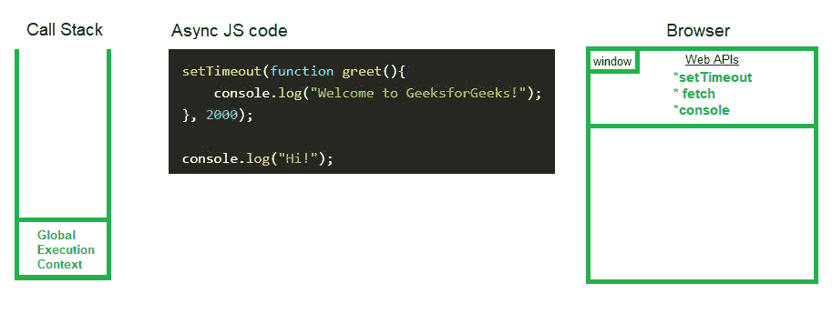
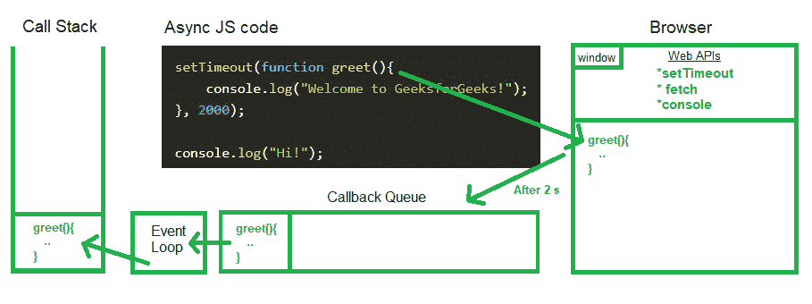

# 异步 JavaScript 代码如何在浏览器中执行？

> 原文:[https://www . geesforgeks . org/how-asynchronous-JavaScript-code-get-executed-in-browser/](https://www.geeksforgeeks.org/how-asynchronous-javascript-code-gets-executed-in-browser/)

与其他功能或操作并行运行的功能或操作在 JavaScript 中称为[异步](https://www.geeksforgeeks.org/synchronous-and-asynchronous-in-javascript/)功能或操作。异步函数使用稍后执行的[回调函数](https://www.geeksforgeeks.org/javascript-callbacks/)。让我们看一个例子来证明这一点:

## java 描述语言

```
setTimeout(function greet() {
  console.log("Welcome to GeeksforGeeks!");
}, 2000);
```

在上例中， *setTimeout* 是异步函数，使用回调函数*问候*，延迟 2000 毫秒。因此，定时器到期后，消息会打印在控制台中。现在，让我们看看上面的操作是如何在浏览器的 JavaScript 引擎中执行的。

**异步 JavaScript 执行的幕后:**

JavaScript 代码由[调用栈](https://www.geeksforgeeks.org/what-is-the-call-stack-in-javascript/)执行，由于调用栈不包含任何类似定时器的东西，我们不能延迟代码的执行。因此，为了执行异步操作，我们使用了 web API s *etTimeout()* 的帮助，它在浏览器的*窗口*全局对象中可用。

有趣的是 *setTimeout* 并不是 JavaScript 的一部分，它是众多 web APIs(如: [*setTImeout*](https://www.geeksforgeeks.org/java-script-settimeout-setinterval-method/) *、DOM APIs、*[*fetch*](https://www.geeksforgeeks.org/how-to-use-the-javascript-fetch-api-to-get-data/)*[*local storage*](https://www.geeksforgeeks.org/localstorage-and-sessionstorage-web-storage-apis/)*)、控制台、位置*等。)在浏览器的全局对象中可用。浏览器使 JavaScript 引擎能够通过这个全局对象访问这些 web APIs。而且，因为*窗口*是一个全局对象，所以我们可以在没有*窗口*关键字的情况下访问网络应用编程接口。*

*为了了解异步代码在浏览器中执行的幕后工作，让我们首先看一个异步代码的例子。*

***示例:***

## *java 描述语言*

```
*setTimeout(function greet(){
    console.log("Welcome to GeeksforGeeks!");
}, 2000);

console.log("Hi!");*
```

*这里 *setTimeout* 在 web API 环境中注册回调函数*问候*，并附加一个 2 秒时间的定时器。现在，当所有的 JavaScript 都被调用栈执行时，JavaScript 引擎将首先创建一个全局执行上下文，并执行最后一行并打印“嗨！”在控制台里。*

*

浏览器中异步 JavaScript 操作的执行* 

*一旦执行完成，全局执行上下文将从调用堆栈中移除。现在，在计时器到期后，为了打印问候消息，我们需要以某种方式将回调函数*问候*提取到调用堆栈中以便执行。这是由[**事件循环**](https://www.geeksforgeeks.org/what-is-an-event-loop-in-javascript/) 和**回调队列**完成的。*

*计时器过期后，回调函数被放入回调队列，事件循环的任务是检查调用堆栈是否为空，如果为空，则将回调函数从回调队列推到调用堆栈，回调函数从回调队列中移除。然后调用栈创建回调函数的执行上下文并执行它。*

*

浏览器中异步 JavaScript 操作的执行* 

*因此，代码的输出将是:*

```
*Hi!
Welcome to GeeksforGeeks!*
```

*延迟 2 秒后，将显示第二行。这就是 JavaScript 中的异步操作是如何在浏览器场景后面执行的。*