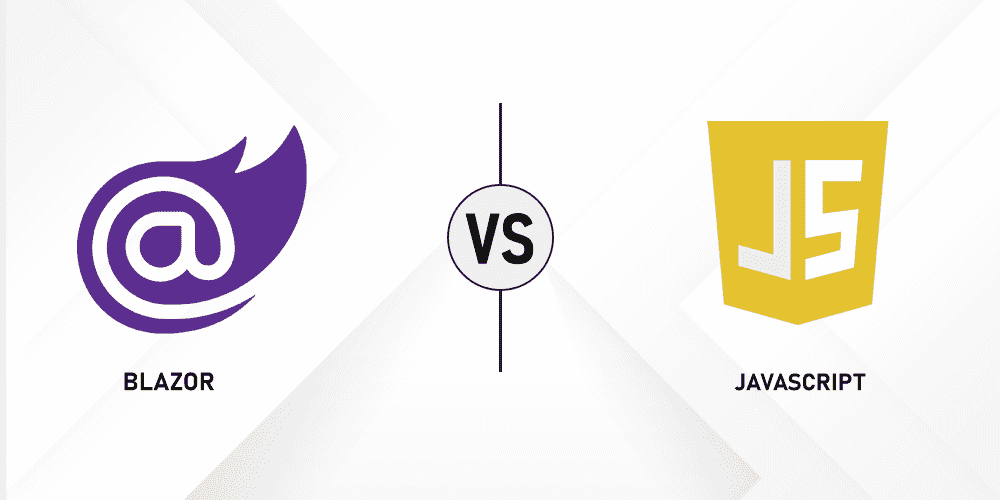

# Blazor 框架如何优于 JavaScript 框架？

> 原文:[https://www . geesforgeks . org/how-blazor-framework-优于-JavaScript-framework/](https://www.geeksforgeeks.org/how-blazor-framework-is-better-than-javascript-frameworks/)

JavaScript 是一种面向 web 的前端编程语言，它是一种轻量级且最常用的前端编程语言。它还使用来操作和验证数据。JavaScript 框架基本上是使用预写代码的 JavaScript 代码库。使用这些代码，我们可以创建网站和网络应用程序。以下是 JavaScript 框架的主要类型。

*   React.js
*   Angular.js
*   view . js-检视. js

### **1。React.js**

这是一个由脸书开发的开源客户端库。它非常简单且可扩展，用于创建单页应用程序或移动应用程序。借助 JavaScript 库和 angular js 模型视图控制器可以轻松使用，还提供了单向数据流。它使用单向绑定。

**反应堆的特性**

*   使用 JSX 扩展 react.js 是一个 JavaScript 语法扩展。保存应用程序时，有必要使用 JSX 扩展。
*   它作为一个组件工作。在 React.js 中，一切都是一个组件。在处理大规模项目时，它有助于维护代码。

**ReactJS 的优势**

*   ReactJS 使用虚拟文档对象模型。虚拟 DOM 提高应用程序性能 react.js 比常规 DOM 快得多。

**ReactJS 的缺点**

*   React.js 使用了一个巨大的库。
*   在作出反应时没有提供好文件

### 2.安古斯

Angular 是一个基于客户端 MVC 的框架。它为我们的网站提供了良好的设计和互动外观。JavaScript。AngularJS 将静态 HTML 内容更改为动态 Html 内容，它还提供了一个自定义属性选项。

**AngularJS**的特性

*   Angular 支持 MVC 架构。
*   它提供了角度 CLI。
*   它提供数据绑定。

**棱角分明的优点**

*   在 angular js 中，您可以使用可重用组件。
*   这对动态客户端应用程序很有帮助。

**棱角分明的缺点**

*   有角度的框架学习起来相当复杂。
*   Angular 提供了有限的 SEO 选项。

### 3.view . js-检视. js

它是一个 JavaScript 框架，用于设计交互式前端应用程序。它在视图图层上工作。它与大型项目顺利整合。

**vue . js 的特点**

*   使用虚拟文档对象模型。
*   它提供数据绑定。
*   它提供元素的动画和过渡。
*   Vue.js 是一个轻量级框架。
*   Vue.js 提供内置库，我们可以在代码中轻松使用这些库。

**vue . js 的优势**

*   这是一个小型框架。
*   Vue.js 很容易理解，可以顺利开发应用。
*   Vue.js 提供了详细的文档。
*   Vue.js 提供双向通信。
*   Vue.js 易于集成。

**vue . js 的缺点**

*   Vue.js 提供了一些插件。
*   它是由一个小社区开发的。
*   它不支持大型项目。

**什么是布拉佐？**

Blazor 是客户端 web 应用程序的 UI 框架。在这种情况下，我们使用 c#语言，它运行在网络汇编上。

**什么是 Web 组装？**

它类似于 Java 字节码，这意味着如果代码运行在 web 程序集中，它很容易与任何 web 浏览器兼容或运行。主要是给用户提供平台独立性。

**什么是 Blazor Web Assembly？**

Blazor web assembly 在 web 浏览器上运行，它执行一些类似于 JavaScript 框架 angular js 的功能或作出反应。

**布拉佐框架的特点**

*   表单和验证功能。
*   依赖注入特性。
*   路由功能。
*   布局特征。

**布拉佐的优势**

*   使用 C#制作网络应用程序。
*   它为我们的网站提供了一个互动的外观。
*   Blazor 服务器允许应用程序在服务器端运行。
*   在 Blazor web 程序集中，代码可以在客户端和服务器端共享。

**布拉佐的缺点**

遵循 Blazor 网络应用程序的缺点

*   它不兼容所有浏览器。它只与现代浏览器兼容。
*   与 Angular 或 React.js 相比，小型社区开发了 Blazor web 程序集

**Blazor Web 组件中的托管模型**

*   **客户端:**app 基于运行时直接在 web 组件上的 web 浏览器上执行。它也被称为静态 Blazor web 程序集。
*   **服务器:**这个中的组件运行在服务器端。它也被称为动态 Blazor web 程序集。它更小，应用程序加载更快。

### 为什么要在 JavaScript 框架上使用 Blazor？

Blazor 使用两种托管模型，客户端模型和服务器端模型。我们可以使用 Blazor 服务器在服务器端和客户端执行应用程序。在 Blazor 中，不需要第三方插件。

Blazor 使用最新的浏览器功能。而 JavaScript，我们可以像最古老的浏览器一样工作在现代。在 Blazor 中，我们可以在客户机和服务器之间共享代码。在 JavaScript 中，我们不能使用两种宿主模型。JavaScript 用作前端开发。

### JavaScript 框架与 Blazor 的比较

**Blazor VS React.js**

*   Blazor 和 React 用于网络应用程序构建器。这两个框架都是开源的。React 为开发的交互式用户界面提供了详细的 JavaScript 库。
*   Blazor 有一个使用 C#编程语言的 UI 框架，HTML Razor 在使用 web 程序集的浏览器的帮助下运行。在 Blazor 中使用增量 DOM，但在 react virtual 中，使用 DOM。在 Blazor 中，不需要插件，它还提供服务器端渲染。React 不提供服务器端呈现。Blazor 比 react 更高效，Blazor 还提供。net 调试。

**布拉佐 VS 角度**

*   两者都是开源的。Angular 基于 JavaScript，Blazor 支持 C#编程语言。
*   Angular 是一个生产就绪的框架。Blazor 使用单向绑定，而 Angular 使用双向绑定。
*   Angular 使用常规 DOM，Blazor 使用增量 DOM。
*   Angular 使用 Typescript 语言，Blazor 使用 web 汇编和 C#语言。
*   对于单元测试和调试使用 Jasmine Tool in Angular，而 Blazor 测试和调试使用 Blazor 测试占位符。Angular 完全支持 PWA，但是 Blazor 不能和 PWA 一起工作。Angular 不支持服务器端渲染，而 blazor 支持服务器端渲染。

**Blazor 诉 vista . js**

*   两者都是开源框架。Vue.js 使用 JavaScript 框架，Blazor 使用 web 程序集。Blazor 提供单向绑定，而 vue.js 提供双向绑定。Vue.js 使用的是 typescript 和 JavaScript 语言，而 Blazor 只使用 typescript 语言。Angular 使用虚拟 DOM，而 Blazor 使用增量 DOM。

这两个框架有不同的重要性。两者功能相同，结构不同。Angular、Vue.js 和 React 都是 JavaScript 框架，但是 Blazor 在 web 汇编和 C#编程语言上工作。Blazor 使用的是增量 DOM，而 JavaScript 框架使用的是虚拟 DOM。Blazor 使用在客户端和服务器端工作的托管模型。Blazor 提供服务器端渲染。