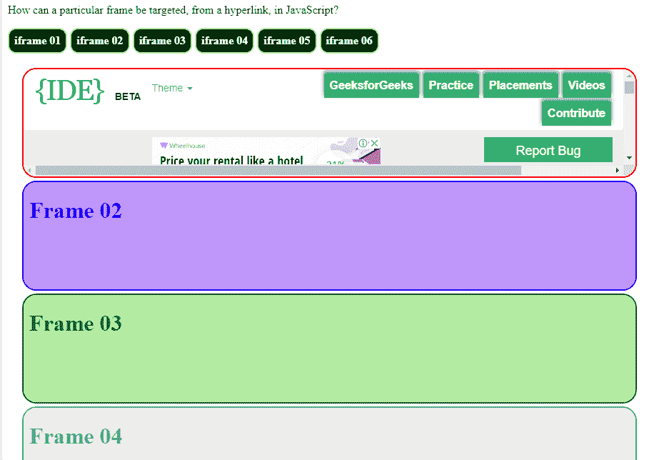

# 在 JavaScript 中，如何从超链接中定位特定的框架？

> 原文:[https://www . geesforgeks . org/如何从 javascript 中的超链接定位特定框架/](https://www.geeksforgeeks.org/how-can-a-particular-frame-be-targeted-from-a-hyperlink-in-javascript/)

*   frames 元素用于将一个浏览器窗口分成多个独立的浏览上下文。
*   框架已经被弃用，不应该被像 HTML 5 这样的现代网站使用。
*   然而，将一个文档放入另一个文档的能力仍然存在，通过 iframes，像 object，embed 这样的标签..

**主要有以下两种方式:**

1.  **目标帧不使用 JavaScript**

    ```
    // Target attribute has iframe name as its value
    <a href="#" target="frame-name" >Link</a>

    //Name attribute has name of the iframe
    <iframe src="" name="frame-name"></iframe>
    ```

2.  **目标帧使用 JavaScript:**

    ```
    //General syntax
    document.getElementById("frame-id").src = "url";

    //If object tag used
    x = document.getElementById("frame-id");
    x.data = "";
    //If iframe tag used
    x = document.getElementById("frame-id");
    x.src = "";
    //If embed tag used
    x = document.embeds.src = "";
    document.getElementById("frame-id").src = x;
    ```

**示例:**演示如何在 JavaScript 中从超链接定位特定的框架。

```
<!DOCTYPE html>
<html>

<head>
    <meta charset="UTF-8">

    <style>
        a:link {
            color: #FFF;
            background-color: #000;
            font-weight: bold;
            text-decoration: none;
            cursor: pointer;
            border: 2px solid yellow;
            border-radius: 12px;
            padding: 7px;
            display: inline-block;
        }

        a:visited {
            color: #FFF;
            background-color: #000;
            font-weight: bold;
            text-decoration: none;
            cursor: pointer;
            border: 2px solid yellow;
            border-radius: 12px;
            padding: 7px;
            display: inline-block;
        }

        #my-iframe1 {
            border: 2px solid red;
            border-radius: 20px;
        }

        #my-iframe2 {
            border: 2px solid blue;
            border-radius: 20px;
        }

        #my-iframe3 {
            border: 2px solid green;
            border-radius: 20px;
        }

        #my-iframe4 {
            border: 2px solid grey;
            border-radius: 20px;
        }

        #my-iframe5 {
            border: 2px solid brown;
            border-radius: 20px;
        }

        #my-iframe6 {
            border: 2px solid orange;
            border-radius: 20px;
        }

        #iframes {
            padding: 20px;
        }
    </style>

</head>

<body>
    <p>How can a particular frame be targeted, 
      from a hyperlink, in JavaScript?</p>

    <!--Target frame  using JavaScript-->
    <a href="javascript:void(0)" 
       onclick="document.getElementById(
                'my-iframe1').src='https://ide.geeksforgeeks.org/';
                document.getElementById(
                'my-iframe1').removeAttribute('srcdoc');">
      iframe 01
  </a>
    <!--Target frame without using JavaScript-->
    <a href="https://ide.geeksforgeeks.org/"
       target="my-iframe2">
      iframe 02
  </a>

    <!--Targeting frame  using JavaScript-->
    <a href="javascript:void(0)" onclick="showpage()">iframe 03</a>
    <!--Targeting frame without using JavaScript just using frame name-->
    <a href="#my-iframe4">iframe 04</a>
    <!--Targeting frame  using JavaScript-->
    <a href="javascript:void(0)" onclick="myFunction1()">iframe 05</a>
    <!--Targeting frame  using JavaScript-->
    <a href="javascript:void(0)" onclick="myFunction2()">iframe 06</a>

    <div id="iframes">
        <iframe src="" 
                height="150px"
                width="100%" 
                name="my-iframe1" 
                id="my-iframe1"
                srcdoc="<html>
                        <body style='background-color:#fcb;color:red;'>
                        <h1>Frame 01</h1>
                        </body>
                        </html>">
      </iframe>

        <iframe src="" 
                height="150px"
                width="100%" 
                name="my-iframe2"
                id="my-iframe2" 
                srcdoc="<html>
                        <body style='background-color:#b9f;color:blue;'>
                        <h1>Frame 02</h1>
                        </body>
                        </html>">
      </iframe>
        <iframe src="#" 
                height="150px"
                width="100%" 
                name="my-iframe3" 
                id="my-iframe3" 
                srcdoc="<html>
                        <body style='background-color:#be9;color:green;'>
                        <h1>Frame 03</h1>
                        </body>
                        </html>">
      </iframe>
        <iframe src="" 
                height="150px"
                width="100%" 
                name="my-iframe4" 
                id="my-iframe4"
                srcdoc="<html>
                        <body style='background-color:#eee;color:grey;'>
                        <h1>Frame 04</h1>
                        </body>
                        </html>">
      </iframe>

        <object width="100%" 
                height="150px" 
                name="my-iframe5"
                id="my-iframe5" 
                style='background-color:#ffa;color:brown;'>

            <h1>Frame 05</h1></object>
        <embed id="my-iframe6" width="100%" height="150px" />
    </div>
</body>
<script>
    function showpage() {
        var e1 = document.getElementById("my-iframe3");
        e1.src = "https://ide.geeksforgeeks.org/";
        e1.removeAttribute("srcdoc");
    }
</script>
<script>
    function myFunction1() {
        var x = document.getElementById("my-iframe5");
        x.data = "https://ide.geeksforgeeks.org/";
    }
</script>
<script>
    function myFunction2() {
        var y = document.embeds.src = "https://ide.geeksforgeeks.org/";
        document.getElementById("my-iframe6").src = y;

    }
</script>

</html>
```

**输出:**
