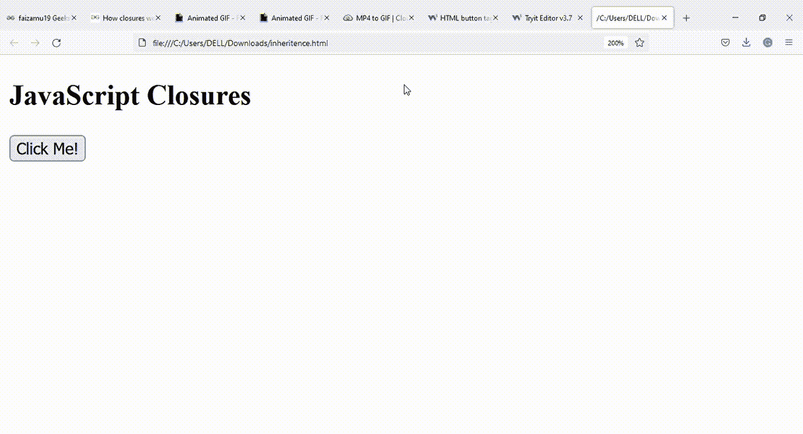

# 在 JavaScript 中闭包是如何工作的？

> 原文:[https://www . geesforgeks . org/how-closure-works-in-JavaScript/](https://www.geeksforgeeks.org/how-closure-works-in-javascript/)

在本文中，我们将讨论使用 JavaScript 的闭包。让我们首先了解什么是闭包，以及在 JavaScript 中与闭包相关的基本细节。

一个**闭包**是一个包含对其周围状态(词汇环境)的引用的函数的组合。在 JavaScript 中，每次在运行时创建函数时都会创建闭包。换句话说，闭包只是一个函数的花哨名称，它记住了函数内部使用的外部事物。

让我们看一些例子来理解闭包在 JavaScript 中是如何工作的。

**例 1:**

*   **在这个例子中，我们将声明一个闭包，它将最终从外部函数访问外部变量 balance。**
*   **在内部函数中使用外部变量后，每次调用外部函数时，特定的闭包将帮助我们从中扣除 100。**

## **超文本标记语言**

```
<!DOCTYPE html>
<html>

<body>
    <h2>JavaScript Closures</h2>
    <button type="button" onclick="initaccount()">
          Click Me!
        </button>
    <p id="demo"></p>
    <script>
    function initaccount() {
        var balance = 1000;

        function currentbalance() {
            balance = balance - 100;
            alert(balance);
        }
        currentbalance();
    }
    </script>
</body>

</html>
```

****输出:****

****

****说明:**在上面的例子中，currentbalance()可以访问外部变量 balance，因此每次调用 initaccount()方法都会扣除 100 的余额。**

****示例 2:** 闭包可以像下面的示例一样嵌套。在本例中，外部函数()和内部函数()都可以访问计数器变量，因此在调用计数器()时，外部函数()和内部函数()都会增加计数器的值。在这种情况下，我们可以说闭包可以访问所有的外部函数范围。**

## **超文本标记语言**

```
<!DOCTYPE html>
<html>

<body>
    <h2>JavaScript Closures</h2>
    <button type="button" onclick=" Counter()">
        Click Me!
    </button>
    <p id="demo1"></p>
    <p id="demo2"></p>
    <script>
    function Counter() {
        var counter = 0;

        function outerfunction() {
            counter += 1;
            document.getElementById("demo1").innerHTML
                = "outercounter = " + counter +
                "from outerfunction " ;

            function innerfunction() {
                counter += 1;
                document.getElementById("demo2").innerHTML
                 = " innercounter = " + counter + 
                   "from innerfunction ";
            };
            innerfunction();
        };
        outerfunction();
    };
    </script>
</body>

</html>
```

****输出:****

****