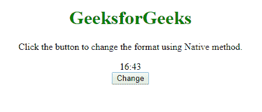
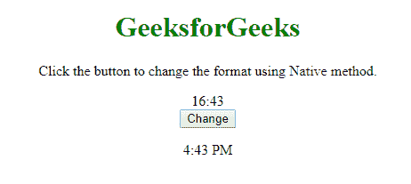
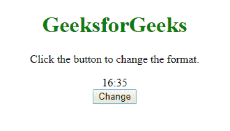
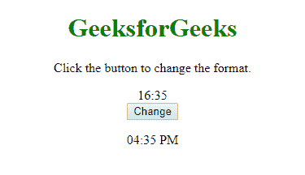

# 如何以 12 小时 AM/PM 格式显示 JavaScript 日期时间？

> 原文:[https://www . geesforgeks . org/how-do-display-JavaScript-datetime-in-12-hour-am-pm-format/](https://www.geeksforgeeks.org/how-do-you-display-javascript-datetime-in-12-hour-am-pm-format/)

JavaScript 使用 24 小时格式作为 DateTime 的默认格式。然而，JavaScript 中的白天可以使用几种方法以 12 小时的上午/下午格式显示。我们将在这篇文章中研究几个。

**方法 1:**
在这种方法中，我们将只使用本机方法来更改日期时间格式。简单地说，我们将应用模**“%”**运算符来查找 12 小时格式的小时，并使用条件**？:**操作员应用**“AM”**或**“PM”**。

**程序:**

```
<!DOCTYPE html>
<html>

<body>
    <center>
        <h1 style="color:green">
          GeeksforGeeks
      </h1>
        <p>
          Click the button to change the 
          format using Native method.
      </p>
        <div id="old_time"></div>
        <script>
            // JavaScript Program to display
            // current time in 24-hour format
            var date = new Date();
            var hours = (date.getHours() < 10 ? '0' : '') + 
                date.getHours();
            var minutes = (date.getMinutes() < 10 ? '0' : '') + 
                date.getMinutes();

            var div = document.getElementById('old_time');
            div.innerHTML = hours + ":" + minutes;
        </script>

        <button onclick="myFunction()">
          Change
      </button>

        <p id="change"></p>
        <script>
            // JavaScript function to
            // Display 12 hour format
            function myFunction() {
                var date = new Date();
                var hours = date.getHours();
                var minutes = date.getMinutes();

                // Check whether AM or PM
                var newformat = hours >= 12 ? 'PM' : 'AM'; 

                // Find current hour in AM-PM Format
                hours = hours % 12; 

                // To display "0" as "12"
                hours = hours ? hours : 12; 
                minutes = minutes < 10 ? '0' + minutes : minutes;

                document.getElementById("change").innerHTML = 
                  hours + ':' + minutes + ' ' + newformat;
            }
        </script>
  </center>
</body>

</html>
```

**之前:**


**之后:**


**方法 2:**
在这种方法中，我们将利用一种内置的方法 **[将给定日期的格式更改为 AM-PM 格式。](https://www.geeksforgeeks.org/javascript-date-tolocalestring/)**

**ToLocalString():**它返回日期对象的字符串表示形式。两个参数*区域*和*选项*允许自定义方法的行为。

**语法:**

```
dateObject.toLocaleString([locales[, options]])

```

**程序:**

```
<!DOCTYPE html>
<html>

<body>
    <center>
        <h1 style="color:green">GeeksforGeeks</h1>
        <p>Click the button to change the format.</p>
        <div id="old_time"></div>
        <script>
            var date = new Date();
            var hours = (date.getHours() < 10 ? '0' : '') +
                date.getHours();
            var minutes = (date.getMinutes() < 10 ? '0' : '') + 
                date.getMinutes();
            var div = document.getElementById('old_time');
            div.innerHTML = hours + ":" + minutes;
        </script>

        <button onclick="myFunction()">
          Change
      </button>

        <p id="change"></p>
        <script>
            var now = new Date();
            var hours = now.getHours();

            function myFunction() {
                var d = new Date();
                var n = d.toLocaleString([], {
                    hour: '2-digit',
                    minute: '2-digit'
                });
                document.getElementById("change").innerHTML = n;
            }
        </script>
  </center>
</body>

</html>
```

**之前:**


**之后:**
