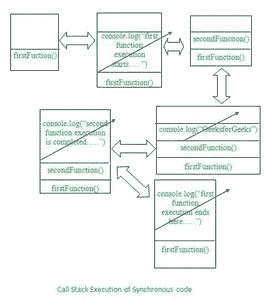
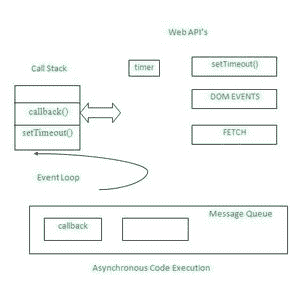

# 异步代码在 JavaScript 中是如何工作的？

> 原文:[https://www . geeksforgeeks . org/异步代码如何在 javascript 中工作/](https://www.geeksforgeeks.org/how-does-asynchronous-code-work-in-javascript/)

在本文中，我们将学习在 JavaScript 中工作的[异步代码](https://www.geeksforgeeks.org/synchronous-and-asynchronous-in-javascript/)。让我们了解与[同步 JavaScript](https://www.geeksforgeeks.org/synchronous-and-asynchronous-in-javascript/) 相关的基本细节。

**同步 JavaScript:**

*   同步 JavaScript 意味着用户拥有同步访问的数据，并且可以按顺序使用。
*   在这种情况下，用户试图访问代码的不同部分(如不同的函数或方法)中可用的数据，这些数据相互关联或相互依赖。
*   [调用堆栈](https://www.geeksforgeeks.org/what-is-the-call-stack-in-javascript/)的概念出现在图中，这是一个遵循后进先出(LIFO)结构的堆栈，其中任务的每个功能都是通过移除堆栈顶部的任何内容来执行的。

**示例:**借助下面的代码，让我们了解同步 JavaScript 的概念。

## Java Script 语言

```
<script>
    let secondFunction = () => {
        console.log("GeeksforGeeks....");
        console.log("Second Function execution is completed.....");
    }

    let firstFunction = () => {
        console.log("First function Execution Starts.....");
        secondFunction();
        console.log("First Function execution ends here.....");
    }

    firstFunction();
</script>
```

**输出:**

```
First function Execution Starts.....
GeeksforGeeks....
Second Function execution is completed.....
First Function execution ends here.....
```

上面的同步代码的工作借助于下面调用栈的图形表示来解释。



*   每个元素都从堆栈顶部移除，当它被移除时，会在浏览器的控制台中打印出来。
*   每当调用不同的函数并执行各自的数据时，同步代码就是这样工作的。

现在我们已经理解了与同步 JavaScript 相关的细节，让我们现在理解什么是异步 JavaScript 及其在执行时的工作原理。

**异步 JavaScript:**



*   异步 JavaScript 简单地暗示了这样一个事实，即用户将以更快的方式接收数据。
*   这通常发生在用户试图从应用编程接口资源获取数据或者试图从应用编程接口本身收集响应的时候。
*   为了处理异步数据，我们使用[承诺](https://www.geeksforgeeks.org/javascript-promises/)或回调，这有助于用户轻松地从应用编程接口获取响应或数据。
*   在了解了调用堆栈的基础之后，还存在一些更技术性的概念，如事件循环、网络应用编程接口和消息队列。
*   所有这些都与 JavaScript 引擎无关，它们实际上与 Browser 的 JavaScript 运行时环境有关。
*   每当任何同步方法或 DOM 事件(如 setTimeout 或 promises 或回调)出现时，它都会被执行到网络应用编程接口中，并且在其计时器完成后，它会被推入消息队列中，事件循环会进一步将该消息推入调用堆栈中以供执行。
*   事件循环执行的任务基本上是确定堆栈是否为空。如果它是空的，那么这个特定的事件循环从消息队列中获取数据到调用堆栈中执行。

**示例 1:** 以下是一些示例，我们将使用承诺或回调或 DOM 事件展示 JavaScript 代码的异步特性。

## Java Script 语言

```
<script>
    console.log("Program Starts......");

    setTimeout(() => {
      console.log("setTimeout execution....");
    }, 0);

    new Promise((resolve, reject) => {
      resolve("Promise resolved.....");
    })
     .then((res) => console.log(res))
     .catch((error) => console.log(error));

    console.log("Program Ends.....");
</script>
```

**输出:**

```
Program Starts......
Program Ends.....
Promise resolved.....
setTimeout execution....
```

**例 2:**

## Java Script 语言

```
<script>
    console.log("Program Starts......");
    setTimeout(() => {
        console.log("setTimeout 1 execution....");
    }, 0);
    setTimeout(() => {
        console.log("setTimeout 2 execution....");
    }, 0);
    new Promise((resolve, reject) => {
        resolve("Promise 1 resolved.....");
    }).then((res) => console.log(res))
      .catch((error) => console.log(error));
    new Promise((resolve, reject) => {
        resolve("Promise 2 resolved.....");
    }).then((res) => console.log(res))
      .catch((error) => console.log(error));
    console.log("Program Ends.....");
</script>
```

**输出:**

```
Program Starts......
Program Ends.....
Promise 1 resolved.....
Promise 2 resolved.....
setTimeout 1 execution....
setTimeout 2 execution.... 
```