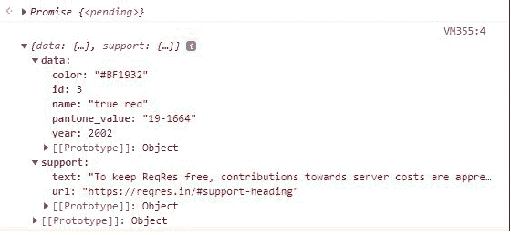

# 等待和异步在 ES6 中是如何工作的？

> 原文:[https://www . geesforgeks . org/how-to-wait-and-async-works-in-es6/](https://www.geeksforgeeks.org/how-does-await-and-async-works-in-es6/)

在本文中，我们将尝试了解[异步和等待](https://www.geeksforgeeks.org/async-await-function-in-javascript/)在 ES6 中是如何工作的。让我们先试着理解什么是异步和等待以及它们的用法，然后我们会看到一些例子，在这些例子中，我们会看到如何使用异步和等待以及正常的函数。

[**异步等待**](https://www.geeksforgeeks.org/async-await-function-in-javascript/) **:**

*   异步和等待都被认为是特殊的关键字，由 [ES6](https://www.geeksforgeeks.org/introduction-to-es6/) 提供，以便执行一些异步数据操作。甚至同步操作也可以使用这些关键字来执行。
*   [Async](https://www.geeksforgeeks.org/understanding-the-async-in-javascript/) 关键字与函数声明一起使用，该声明指定该函数现在能够接受自身上的所有类型的异步事件。
*   换句话说，async 关键字与函数(或方法)一起使用，使它们能够轻松接收所有类型的异步数据。
*   Async 关键字的使用以及函数总是在最后返回一个[承诺](https://www.geeksforgeeks.org/javascript-promises/)及其状态(待定、已解决或已拒绝)。
*   Await 用在异步函数中，虽然对结果的等待很有用。
*   wait 基本上等待从异步函数将要从中获取数据的源中获取的结果。
*   等待需要一点时间从源中获取结果(比如应用编程接口)，然后与异步函数一起以承诺的形式返回结果。
*   如果异步与函数声明一起使用，也可以使用等待。

**异步和等待工作:**

*   每当用户在声明中声明一个带有 async 关键字的函数时，它会自动暗示一个事实，即该函数或方法已经准备好接收其自身的所有异步事件。
*   在这之后，我们通常使用 wait 关键字，然后等待结果，然后成功获取它。
*   之后，我们将提取的结果存储在某个随机变量中，然后显示该结果，或者根据需要将该结果用于其他几个目的。
*   与其他普通函数相比，使用异步/等待关键字的函数最终会将结果保存一小段时间。
*   成功完成后，结果可以用于代码本身中的进一步数据操作，或者可以成功地显示在浏览器的控制台上。

现在我们已经理解了与异步/等待在正常函数中的使用相关的细节，让我们看看下面的一些例子，这些例子最终会帮助我们以更好的方式理解事物。

**示例 1:** 在本例中，我们将在常规函数(或方法)中使用异步和等待。除此之外，我们还会展示一些其他结果。下面的输出将向我们展示一件事，由于使用了 wait 关键字，我们的结果与我们正在显示的其他结果相比会稍微延迟一点。

## 超文本标记语言

```
<script>
    let dataDisplay = async () => {
      let data = await "GeeksforGeeks";
      console.log(data);
    };
    console.log(1);
    dataDisplay();
    console.log("Hello");
</script>
```

**输出:**

```
1
Hello
GeeksforGeeks
```

**示例 2:** 在这个示例中，我们将使用开源 API，这是一个免费提供的 API，所有人都可以访问。我们将在浏览器的控制台中从该应用编程接口获取结果。这个例子清楚地展示了我们在使用几个实时 API 时如何使用异步/等待。输出将显示在下图中。

## 超文本标记语言

```
<script>
    async function fetchMethod() {
      let response = await fetch(
        "https://reqres.in/api/products/3");
      let data = await response.json();
      console.log(data);
    }
    fetchMethod();
</script>
```

**输出:**

