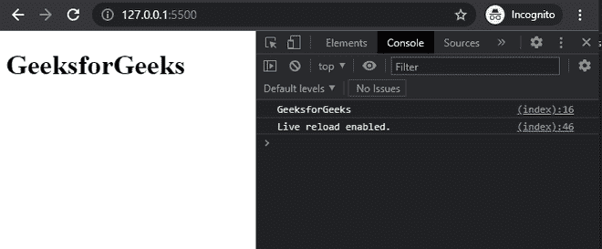

# 【getElementByID 在 JavaScript 中是如何工作的？

> 原文:[https://www . geesforgeks . org/how-getelementbyid-works-in-JavaScript/](https://www.geeksforgeeks.org/how-getelementbyid-works-in-javascript/)

文档方法 [**getElementById()**](https://www.geeksforgeeks.org/html-dom-getelementbyid-method/) 返回一个元素对象，表示 Id 属性与给定值匹配的元素。这种方法用于操作我们文档中的一个元素&在网页设计中被广泛使用来改变任何特定元素的值或者得到一个特定元素。如果传递给该方法的标识不存在，则返回空值。

网页中应使用唯一的 id。但是，如果特定 id 存在多个元素，那么第一个元素将被考虑&由代码中的 getElementByID 返回。

**语法:**

```
const gfg = document.getElementById(id);
```

**参数:**

*   **id:** 我们要抓取的元素的 id。是区分大小写的字符串，在文档中是唯一的。

**返回值:**指定标识的元素对象，如果没有找到匹配的元素，则*为空*。

**示例:**下面的示例通过获取具有指定值的 Id 属性的元素来说明 *getElementById、*的使用。

## 超文本标记语言

```
<!DOCTYPE html>
<html lang="en">

<body>

    <!-- defining an element with an id -->
    <h1 id="gfg">GeeksforGeeks</h1>

    <!-- Adding javascript -->
    <script>

    // Grabbing element
    const gfg = document.getElementById('gfg');
    console.log(gfg.innerText)
    </script>
</body>

</html>
```

**输出:**在这里，可以看到控制台选项卡上打印的“GeeksforGeeks”。现在，在抓取一个元素后，我们可以对该元素执行任何操作，如更改文本、添加样式等。



getElementByID