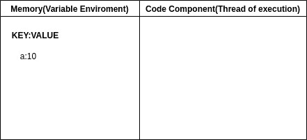
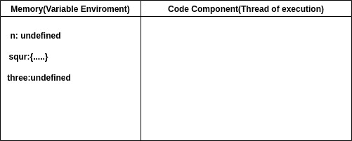
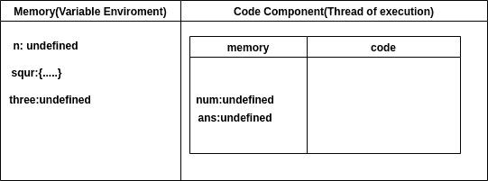
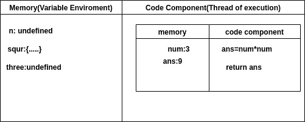
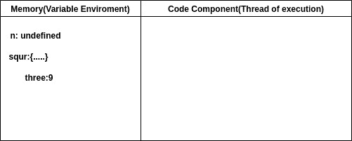

# 【JavaScript 是如何工作的，代码是如何在场景背后执行的？

> 原文:[https://www . geesforgeks . org/how-JavaScript-works-code-is-executed-幕后/](https://www.geeksforgeeks.org/how-javascript-works-and-code-is-executed-behind-the-scene/)

JavaScript 是世界上一种有趣的语言，它的工作过程与其他语言大不相同。JavaScript 是同步的(执行的特定顺序)，单线程语言(这意味着 JavaScript 一次只能执行一个命令)。

JavaScript 中的一切都发生在一个执行上下文(EXECUTION CONTEXT)中，您可以假设它是一个大盒子或容器，在其中执行整个 JavaScript 代码。EXECUTION CONTEXT 包含两个部分，一个是内存(变量环境)，所有变量和函数都存储键:值对，另一个是代码组件(执行线程)，代码一次执行一行(如下图所示)。



执行上下文的图形表示

现在，当你运行 JavaScript 代码时会发生什么？

简单的答案是:创建了一个执行上下文。

现在我在下面写一个演示代码，我会一行行地说，代码是如何运行的。

## java 描述语言

```
<script>
    var n = 3;
    function squr(num) {
        var ans = num * num;
        return ans;
    }
    var three = squr(n);
</script>
```

当您运行整个代码时，会创建一个全局执行上下文，它包含两个部分，一个是内存，另一个是代码执行。

当遇到第一行时，它将为所有变量(n，3，5)和函数(square)保留内存。当为变量保留内存时，它会保留一个未定义的特殊值，对于函数，它会存储整个代码。图示如下。



全局执行上下文的图形表示

为所有变量和函数分配内存后，代码执行阶段开始(代码逐行运行)。

第 1 行:var n=3，3 放入 n 标识符的值。

第 2-5 行:没有要执行的内容。

第 6 行:我们调用一个函数，现在函数是 JavaScript 的心脏。该函数是一个小程序，每当一个新函数被一起调用时，就会创建一个新的执行上下文(在代码执行阶段)。它还包含两部分内存和代码执行阶段。内存分配给变量和函数(涉及函数参数和其他变量)。



函数执行上下文的图形表示

分配内存后，代码执行阶段来到这里，函数内部的代码执行，未定义的被实际值替换。



函数执行时执行上下文的图形表示

之后，当遇到 return 时，将程序的控制返回到调用函数的地方，控制转到第 6 行，在本地内存中找到答案，并返回 control 3 和由 ans 值替换的值 3(未定义)，然后删除整个内容(执行上下文)。



代码执行后全局执行上下文的图形表示

之后，全局执行上下文被删除，我们的程序结束。还有一点，JavaScript 处理所有被删除和创建的东西(管理执行上下文)，它管理一个堆栈。它的名字叫 CALL STACK。这是一个维护执行顺序的堆栈。