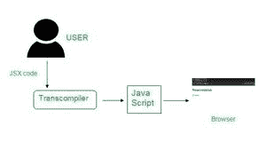
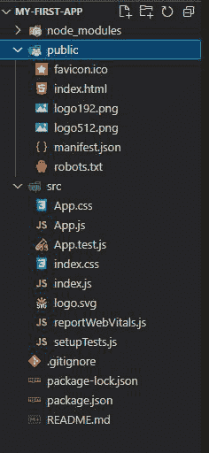

# JSX 在幕后是如何运作的？

> 原文:[https://www . geesforgeks . org/how-jsx-work-幕后/](https://www.geeksforgeeks.org/how-jsx-works-behind-the-scene/)

学习 HTML 比反应容易，反应由[状态](https://www.geeksforgeeks.org/reactjs-state-react/)、[组件](https://www.geeksforgeeks.org/reactjs-components/)、[事件](https://www.geeksforgeeks.org/how-to-create-an-event-in-react/)等组成。所以，为了让易编码反应过来引入了 [JSX](https://www.geeksforgeeks.org/reactjs-introduction-jsx/) 。这是一个 [JavaScript](https://www.geeksforgeeks.org/introduction-to-javascript/) 扩展，我们可以在其中将有效的 JavaScript 对象嵌入到 HTML 元素中。JSX 使代码更容易阅读和理解。通常，HTML 和 JavaScript 是分开编写的，但是 react 会创建包含 HTML 和 JavaScript 的组件。因此，如果你熟悉 HTML，你可以很容易地使用 JSX 修改你的代码。

```
const age = 20;
const ele = <h1> I'm {age} years old </h1>;
```

### JSX 在幕后是如何工作的:

大多数用户使用 JSX，因为它易于学习和实施，并可以很容易地发现错误。每当在 JSX 编写代码时，巴别塔和 T2 会将代码转换成 JavaScript 代码。



JSX 转换成 JavaScript

### 创建一个反应应用程序

按照以下步骤创建 react 应用程序:

**步骤 1:** 使用以下命令创建一个 react 应用程序。

```
npx create-react-app foldername
```

**步骤 2:** 将目录更改为新创建的文件夹。

```
cd foldername
```

它创建了如下所示的项目结构:



项目结构

**第三步:**现在在 **index.js** 里面，写下下面的代码，检查有没有 JSX 和没有 JSX 的代码。

在 JSX 编写的代码看起来像下面的代码:

## java 描述语言

```
import React from 'react';
import ReactDOM from 'react-dom';

const ele = ( 
  <div> 
    <h1 id="h1"> Welcome to GeeksforGeeks </h1> 

<p> Don't stop learning </p>

  </div>
);
ReactDOM.render(ele, document.getElementById('root'));
```

**不使用 JSX:** 在 JSX 写的代码使用巴别塔编译器转换成 react 代码，如下所示:

## java 描述语言

```
import React from 'react';
import ReactDOM from 'react-dom';

const ele = React.createElement(
    "div", { "class": "container" },
    React.createElement(
        "h1", { id: "h1" }, "Welcome to GeeksforGeeks"),
    React.createElement("p", null, "Don't stop learning"));

ReactDOM.render(ele, document.getElementById('root'));
```

**运行应用程序的步骤:**要运行应用程序，请输入以下命令。

```
npm start
```

#### 输出:

这两个代码都产生以下输出:

