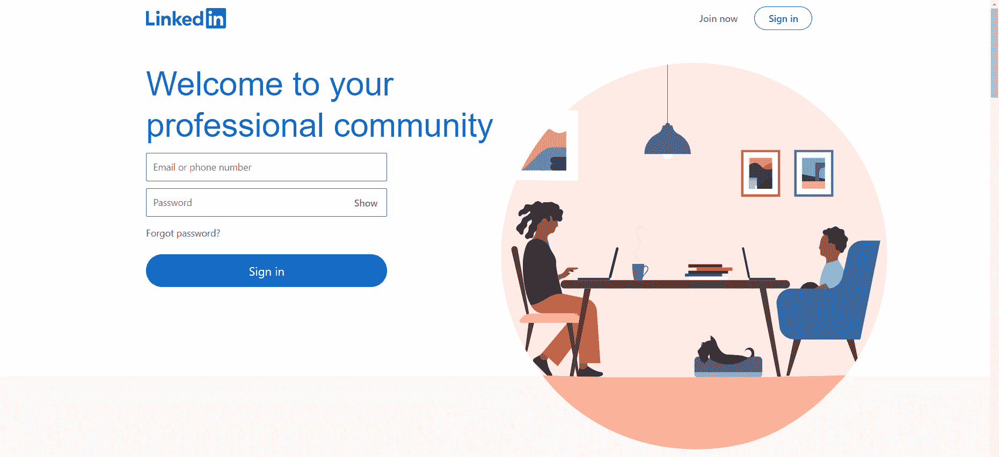
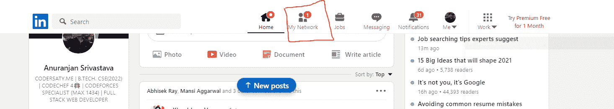
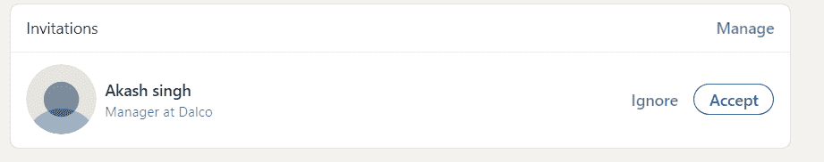
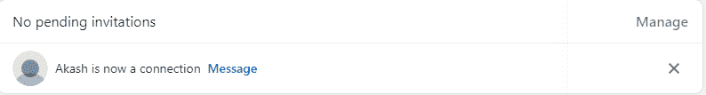

# 如何使用 JavaScript 接受 LinkedIn 上所有待处理的连接请求？

> 原文:[https://www . geesforgeks . org/如何接受所有待定连接请求-在 linkedin 上-使用-javascript/](https://www.geeksforgeeks.org/how-to-accept-all-pending-connection-requests-on-linkedin-using-javascript/)

很多时候我们通过 **LinkedIn** 收到很多连接请求，我们想要接受所有的连接请求，但是为此，我们必须为每个连接请求点击接受按钮。借助下面的方法，我们可以使用 JavaScript 一次性接受所有这些，帮助我们节省时间和精力。

**进场:**

*   创建一个指向所有挂起连接的数组的变量连接。
*   运行循环来迭代所有挂起的连接。
*   然后使用 JavaScript 点击功能点击该连接请求的接受按钮。

**步骤:**

*   进入领英页面或[点击这里。](https://www.linkedin.com/)
*   如果您没有登录。您应该登录您的帐户。



*   打开页面上可见的**我的网络**标签。



*   点击**显示更多**按钮查看所有连接请求。
    **注意:**仅当您有 3 个以上的连接请求时，显示更多按钮才可见。继续点击，直到所有的连接请求都可见。
*   按下 ***F12*** 或 ***CTRL+SHIFT+I*** 打开开发者控制台


*   将以下**脚本**复制粘贴到控制台上，点击回车。

## java 描述语言

```
var connection = document
    .querySelectorAll(
    '.invitation-card__action-btn.artdeco-button--secondary');

for(var i = 0; i < connection.length; i = i + 1)
  connection[i].click();
```

**输出:**

```
Before running script:
```



```
After running script:
```



**注:**

*   请确保有稳定的互联网连接，以便脚本能够顺利运行。
*   只有当所有连接都可见时，该脚本才会工作。
*   本教程仅用于教育目的。