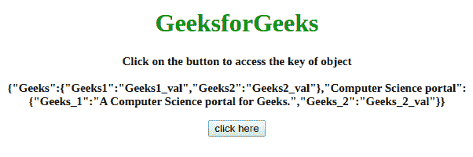
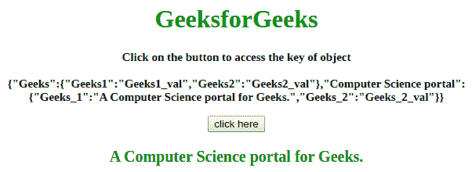
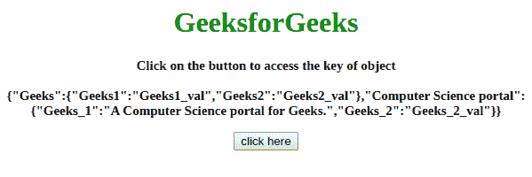
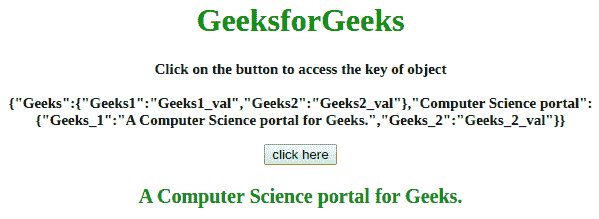

# 如何使用 JavaScript 访问对象的键中有空格的对象？

> 原文:[https://www . geesforgeks . org/如何使用 javascript 访问对象中有空格的对象/](https://www.geeksforgeeks.org/how-to-access-an-object-having-spaces-in-the-objects-key-using-javascript/)

给定一个对象，任务是访问键中包含空格的对象。解决这个问题的方法很少，下面讨论:

**方法 1:**

*   创建一个具有空格分隔键的对象。
*   使用**方括号符号**代替**点符号**访问属性。

**示例:**该示例实现了上述方法。

```
<!DOCTYPE HTML>
<html>

<head>
    <title>
        Access a JavaScript object having 
        spaces in the object's key.
    </title>
</head>

<body id="body" align="center">
    <h1 style="color:green;">  
       GeeksforGeeks  
    </h1>
    <p id="GFG_UP" 
       style="font-size: 15px; font-weight: bold;">
    </p>
    <button onclick="GFG_Fun()">
        click here
    </button>
    <p id="GFG_DOWN" 
       style="font-size: 20px; font-weight: bold; color:green;">
    </p>
    <script>
        var el_up = document.getElementById('GFG_UP');
        var el_down = document.getElementById('GFG_DOWN');
        var JSObject = {
            'Geeks': {
                Geeks1: 'Geeks1_val',
                Geeks2: 'Geeks2_val'
            },
            'Computer Science portal': {
                Geeks_1: 'A Computer Science portal for Geeks.',
                Geeks_2: 'Geeks_2_val'
            }
        }
        el_up.innerHTML = "Click on the button to access the "+ 
              "key of object<br><br>"+ JSON.stringify(JSObject);

        function GFG_Fun() {
            el_down.innerHTML = 
              JSObject['Computer Science portal'].Geeks_1;
        }
    </script>
</body>

</html>
```

**输出:**

*   **点击按钮前:**
    [](https://media.geeksforgeeks.org/wp-content/uploads/20190905104932/Screenshot-from-2019-09-05-10-46-41.png)
*   **点击按钮后:**
    [](https://media.geeksforgeeks.org/wp-content/uploads/20190905104934/Screenshot-from-2019-09-05-10-46-43.png)

**方法 2:**

*   创建一个具有空格分隔键的对象。
*   取一个变量的键，用这个变量代替键(但是，这里方括号符号也可以)。

**示例:**该示例实现了上述方法。

```
<!DOCTYPE HTML>
<html>

<head>
    <title>
        Access a JavaScript object having
        spaces in the object's key.
    </title>
</head>

<body id="body" align="center">
    <h1 style="color:green;">  
            GeeksforGeeks  
        </h1>
    <p id="GFG_UP" 
       style="font-size: 15px; font-weight: bold;">
    </p>
    <button onclick="GFG_Fun()">
        click here
    </button>
    <p id="GFG_DOWN" 
       style="font-size: 20px; font-weight: bold; color:green;">
    </p>
    <script>
        var el_up = document.getElementById('GFG_UP');
        var el_down = document.getElementById('GFG_DOWN');
        var JSObject = {
            'Geeks': {
                Geeks1: 'Geeks1_val',
                Geeks2: 'Geeks2_val'
            },
            'Computer Science portal': {
                Geeks_1: 'A Computer Science portal for Geeks.',
                Geeks_2: 'Geeks_2_val'
            }
        }
        el_up.innerHTML = "Click on the button to access "+
            "the key of object<br><br>" + JSON.stringify(JSObject);

        function GFG_Fun() {
            var someKey = 'Computer Science portal';
            el_down.innerHTML = JSObject[someKey].Geeks_1;
        }
    </script>
</body>

</html>
```

**输出:**

*   **点击按钮前:**
    [](https://media.geeksforgeeks.org/wp-content/uploads/20190905105254/Screenshot-from-2019-09-05-10-51-33.png)
*   **点击按钮后:**
    [](https://media.geeksforgeeks.org/wp-content/uploads/20190905105257/Screenshot-from-2019-09-05-10-51-35.png)