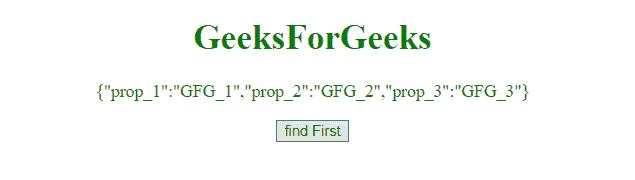
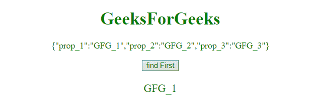
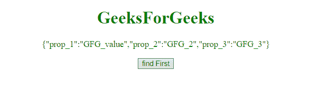
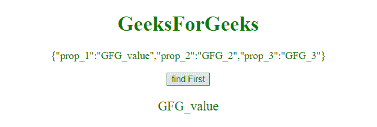

# 如何使用 JavaScript 访问对象的第一个值？

> 原文:[https://www . geesforgeks . org/如何使用 javascript 访问对象的第一个值/](https://www.geeksforgeeks.org/how-to-access-first-value-of-an-object-using-javascript/)

在 JavaScript 中有许多方法可以访问对象的第一个值，下面讨论其中的一些方法:

**示例 1:** 本示例使用 **object.keys()** 方法访问 **GFG_object** 的第一个值对象。

```
<!DOCTYPE html>  
<html>  
    <head> 
        <title> 
            How to access first value of
            an object using JavaScript ?
        </title> 
    </head> 

    <body style = "text-align:center;">  

        <h1 style = "color:green;" >  
            GeeksForGeeks  
        </h1> 

        <p id = "GFG_UP" style = "color:green;">
        </p>

        <button onclick = "gfg_Fun()"> 
            find First
        </button> 

        <p id = "GFG_DOWN" style = "color:green; font-size: 20px;">
        </p>

        <script> 

            // Declare an object
            var GFG_object = {prop_1: "GFG_1",
                    prop_2: "GFG_2", prop_3: "GFG_3"};

            var el_up = document.getElementById("GFG_UP");
            var el_down = document.getElementById("GFG_DOWN");

            // Use SON.stringify() function to take object
            // or array and create JSON string
            el_up.innerHTML = JSON.stringify(GFG_object);

            // Access the first value of an object
            function gfg_Fun() {  
               el_down.innerHTML = GFG_object[Object.keys(GFG_object)[0]]; 
           }
        </script> 
    </body>  
</html>
```

**输出:**

*   **点击按钮前:**
    
*   **点击按钮后:**
    

**示例 2:** 本示例通过遍历对象并在访问第一个值时中断循环来访问对象**的第一个值 GFG _ 对象**。

```
<!DOCTYPE html> 
<html> 
    <head> 
        <title> 
            How to access first value of
            an object using JavaScript ?
        </title> 
    </head> 

    <body style = "text-align:center;"> 

        <h1 style = "color:green;" > 
            GeeksForGeeks 
        </h1> 

        <p id = "GFG_UP" style = "color:green;"></p>

        <button onclick = "gfg_Fun()"> 
            find First
        </button> 

        <p id="GFG_DOWN" style="color:green;font-size:20px;"></p>

        <script> 

            // Declare an object
            var GFG_object = {prop_1: "GFG_1",
                    prop_2: "GFG_2", prop_3: "GFG_3"};

            var el_up = document.getElementById("GFG_UP");
            var el_down = document.getElementById("GFG_DOWN");

            // Use SON.stringify() function to take object
            // or array and create JSON string
            el_up.innerHTML = JSON.stringify(GFG_object);

            // Function to access the first value of an object
            function gfg_Fun() { 
                for (var prop in GFG_object) {
                    el_down.innerHTML = GFG_object[prop]
                    break;
                }
            }         
        </script> 
    </body> 
</html>                    
```

**输出:**

*   **点击按钮前:**
    
*   **点击按钮后:**
    

**示例 3:** 本示例使用 **object.values()** 方法访问对象**的第一个值 GFG_object** 。

```
<!DOCTYPE html> 
<html> 
    <head> 
        <title> 
            JavaScript | Access the first value of an object
        </title> 
    </head> 

    <body style = "text-align:center;"> 

        <h1 style = "color:green;" > 
            GeeksForGeeks 
        </h1> 

        <p id = "GFG_UP" style = "color:green;"></p>

        <button onclick = "gfg_Fun()"> 
            find First
        </button> 

        <p id = "GFG_DOWN" style = "color:green; font-size: 20px;"></p>

        <script> 

            // Declare an object
            var GFG_object = {prop_1: "GFG_value",
                    prop_2: "GFG_2", prop_3: "GFG_3"};

            var el_up = document.getElementById("GFG_UP");
            var el_down = document.getElementById("GFG_DOWN");

            // Use SON.stringify() function to take object
            // or array and create JSON string
            el_up.innerHTML = JSON.stringify(GFG_object);

            // Function to access the first value of an object
            function gfg_Fun() { 
                el_down.innerHTML = Object.values(GFG_object)[0];
        }         
        </script> 
    </body> 
</html>                    
```

**输出:**

*   **点击按钮前:**
    
*   **点击按钮后:**
    